# 從 Docker 到 Kubernetes：Rust 與多樣化 Web 架構（WebSocket / SSR / MPA）實戰

## 目錄

## 第 1 部分：多樣化前端與通訊協定的 Docker 容器化

- 一、雲原生世代與容器技術革命
   - 1.1 虛擬機 vs 容器：從 Namespace 與 Cgroups 理解隔離本質
   - 1.2 技術棧選型：Rust 高併發核心 × 多樣化 Web 前端
   - 1.3 開發環境：Docker Desktop、Podman 與 CLI 工具鏈

- 二、Rust 後端服務的極致容器化（Multi-Stage Builds）
   - 2.1 Rust 編譯特性與容器化挑戰
   - 2.2 多階段構建到 Alpine 與 Distroless
   - 2.3 musl 靜態編譯：把 Rust 壓進 20 MB 以內
   - 2.4 cargo-chef 加速 CI/CD：三段式 Dockerfile

- 三、多樣化 Web 架構的容器化策略
   - 3.1 SPA 模式：React + Vite 建置、Nginx 託管
   - 3.2 SSR / Fullstack 模式：Next.js standalone、靜態抽離與記憶體考量
   - 3.3 MPA / 樣板引擎：Rust + Tera + HTMX，一個二進位檔即全站
   - 3.4 環境變數注入：Build-time vs Run-time，前端三模式全解

- 四、多容器開發與本地編排（Docker Compose）
   - 4.1 Compose 語法：Services、Networks、Volumes 一次搞定
   - 4.2 本地全棧：Rust Server + 雙前端 + PostgreSQL + Redis
   - 4.3 容器間通訊、連接池與 Healthcheck：從能跑到穩跑
   - 4.4 Compose Watch：Rust 與前端 Hot Reload，一存即同步

## 第 2 部分：長連線與混合架構的 12-Factor 雲原生改造

- 五、WebSocket 與長連線雲原生挑戰
   - 5.1 短連線與長連線：在 K8s 裡完全是兩種生物
   - 5.2 WebSocket 狀態抽離與廣播：從單機記憶體到跨 Pod 同步
   - 5.3 負載均衡與 Sticky Sessions：WS 為什麼需要粘性

- 六、全棧應用的無狀態化與 Session 抽離
   - 6.1 SPA 無狀態化：把 Session 趕出伺服器記憶體
   - 6.2 SSR / MPA 的伺服器端 Session：Redis 分散式 Session Store
   - 6.3 檔案上傳解耦：Presigned URL 直傳物件儲存

- 七、長連線環境下的生命週期管理與健康檢測
   - 7.1 WS 優雅停機：SIGTERM 來時體面說再見
   - 7.2 健康檢查設計：別讓長連線害死你的 Pod
   - 7.3 雲原生可觀測性：讓每條 WS 都有跡可循

## 第 3 部分：Kubernetes 編排與長連線流量治理

- 八、單機 Kubernetes 開發環境：Kind
   - 8.1 Kind 的 DinD 原理：把 Kubernetes 裝進 Docker
   - 8.2 Kind YAML 實戰：1 Control-Plane + 2 Workers
   - 8.3 kind load docker-image：把本機映像送進叢集
   - 8.4 Kind Port Mapping 與 NGINX Ingress 安裝

- 九、K8s 核心資源管理與部署
   - 9.1 Deployment 部署三種前端架構：Rust Backend、SSR、SPA
   - 9.2 ConfigMap 與 Secret：把 run-time 配置動態注入
   - 9.3 StatefulSet + PV/PVC：託管 PostgreSQL 與 Redis

- 十、K8s 網絡、長連線流量路由與 Ingress 實戰
   - 10.1 Service 模型：ClusterIP、NodePort、LoadBalancer
   - 10.2 Ingress 超時與 WebSocket 支持（核心節）
   - 10.3 CORS、HTTP/2 與 HTTP/3 QUIC 實踐

- 十一、長連線架構下的資源調度與自動擴縮容
   - 11.1 Requests / Limits 與 QoS：別讓 SSR 吃掉整台 Worker
   - 11.2 WebSocket 擴縮容瓶頸：基於 Active 連線數的 Custom Metrics HPA
   - 11.3 Rolling Update 與長連線平滑遷移

## 第 4 部分：高級主題與生產環境落地

- 十二、GitOps 與自動化部署流水線（CI/CD）
   - 12.1 GitHub Actions 自動建置 Rust 與多前端鏡像並推送至 Registry
   - 12.2 Helm 模組化打包全端：Frontend + Backend + Redis + DB
   - 12.3 ArgoCD GitOps 自動同步

- 十三、服務網格與長連線可觀測性
   - 13.1 Istio / Cilium 在微服務 + 長連線下的選型
   - 13.2 mTLS 加密與 WebSocket 流量治理：熔斷與限流
   - 13.3 OpenTelemetry 全端追蹤：從前端 HTTP/WS 觸發點到 Rust DB Query

- 十四、AI / ML 雲原生算力擴充與長連線 Streaming
   - 14.1 在 Kubernetes 上部署 vLLM 推論服務
   - 14.2 前端 + Rust Gateway SSE 串流 + LLM Pod 架構

## 附錄

- 序言：為什麼是 WebSocket + SSR/MPA
- 本書大綱與寫作策略


# 第 1 部分：多樣化前端與通訊協定的 Docker 容器化


## 一、雲原生世代與容器技術革命


### 1.1 虛擬機 vs 容器：從 Namespace 與 Cgroups 理解隔離本質

#### 從一個問題開始

同樣是「把 Rust 後端丟上伺服器執行」，為什麼虛擬機（Virtual Machine, VM）開機要幾分鐘、映像檔動輒數 GB，而容器（Container）卻能在毫秒級啟動、映像檔只有數十 MB？如果你只把 Docker 當成「輕量 VM」，很快就會在除錯網路、檔案系統與資源限制時吃虧。

本節帶你直搗核心：容器不是虛擬化硬體，而是 Linux 核心（Kernel）提供的兩大機制——命名空間（Namespaces）負責「看見什麼」，控制群組（Control Groups, Cgroups）負責「能用多少」。理解這兩者，你就理解了全書後續所有 Dockerfile、Compose 與 Kubernetes 設計的出發點。

#### 虛擬機 vs 容器：架構對照

虛擬機靠 Hypervisor（虛擬機監視器）模擬出一整台電腦，每台 VM 自帶 Guest OS（客體作業系統）；容器則共用 Host Kernel（宿主核心），只隔離行程（Process）的視角與資源用量。

| | 虛擬機（VM） | 容器（Container） |
|---|---|---|
| **隔離層級** | 硬體層（Hardware-level），經 Hypervisor 模擬 CPU / 記憶體 / 磁碟 | 作業系統層（OS-level），經 Namespace + Cgroups 隔離 |
| **作業系統** | 每台自帶完整 Guest OS，數 GB 起跳 | 共用 Host Kernel，映像檔可小至 5 MB |
| **啟動速度** | 分鐘級（要開機、載入核心） | 毫秒～秒級（只是啟動一個行程） |
| **密度** | 單機跑數十台即吃力 | 單機可跑數百至上千個容器 |
| **安全性** | 強隔離，逃逸難度高 | 共用核心，需配合 Seccomp / AppArmor / gVisor 補強 |
| **可攜性** | 需相容 Hypervisor 格式（AMI / VMDK） | OCI（Open Container Initiative）映像檔跨平台流通 |
| **典型用途** | 強隔離、多 OS 混跑、遺留系統 | 微服務（Microservices）、CI/CD、K8s 調度單元 |

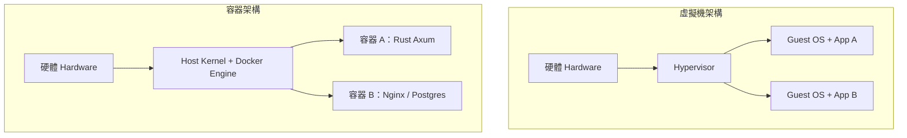

一句話記憶：**VM 是「一人一棟房」，容器是「一人一間套房、共用大樓水電」。**

#### Namespace（命名空間）：你能看見什麼

Linux 提供 8 種 Namespace，每種負責隔離一種全域資源。可用 `lsns` 與 `unshare` 親手驗證。

| Namespace | 隔離對象（Isolation Target） | 容器用途實例 |
|---|---|---|
| `pid` | 行程編號（Process ID） | 容器內 PID 1 是你的 Rust 主行程，看不見宿主行程 |
| `net` | 網路堆疊（Network Stack） | 每個容器有獨立 eth0、IP、iptables |
| `mnt` | 掛載點（Mount Points） | 容器根目錄 `/` 來自映像檔層（Layer） |
| `uts` | 主機名稱（Hostname） | `hostname myapp` 只影響容器內 |
| `ipc` | 行程間通訊（IPC） | 訊息佇列、共享記憶體互不可見 |
| `user` | 使用者 ID（UID/GID） | 容器內 root 對應宿主普通 UID（Rootless 模式） |
| `cgroup` | Cgroup 視角 | 容器只看到自己的資源限制 |
| `time` | 系統時間（Time Namespace） | 容器可有獨立時鐘偏移 |

以下是最精簡、可實際運行的隔離實驗（Linux 宿主或 Docker Desktop 的 Linux VM 內執行）：

```bash
# 1. 觀察宿主的行程與主機名
ps aux | head -n 5
hostname

# 2. 用 unshare 建立 pid + uts + mount 隔離的新環境
sudo unshare --pid --uts --mount --fork --pidfile /tmp/unshare.pid bash

# 3. 在新環境內：改主機名、掛載獨立 proc，只看到自己
hostname container-demo
mount -t proc proc /proc
ps aux        # 只看到 bash 與 ps 本身
hostname      # 顯示 container-demo，宿主不受影響
exit
cat /tmp/unshare.pid
```

> 在 macOS 上 `unshare` 無法直接執行，請進入 Docker 容器實驗：`docker run --rm -it ubuntu bash`，再於容器內執行 `ps aux` 與 `hostname` 對比宿主，即可體會 `pid` 與 `uts` 隔離。

#### Cgroups（控制群組）：你能用多少

Namespace 管「可見性」，Cgroups 管「配額（Quota）」。v2 版本以單一階層管理 cpu、memory、io、pids 四大控制器（Controller）。

```bash
# 查看 Cgroups v2 掛載與控制器
mount | grep cgroup
cat /sys/fs/cgroup/cgroup.controllers

# 用 Docker 驗證 memory 限制：限制 128MB，超過即 OOMKilled
docker run --rm --memory 128m --name mem-demo ubuntu \
  bash -c "cat /sys/fs/cgroup/memory.max; free -m"

# 用 Docker 驗證 CPU 限制：0.5 顆 CPU
docker run --rm --cpus 0.5 --name cpu-demo ubuntu \
  bash -c "cat /sys/fs/cgroup/cpu.max"
```

對應到本書後續章節：Compose 的 `deploy.resources.limits`（3.x / 4.x 語法）與 Kubernetes 的 `resources.requests/limits`，底層最終都轉譯為這兩個檔案的數值。

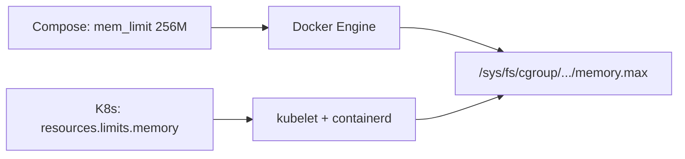

#### 動手做：一個 Rust 行程的隔離視角

```rust
// src/main.rs：編譯後分別在宿主與容器執行，觀察差異
use std::fs;

fn main() {
    let stat = fs::read_to_string("/proc/1/comm").unwrap_or("unknown".into());
    println!("PID 1 comm: {}", stat.trim());
    // 2. 觀察 hostname（uts namespace）
    let hostname = fs::read_to_string("/etc/hostname").unwrap_or("unknown".into());
    println!("hostname file: {}", hostname.trim());
    // 3. 觀察 memory 上限（cgroup）
    let mem_max = fs::read_to_string("/sys/fs/cgroup/memory.max")
        .unwrap_or("no-cgroup-v2".into());
    println!("memory.max: {}", mem_max.trim());
}
```

```bash
# 本機執行 vs 容器執行對照
cargo run
docker build -t ns-demo -f- . <<'EOF'
FROM rust:1.78-bookworm AS build
WORKDIR /app
COPY src ./src
COPY Cargo.toml ./
RUN cargo build --release
FROM debian:bookworm-slim
COPY --from=build /app/target/release/ns-demo /usr/local/bin/ns-demo
CMD ["ns-demo"]
EOF
docker run --rm --hostname rust-in-box --memory 256m ns-demo
```

#### 本節小結

- **VM 虛擬硬體、容器隔離行程**：前者靠 Hypervisor，後者靠 Namespace + Cgroups
- **Namespace（命名空間）** 決定「看見什麼」：pid、net、mnt、uts、ipc、user、cgroup、time
- **Cgroups（控制群組）** 決定「能用多少」：cpu、memory、io、pids，v2 統一階層
- `unshare`、`lsns`、`/sys/fs/cgroup` 是驗證隔離最直接的三把刀
- 後續 Compose / K8s 的所有資源欄位，都只是這層核心機制的宣告式封裝

#### 想一想

1. 既然容器共用 Host Kernel，為什麼 `FROM ubuntu` 的容器能在任何 Linux 發行版宿主上跑？那 `FROM scratch` 的 musl 靜態 Rust 二進位檔又為何連作業系統都不需要？
2. 容器內看到的 `free -m` 總量常常是宿主總量而非限制值，這會對 JVM、Node.js 等依總記憶體自動調優的 Runtime 造成什麼誤判？Rust 為何相對免疫？
3. 如果攻擊者從容器逃逸（Container Escape）到宿主，他最可能利用的是 Namespace 還是 Kernel 漏洞？Seccomp 與 Rootless 模式分別堵住了哪一層？


### 1.2 技術棧選型：Rust 高併發核心 × 多樣化 Web 前端

#### 從一個問題開始

本書要同時處理三種 Web 架構——單頁應用（Single-Page Application, SPA）、伺服器端渲染（Server-Side Rendering, SSR）、多頁應用（Multi-Page Application, MPA）——後端卻只選一種語言：Rust。這是偏執還是深思熟慮？

答案藏在兩個現實裡：第一，現代前端沒有銀彈，後台系統要 SPA、行銷官網要 SSR/SEO、內部工具要 MPA/HTMX 快打快收；第二，無論前端怎麼變，後端都要面對 WebSocket（全雙工長連線）推送、SSR 的高頻 API 聚合、以及容器化後的嚴苛記憶體限制。Rust 的非同步執行期（Async Runtime）與零成本抽象（Zero-Cost Abstraction），恰好是同時吃下這三者的最小公約數。

#### 後端為何選 Rust：Axum vs Actix

| 考量（Concern） | Rust + Tokio 生態 | Node.js（Node） | Go |
|---|---|---|---|
| **長連線併發** | 單執行緒可撐數萬 WebSocket 連線，記憶體每連線僅 KB 級 | 事件迴圈（Event Loop）強，但 CPU 密集易阻塞 | Goroutine（協程）輕量，但每連線記憶體高於 Rust |
| **記憶體佔用** | 無 GC（Garbage Collector），RSS 常駐 < 20 MB | V8 堆積 + GC 暫停，基準即上百 MB | GC + Runtime，基準數十 MB |
| **型別安全** | 所有權（Ownership）+  Send/Sync 在編譯期擋住資料競爭 | any + 執行期錯誤，需靠測試補 | 有 GC 但缺乏泛型約束的嚴格性（已改善） |
| **容器映像檔** | musl 靜態編譯可 < 10 MB，`FROM scratch` | 需 Node Runtime，基準 > 100 MB | 靜態編譯約 15–30 MB |
| **學習曲線** | 陡峭（借用檢查器 Borrow Checker） | 平緩 | 平緩 |

本書以後端框架二選一為主：

| | Axum | Actix Web（Actix） |
|---|---|---|
| **背書** | Tokio 官方團隊維護，與 Tower 中介層（Middleware）生態整合 | 歷史最久、生態最大，TechEmpower 常年霸榜 |
| **風格** | 函式式路由 + Extractor（提取器），型別推導優雅 | Actor（演員模型）+ 巨集路由，效能極致 |
| **適合誰** | 新專案、要接 Tower-HTTP、OpenAPI、WebSocket | 已有 Actix 生態、追求裸機吞吐 |
| **本書立場** | 預設範例用 Axum，效能對照組給 Actix | 第 4 章 Compose 範例兩者可互換 |

可運行的最小 Axum 後端（含 WebSocket 升級）：

```rust
// Cargo.toml: axum = "0.7", tokio = { version = "1", features = ["full"] }
use axum::{Router, routing::get, extract::ws::{WebSocketUpgrade, WebSocket, Message}};

async fn ws_handler(ws: WebSocketUpgrade) -> impl axum::response::IntoResponse {
    ws.on_upgrade(|mut socket: WebSocket| async move {
        while let Some(Ok(Message::Text(t))) = socket.recv().await {
            let _ = socket.send(Message::Text(format!("echo: {t}"))).await;
        }
    })
}

#[tokio::main]
async fn main() {
    let app = Router::new()
        .route("/health", get(|| async { "ok" }))
        .route("/ws", get(ws_handler));
    let listener = tokio::net::TcpListener::bind("0.0.0.0:3000").await.unwrap();
    axum::serve(listener, app).await.unwrap();
}
```

```bash
cargo run &
curl -s localhost:3000/health  # 應回 ok
```

#### 前端三條路：SPA vs SSR vs MPA/HTMX

| | SPA（React + Vite） | SSR/Fullstack（Next.js / Remix） | MPA + HTMX（Rust Tera 樣板） |
|---|---|---|---|
| **渲染位置** | 瀏覽器端（Client-Side Rendering） | 伺服器端首屏渲染 + 水合（Hydration） | 伺服器端樣板直出 HTML（Server-Rendered HTML） |
| **SEO** | 弱（需預渲染 Prerendering） | 強，天生適合行銷頁 | 強，純 HTML |
| **互動複雜度** | 高（Dashboard、編輯器） | 中高（電商、BBS） | 低中（CRUD、內部工具） |
| **後端依賴** | 純靜態檔，可丟 CDN + Nginx | 需 Node Runtime 常駐，記憶體敏感 | 無需 Node，Rust 直出，映像檔最小 |
| **容器形態** | `nginx:alpine` 託管 dist（約 25 MB） | `node:20-slim` 跑 standalone（約 150 MB） | `scratch` 跑 Rust 二進位檔（約 8 MB） |
| **代表指令** | `vite build` | `next build && next start` | `cargo build --release` |

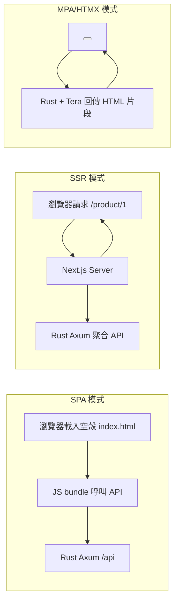

#### 何時選誰：決策表（Decision Matrix）

| 情境 | 推薦 | 理由 |
|---|---|---|
| 內部管理後台、高互動 Dashboard | SPA + Rust API | 前後端分離部署，Nginx 快取靜態檔，Rust 專心做 API 與 WebSocket |
| 行銷官網、電商、需 SEO 與首屏秒開 | SSR（Next.js standalone） | 首屏由 Node 直出，Rust 做 BFF（Backend for Frontend）聚合層 |
| CRUD 內部工具、MVP 兩週上線 | MPA + HTMX + Tera | 零 Node 依賴、零建置步驟，一個 Rust 二進位檔即全站 |
| 萬人聊天室、即時看板推播 | Rust WebSocket 中心 + 任意前端 | Tokio 單機數萬連線，Node/Go 同規格成本高 3–10 倍 |
| 記憶體限制 < 128 MB 的邊緣節點 | MPA 或 SPA，避開 SSR | Next.js 基準即 150–300 MB，Rust + Nginx 可壓在 30 MB 內 |

Rust 高併發長連線優勢一瞥（概念性基準，實測以 TechEmpower 為準）：單 Pod 1 vCPU / 512 MB 可維持約 3 萬條閒置 WebSocket 連線仍可正常廣播，而同規格 Node 約在 8 千–1.2 萬連線後 GC 暫停明顯拉高 p99 延遲。這正是第 3.3 節敢用「一個 Rust 行程扛全站」做 MPA 的底氣。

#### 本書約定：一個後端、三種前端

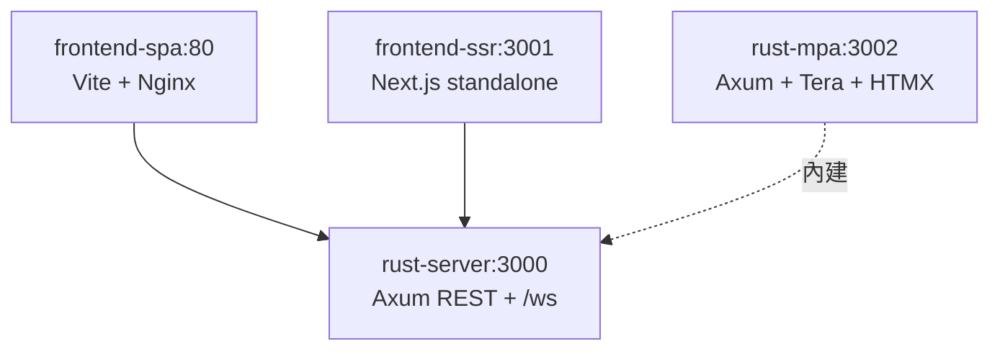

全書 Compose（4.2 節）會同時啟動這四個服務，讓你用 `http://localhost:8080`（SPA）、`:8081`（SSR）、`:8082`（MPA）親手比較差異，而後端永遠是同一個 Rust 映像檔。

#### 本節小結

- **後端統一 Rust**：Axum 預設、Actix 對照，換取無 GC、低記憶體、強長連線能力
- **前端三轨並行**：SPA 重互動、SSR 重 SEO 首屏、MPA/HTMX 重交付速度與體積
- **決策看三軸**：互動複雜度、SEO/首屏需求、記憶體與維運預算
- 全書以「同一 Rust API 配三種前端」貫穿，容器化差異即教學主線

#### 想一想

1. 如果你的團隊只有兩人、兩週要交付一個有登入與報表的內部系統，你會選 SPA、SSR 還是 HTMX？各自的建置與部署成本差在哪？
2. 為什麼 SSR 節點的記憶體限制（memory limits）要比 Rust API 寬鬆 5–10 倍？這對 Kubernetes 的 requests/limits 設計有何啟示？
3. WebSocket 連線是有狀態（Stateful）的，這會給後面的 Kubernetes 水平擴展（Horizontal Scaling）帶來什麼麻煩？Stadeless API 與 Stateful 連線該如何分開部署？


### 1.3 開發環境：Docker Desktop、Podman 與 CLI 工具鏈

#### 從一個問題開始

新手第一天最常卡住的不是 Rust 語法，而是：「Docker Desktop 一直轉圈圈」「M1/M2 拉的映像檔在伺服器上跑不起來」「到底要裝 Docker 還是 Podman？」本節一次把開發環境講定：給出一條全書通用的工具鏈（Toolchain），並讓你在 10 分鐘內驗證 `docker buildx`、`kind` 與 `cargo` 全數可用。

#### Docker Desktop vs Podman：對照與選擇

| | Docker Desktop | Podman（+ Podman Desktop） |
|---|---|---|
| **架構** | Client–Daemon（需 dockerd 常駐，macOS/Windows 跑 Linux VM） | Daemonless（無守護行程，直接 fork/exec，相容 Docker CLI） |
| **授權** | 大型企業需付費訂閱 | 全開源（Apache-2.0），企業友善 |
| **相容性** | 原生 `docker compose`、`buildx`、`Extensions` 生態最齊 | `alias docker=podman` 大多可用，Compose 經 `podman-compose` 或 Podman v4 內建 |
| **Kubernetes 整合** | 內建單節點 K8s（One-Node K8s），開關一鍵 | 需搭配 kind / minikube / OpenShift |
| **本書建議** | 個人學習、macOS/Windows 首選，開箱即用 | Linux 伺服器、CI Runner、授權敏感企業首選 |
| **切換成本** | 低：OCI 標準下 Dockerfile / compose.yaml 通用 | 低：`podman run nginx` 與 Docker 語法幾乎一致 |

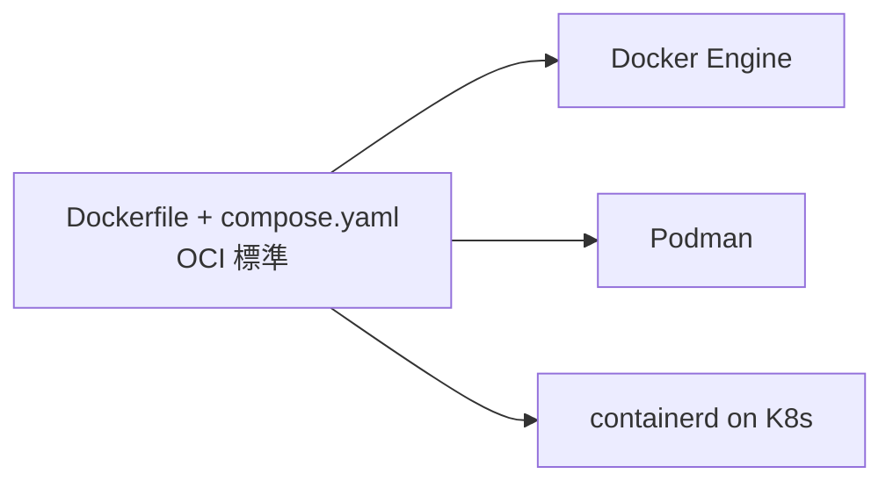

一句話：**學標準（OCI / Compose Spec），不綁工具**。本書指令以 `docker` 示範，Podman 用戶把 `docker` 換成 `podman` 即可，差異處會特別註明。

#### 一次裝好：各平台最小工具鏈

| 工具 | 版本要求 | 用途 | 驗證指令 |
|---|---|---|---|
| Docker Desktop / Podman | ≥ 4.x / ≥ 4.9 | 建置與執行容器 | `docker version && docker info` |
| Buildx（多架構建置） | 隨 Docker 附帶 | 建 `linux/amd64` + `arm64` 映像檔 | `docker buildx version` |
| Compose | v2.x（`docker compose` 無橫線） | 本地全棧編排（第 4 章） | `docker compose version` |
| Rust（rustup） | stable ≥ 1.78 | 後端編譯 | `cargo --version && rustc --version` |
| Node.js | LTS 20.x | SPA/SSR 前端建置 | `node -v && npm -v` |
| kind / kubectl | kind ≥ 0.22 | 本地 K8s（第 5 章起） | `kind version && kubectl version --client` |

```bash
# macOS（Homebrew）一鍵安裝
brew install --cask docker
brew install rustup node@20 kind kubectl
rustup-init -y && source "$HOME/.cargo/env"

# Ubuntu / Debian
sudo apt-get update && sudo apt-get install -y docker.io docker-compose-plugin
curl --proto '=https' --tlsv1.2 -sSf https://sh.rustup.rs | sh -s -- -y
# Podman 替代方案（Ubuntu 22.04+）
sudo apt-get install -y podman podman-compose

# 驗證全鏈路（全部應回傳版本號）
docker version && docker compose version && docker buildx version
cargo --version && node -v && kind version
```

#### 第一個可運行驗證：Rust + Nginx 同時跑起來

```bash
# 1. Rust 後端連通性
cargo new --bin hello-rust && cd hello-rust
cargo run &                                  # 預設 8080 或自訂
curl -s localhost:8080 || echo "cargo ok, 自訂埠請改"

# 2. 容器引擎連通性（含多架構與 Compose）
docker run --rm hello-world                  # 引擎正常即印 Hello from Docker!
docker buildx ls                             # 應列出 default builder
docker compose version                       # v2.x 即後續章節可用
```

若 `hello-world` 在 Apple Silicon 上出現 `exec format error`，代表拉到錯誤架構（Architecture），解法是顯式指定平台（Platform）：

```bash
docker run --rm --platform linux/arm64 hello-world
docker buildx build --platform linux/amd64,linux/arm64 -t demo:multiarch .
```

#### CLI 日常：本書高頻指令速查

```bash
# 建置與除錯
docker build -t rust-server:dev -f Dockerfile .
docker run --rm -it -p 3000:3000 rust-server:dev sh
docker logs -f <container>          # 追日誌
docker exec -it <container> sh      # 進容器開刀

# Compose（第 4 章主戰場）
docker compose up -d --build        # 背景啟動全棧
docker compose ps && docker compose logs -f api
docker compose down -v              # 停機並清 Volume（小心資料）

# 清理磁碟（Rust 建置快取很肥，定期執行）
docker system df
docker builder prune -f
```

> Podman 對應：`podman machine init && podman machine start`（macOS 需先啟 VM），其餘把 `docker` 換字即可；`docker compose` 對應 `podman-compose up` 或 `podman compose`（v4.7+）。

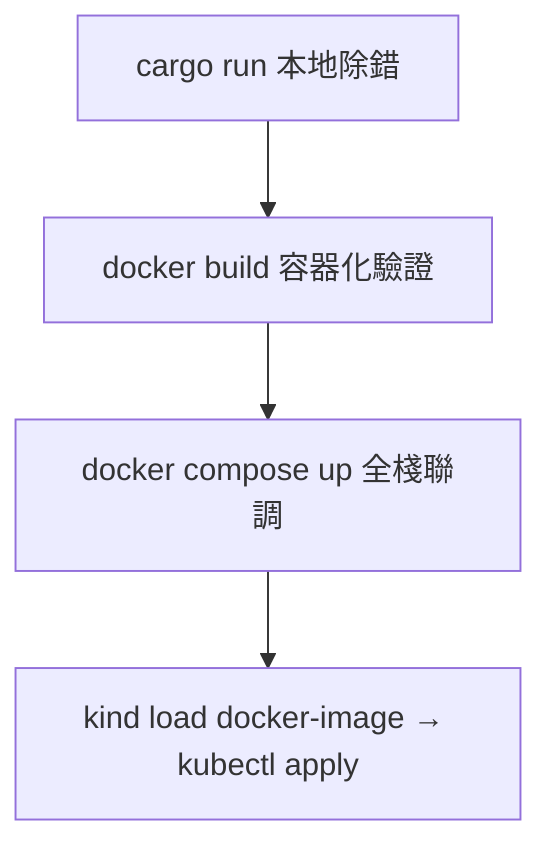

#### 本節小結

- **綁標準不綁工具**：Dockerfile / OCI / Compose 通吃 Docker 與 Podman
- **最小工具鏈六件套**：Docker（Buildx+Compose）、Rust、Node、kind/kubectl，版本先對齊再開工
- **多架構意識**：Apple Silicon 開發、linux/amd64 上線是常態，`--platform` 與 buildx 是必修
- 高頻指令只有三組：`run/exec/logs` 單容器、`compose up/ps/down` 全棧、`builder prune` 清磁碟

#### 想一想

1. 為什麼 Docker Desktop 在 macOS 上一定要跑一個 Linux VM？這對檔案掛載（Bind Mount）效能與 `inotify` 熱重載有什麼影響？
2. 你的 CI Runner 若同時要編 Rust 又要建多架構映像檔，應該選 Docker-in-Docker（DinD）還是 Podman？安全與快取層面各有什麼代價？
3. `docker compose up` 與 `kind + kubectl apply` 的界線在哪？什麼時候該從 Compose 畢業、切到本地 K8s 聯調？


## 二、Rust 後端服務的極致容器化（Multi-Stage Builds）


### 2.1 Rust 編譯特性與容器化挑戰

#### 從一個問題開始

同樣一句 `docker build .`，Node 專案 30 秒完成，Rust 專案卻跑 8 分鐘、磁碟多出 2 GB——是 Rust 不適合容器嗎？恰好相反：Rust 編譯慢、產物快（編譯慢、執行快），而容器的價值正在於把「慢的編譯」隔離在建置期（Build-time），把「快的執行」留給運行期（Run-time）。本節先理解 Rust 工具鏈為何又大又慢，後三節再逐一拆招。

#### Rust 為何編譯慢：三大根因

| 特性（Feature） | 帶來的執行期好處 | 付出的編譯期代價 |
|---|---|---|
| 單態化泛型（Monomorphization） | 零成本抽象，迭代器不輸手寫迴圈 | 每個泛型實例重複生成程式碼，LLVM 負載倍增 |
| 借用檢查（Borrow Checker）+ 龐大型別推導 | 無 GC、無資料競爭（Data Race） | 前端分析耗時，增量編譯單位大 |
| LLVM 優化（LTO / codegen-units=1） | release 二進位檔又小又快 | 連結（Linking）與優化動輒數分鐘 |
| 靜態連結（Static Linking）預設 | 執行期無依賴缺失 | 依賴圖（Dependency Graph）全量參與連結 |

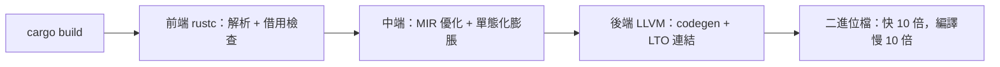

一個實測體感數字（Axum + Tokio + SQLx 中型專案，M1 Pro）：`debug` 約 40 秒、`release` 約 3–6 分鐘、`target/` 約 1.5–3 GB。這三個數字就是容器化要馴服的對象。

#### 容器化的四重挑戰

| 挑戰 | 症狀 | 不處理的後果 |
|---|---|---|
| **建置慢** | 每改一行就重編全量依賴 | CI 10 分鐘起跳，開發者不敢推程式碼 |
| **層快取失效** | `COPY . .` 在前、`cargo build` 在後 | 改 README 也重抓 crates.io，快取全毀 |
| **映像檔肥大** | `FROM rust:1.78` 直出（約 1.2 GB） | 推送慢、K8s 調度慢、CVE 掃描滿江紅 |
| **平台漂移** | 本機 arm64、雲端 amd64、glibc/musl 混雜 | `exec format error` 或缺 `libssl.so` 啟動即崩 |

可運行的「肥大原型」——先讓問題現形：

```dockerfile
# Dockerfile.fat：能跑，但又肥又慢（對照組，勿用於生產）
FROM rust:1.78-bookworm
WORKDIR /app
COPY . .
RUN cargo build --release
CMD ["./target/release/rust-server"]
```

```bash
docker build -f Dockerfile.fat -t rust-fat:1.0 .
docker images rust-fat:1.0        # 約 1.5–2 GB
docker history rust-fat:1.0       # 觀察 target/ 與工具鏈層佔比
time docker build -f Dockerfile.fat -t rust-fat:1.0 .  # 二次建置仍慢
```

#### 挑戰全景圖：後三節的解法地圖

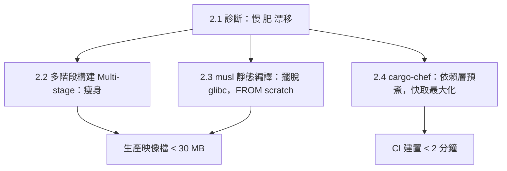

核心原則只有兩句：**層（Layer）是有順序的快取**——把不常變的依賴編譯放前面；**產物（Artifact）與工具鏈分離**——運行期映像檔只留二進位檔與必要 CA 證書（CA Certificates）。

#### 先做一次體檢：你的專案有多「肥」

```bash
# 1. 依賴數量與特徵（Features）盤點
cargo tree --depth 1 | head -n 30
cargo bloat --release --crates 2>/dev/null | head -n 20 || echo "可選裝 cargo-bloat"

# 2. target 體積與最大產物
du -sh target/ 2>/dev/null
du -sh target/release/rust-server 2>/dev/null

# 3. 動態連結依賴（musl 化前先看清敵人）
ldd target/release/rust-server | head -n 20
```

```toml
# Cargo.toml 體檢清單：關掉不需要的預設特徵最立竿見影
[dependencies]
tokio = { version = "1", features = ["rt-multi-thread", "macros"] } # 別全開 full
sqlx = { version = "0.7", default-features = false, features = ["postgres", "runtime-tokio"] }
```

#### 本節小結

- Rust「編譯慢、執行快」是設計取捨：單態化 + LLVM + 靜態連結換來無 GC 與極致效能
- 容器化四痛：建置慢、快取失效、映像檔肥、平台漂移
- 解方總綱：**依賴層前置快取、多階段分離產物、musl 靜態化、chef 預煮依賴**
- 任何優化前先量測：`docker history`、`du -sh target/`、`ldd` 是三大體檢儀

#### 想一想

1. 為什麼 `COPY . .` 放在 `RUN cargo build` 之前會毀掉 Docker 層快取？如果把 `Cargo.toml` 先複製、依賴先編，會發生什麼不同的快取行為？
2. `debug` 與 `release` 的編譯产物在優化等級（Opt-level）與除錯符號（Debug Symbols）上有何差異？為什麼運行期映像檔絕不能用 debug 建置？
3. 靜態連結讓 Rust 擺脫 `libssl.so` 地獄，但 OpenSSL 本身仍需系統庫；改用 `rustls`（純 Rust TLS）對 musl 靜態編譯有何決定性幫助？


### 2.2 多階段構建到 Alpine 與 Distroless

#### 從一個問題開始

2.1 節的 `Dockerfile.fat` 把編譯器（rustc）、原始碼、`target/` 全塞進同一個映像檔——就像把鷹架跟大樓一起交付給住戶。多階段構建（Multi-stage Build）要做的只有一件事：**建置階段（Build Stage）用重型工具鏈，運行階段（Runtime Stage）只留執行產物**。本節給出可直接上線的完整 Dockerfile，並比較 Alpine 與 Distroless 兩條運行路線。

#### 多階段核心語法：四個關鍵字

| 語法 | 作用 | 本書用法 |
|---|---|---|
| `FROM ... AS <stage>` | 命名建置階段 | `AS chef` / `AS builder` / `AS runtime` |
| `COPY --from=<stage>` | 跨階段只搬產物 | 只搬 `target/release/rust-server` |
| `RUN --mount=type=cache` | BuildKit 快取掛載（不進層） | 快取 `~/.cargo` 與 `target/` |
| `ARG` / `TARGETPLATFORM` | 建置參數與平台感知 | 多架構、`APP_VERSION` 注入 |

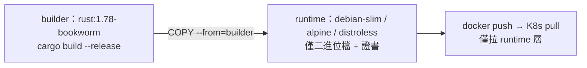

#### 完整 Dockerfile：Builder + Runtime（glibc 路線，最穩）

```dockerfile
# syntax=docker/dockerfile:1
ARG RUST_VERSION=1.78
ARG APP_NAME=rust-server

# ---------- Stage 1: builder ----------
FROM rust:${RUST_VERSION}-bookworm AS builder
WORKDIR /app
ARG APP_NAME
COPY Cargo.toml Cargo.lock ./
COPY src ./src
# 啟用 BuildKit 快取掛載：cargo registry 與 target 不進層、可跨次建置重用
RUN --mount=type=cache,target=/usr/local/cargo/registry \
    --mount=type=cache,target=/app/target \
    cargo build --release --bin ${APP_NAME} && \
    cp /app/target/release/${APP_NAME} /tmp/app

# ---------- Stage 2: runtime ----------
FROM debian:bookworm-slim AS runtime
RUN apt-get update && apt-get install -y --no-install-recommends ca-certificates \
    && rm -rf /var/lib/apt/lists/*
COPY --from=builder /tmp/app /usr/local/bin/app
USER 65532:65532
EXPOSE 3000
ENV RUST_LOG=info
HEALTHCHECK --interval=30s --timeout=3s CMD ["/usr/local/bin/app", "--health-check"]
ENTRYPOINT ["/usr/local/bin/app"]
```

```bash
DOCKER_BUILDKIT=1 docker build -t rust-server:slim .
docker images rust-server:slim        # 約 80–100 MB（含 debian-slim）
docker run --rm -p 3000:3000 rust-server:slim
curl -s localhost:3000/health
```

#### Alpine vs Distroless：運行基底對照

| | Debian Slim（本節預設） | Alpine | Distroless（cc / base） |
|---|---|---|---|
| **大小** | 約 70 MB 基底 | 約 5 MB 基底 | 約 20 MB 基底 |
| **libc** | glibc，與 builder 一致，最無痛 | musl，需 musl 目標或靜態編譯 | glibc，但無 shell 與套件管理器 |
| **除錯** | `apt-get` + shell 齊全 | `apk add` 方便 | 無 shell，`docker exec` 進不去，需 debug 標籤 |
| **CVE 面積** | 中 | 小 | 極小（Google 維護、簽名） |
| **適用** | 預設生產選擇 | 追求極小且能處理 musl 差異時 | 安全合規最嚴、需 SLSA 供應鏈時 |

Alpine 變體（需切 musl target，詳見 2.3 節）：

```dockerfile
# Alpine runtime 片段：builder 需先 rustup target add x86_64-unknown-linux-musl
FROM alpine:3.19 AS runtime-alpine
RUN apk add --no-cache ca-certificates
COPY --from=builder /tmp/app /usr/local/bin/app
USER 65532:65532
ENTRYPOINT ["/usr/local/bin/app"]
```

Distroless 變體（無 shell，Healthcheck 改由 K8s exec 以外的探針承擔）：

```dockerfile
FROM gcr.io/distroless/cc-debian12 AS runtime-distroless
COPY --from=builder /tmp/app /app
USER 65532:65532
ENTRYPOINT ["/app"]
```

#### 常見陷阱：USER、時區、CA 證書三件套

```dockerfile
# 生產 runtime 必備三行，少一行半夜就被叫醒
RUN apt-get update && apt-get install -y --no-install-recommends \
    ca-certificates tzdata && rm -rf /var/lib/apt/lists/*
USER 65532:65532   # 非 root 執行（Non-root），配合 K8s runAsNonRoot
ENV TZ=Asia/Taipei
```

```bash
# 驗證非 root 與證書
docker run --rm rust-server:slim whoami          # 應非 root（debian 有 whoami）
docker run --rm rust-server:slim ls /etc/ssl/certs/ca-certificates.crt
```

#### 本節小結

- 多階段 = **builder 留工具鏈、runtime 只留二進位檔**，`COPY --from` 是唯一橋樑
- 預設選 **Debian Slim**：glibc 一致、除錯友善；要更小選 Alpine（musl）、要最安全選 Distroless
- BuildKit 的 `--mount=type=cache` 讓 cargo 快取不進層又跨次可用，是 2.4 節 chef 的前置觀念
- 生產三件套：`ca-certificates`、`USER non-root`、`HEALTHCHECK` 缺一不可

#### 想一想

1. `COPY --from=builder /app/target/release/app` 與先 `cp` 到 `/tmp/app` 再搬，兩者在層快取與權限（Permissions）上有何差異？
2. Distroless 沒有 shell，`HEALTHCHECK CMD` 與 `kubectl exec` 都會失效，你該如何改用 HTTP 探針（Liveness/Readiness Probe）來取代？
3. 為什麼 `USER 65532` 要放在 `COPY` 之後？`COPY --chown` 與運行期 `USER` 的搭配如何影響 K8s 的 `fsGroup` 與 Volume 寫入權限？


### 2.3 musl 靜態編譯：把 Rust 壓進 20 MB 以內

#### 從一個問題開始

2.2 節的 Debian Slim 運行映像檔約 80–100 MB，其中 70 MB 是作業系統。能不能連作業系統都不要？可以——只要 Rust 二進位檔是**靜態連結（Statically Linked）**的，就能跑在 `FROM scratch`（空映像檔）上。本節用 musl 目標（musl Target）把 Axum 後端壓到 20 MB 以內，並講清 glibc（GNU C Library）與 musl 的取捨。

#### glibc vs musl：為何需要靜態編譯

| | glibc 動態連結（預設） | musl 靜態連結 |
|---|---|---|
| **連結方式** | 執行期載入 `/lib/libc.so`，需基底 OS 提供 | 編譯期全部打包，`ldd` 顯示 `not a dynamic executable` |
| **映像檔** | 至少 debian-slim（約 80 MB） | `scratch` + 單一二進位檔（約 5–15 MB） |
| **DNS/時區坑** | 無，glibc 行為標準 | musl 的 DNS 與 jemalloc 相容性需測試 |
| **TLS 建議** | OpenSSL 可用系統庫 | 改用 `rustls`（純 Rust TLS）避開 C 依賴 |
| **效能** | malloc 經高度優化 | 預設 malloc 較慢，高併發可換 `mimalloc` |

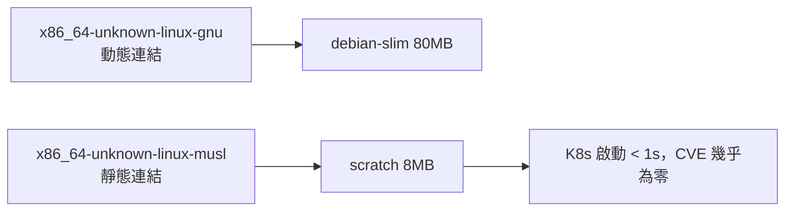

#### 完整 Dockerfile：musl + scratch（可運行）

```dockerfile
# syntax=docker/dockerfile:1
FROM rust:1.78-alpine AS builder
WORKDIR /app
# Alpine 自帶 musl 工具鏈，另裝靜態連結必備件
RUN apk add --no-cache musl-dev openssl-libs-static
RUN rustup target add x86_64-unknown-linux-musl
ARG APP_NAME=rust-server
COPY Cargo.toml Cargo.lock ./
COPY src ./src
RUN --mount=type=cache,target=/usr/local/cargo/registry \
    --mount=type=cache,target=/app/target \
    cargo build --release --target x86_64-unknown-linux-musl --bin ${APP_NAME} && \
    cp /app/target/x86_64-unknown-linux-musl/release/${APP_NAME} /tmp/app && \
    strip /tmp/app

# CA 證書需另起一階段萃取（scratch 內無 apt/apk）
FROM alpine:3.19 AS certs
RUN apk add --no-cache ca-certificates

FROM scratch
COPY --from=certs /etc/ssl/certs/ca-certificates.crt /etc/ssl/certs/
COPY --from=builder /tmp/app /app
USER 65532:65532
EXPOSE 3000
ENTRYPOINT ["/app"]
```

```bash
DOCKER_BUILDKIT=1 docker build -t rust-server:musl .
docker images rust-server:musl       # 目標 < 20 MB
docker run --rm -p 3000:3000 rust-server:musl &
curl -s localhost:3000/health
# 驗證真是靜態連結（需有 shell 的 builder 階段或本機 target 檔）
ldd target/x86_64-unknown-linux-musl/release/rust-server || echo "static ok"
```

#### 體積對比：四條路線實測表

| 建置路線 | 基底 | 典型大小 | 啟動速度 | 備註 |
|---|---|---|---|---|
| `rust:bookworm` 單階段（2.1 對照組） | bookworm 全工具鏈 | 約 1.5 GB | 慢 | 僅供除錯 |
| 多階段 + debian-slim（2.2） | glibc 動態 | 約 80–100 MB | 快 | 生產預設 |
| 多階段 + alpine | musl 動態/靜態 | 約 15–30 MB | 很快 | 需測 DNS/TLS |
| musl + `scratch`（本節） | 無 OS | **約 6–15 MB** | 極快 | 最小 CVE |

再壓 20% 的三板斧（Cargo.toml / config）：

```toml
[profile.release]
strip = true            # 去除符號表（Symbols）
opt-level = "z"         # 體積優先（或 "s"）
lto = true              # 連結期優化（Link-Time Optimization）
codegen-units = 1       # 單元合併，更小但編譯更慢
panic = "abort"         # 不需要 unwind 時可省體積
```

```bash
# 本機一鍵體檢三連
ls -lh target/x86_64-unknown-linux-musl/release/rust-server
docker images --format '{{.Repository}}:{{.Tag}} {{.Size}}' | grep rust-server
dive rust-server:musl 2>/dev/null || docker history rust-server:musl
```

#### 常見失敗：scratch 除錯三招

- **啟動即 exit 1 且無日誌**：多半缺 CA 證書或監聽 `127.0.0.1` 而非 `0.0.0.0`，改繫結 `0.0.0.0:3000`。
- **DNS 解析失敗**：musl resolver 行為與 glibc 不同，Alpine 階段先 `getent hosts` 驗證，必要時換回 slim。
- **無 shell 怎麼除錯**：建 `Dockerfile.debug` 改 `FROM alpine` 暫代 runtime，或用 `kubectl debug` 掛 ephemeral 容器。

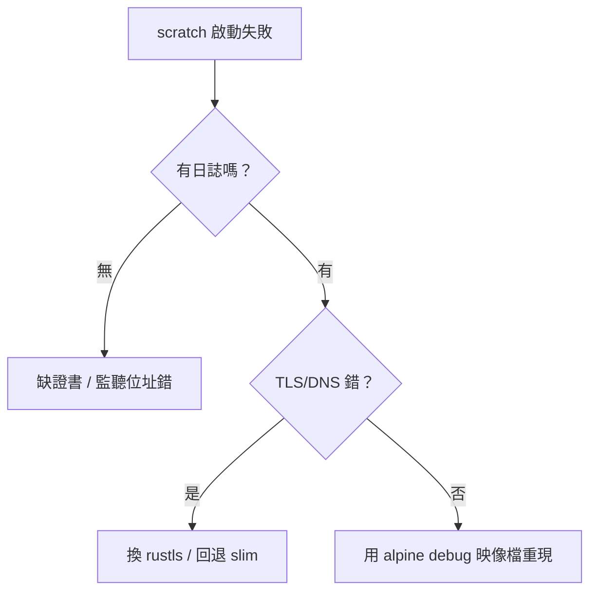

#### 本節小結

- musl 靜態編譯 + `scratch` 是最小體積路線：**Axum 後端可 < 20 MB，比 Node 基底小一個數量級**
- 代價是 musl 相容性測試與無 shell 除錯，需搭配 rustls 與 alpine-debug 流程
- `strip + opt-level=z + lto` 三板斧常再省 20–30%
- 選型建議：預設 slim、邊緣/Serverless 用 scratch、安全合規用 Distroless

#### 想一想

1. 為什麼 `scratch` 映像檔裡連 `sh` 都沒有，卻能執行 Rust 二進位檔？動態連結與靜態連結在 `execve` 時對 `/lib` 的依賴有何根本差異？
2. `panic = "abort"` 省體積但會失去什麼除錯資訊？在 Kubernetes 中這會如何影響 `RUST_BACKTRACE` 與 crash-loop 的可觀測性？
3. 如果你的 Rust 服務依賴 `openssl-sys`（C 綁定），musl 靜態編譯會遇到什麼坑？為什麼全書推薦 `rustls + tokio-rustls`？


### 2.4 cargo-chef 加速 CI/CD：三段式 Dockerfile 讓重建從 8 分鐘變 1 分鐘

#### 從一個問題開始

多階段解決了「肥」，卻沒解決「慢」：每次改一行業務程式碼，Docker 就重編 300 個 crates。cargo-chef 的想法很直白——把**依賴編譯（Dependencies Build）**與**業務編譯（App Build）**切成兩層，只要 `Cargo.toml`/`Cargo.lock` 沒變，依賴層就命中快取（Cache Hit）。本節給出全書標準三段式 Dockerfile，CI 直接快一個數量級。

#### 原理：為何切三段就能命中快取

Docker 層快取以「指令 + 前層檔案雜湊」為鍵。傳統寫法 `COPY . .` 把原始碼變動混入依賴層；chef 把依賴清單先「煮」（cook）成可快取層。

| 階段（Stage） | 指令 | 快取失效條件 |
|---|---|---|
| `planner` | `cargo chef prepare --recipe-path recipe.json` | 依賴宣告變動時 |
| `cacher`（builder 前半） | `cargo chef cook --release --recipe-path recipe.json` | 同上；命中時跳過數分鐘編譯 |
| `builder`（後半） | `cargo build --release` | 原始碼變動時（僅重編業務 crate） |

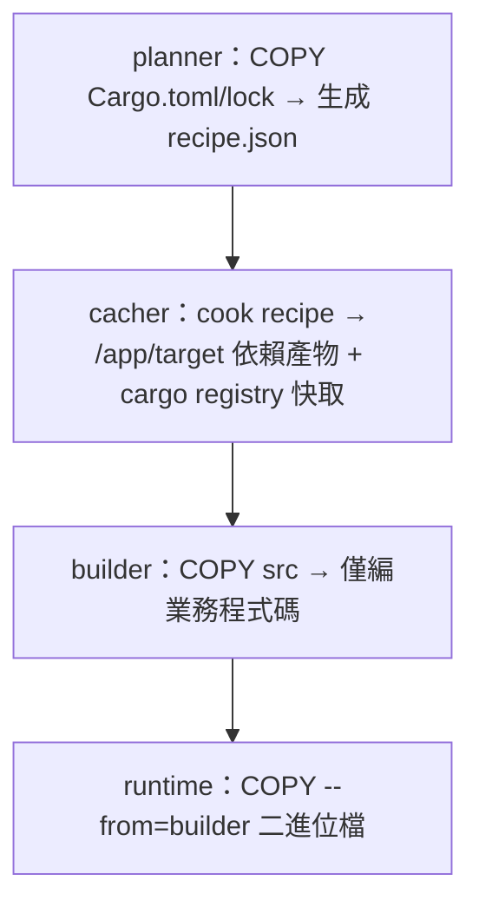

#### 三段式 Dockerfile（完整可運行，本書 CI 標準）

```dockerfile
# syntax=docker/dockerfile:1
ARG RUST_VERSION=1.78
ARG APP_NAME=rust-server
FROM rust:${RUST_VERSION}-bookworm AS chef
WORKDIR /app
RUN cargo install cargo-chef --locked

FROM chef AS planner
COPY Cargo.toml Cargo.lock ./
COPY src ./src
RUN cargo chef prepare --recipe-path recipe.json

FROM chef AS builder
ARG APP_NAME
COPY --from=planner /app/recipe.json recipe.json
# 先煮依賴：此層僅在 recipe 變動時重建
RUN --mount=type=cache,target=/usr/local/cargo/registry \
    --mount=type=cache,target=/app/target \
    cargo chef cook --release --recipe-path recipe.json
# 再編業務：日常改碼只跑這一層
COPY Cargo.toml Cargo.lock ./
COPY src ./src
RUN --mount=type=cache,target=/usr/local/cargo/registry \
    --mount=type=cache,target=/app/target \
    cargo build --release --bin ${APP_NAME} && \
    cp /app/target/release/${APP_NAME} /tmp/app

FROM debian:bookworm-slim AS runtime
RUN apt-get update && apt-get install -y --no-install-recommends ca-certificates \
    && rm -rf /var/lib/apt/lists/*
COPY --from=builder /tmp/app /usr/local/bin/app
USER 65532:65532
EXPOSE 3000
ENTRYPOINT ["/usr/local/bin/app"]
```

```bash
# 驗證快取：第一次慢、第二次改 src 後極快
DOCKER_BUILDKIT=1 time docker build -t rust-chef:1 .
echo "// touch" >> src/main.rs
DOCKER_BUILDKIT=1 time docker build -t rust-chef:2 .
docker history rust-chef:2 | head -n 15   # 觀察 cook 層顯示 CACHED
```

#### CI 實戰：GitHub Actions 快取對照

| 策略 | 典型耗時（中型 Axum 專案） | 說明 |
|---|---|---|
| 無快取直編 | 約 7–10 分鐘 | 每次重抓 + 重編全量 |
| actions/cache 快取 `~/.cargo + target` | 約 3–5 分鐘 | 跨 runner 還原大 tarball，傳輸即成本 |
| chef 三段 + Buildx GHA 快取 | **約 1–2 分鐘** | 依賴層命中，只編業務增量 |
| chef + 自建 runner 快取 | 約 40–80 秒 | 最快，但需維護 runner 磁碟 |

```yaml
# .github/workflows/docker.yml 片段：Buildx GHA 快取 + 多架構
- uses: docker/setup-buildx-action@v3
- uses: docker/build-push-action@v6
  with:
    context: ./rust-server
    push: true
    tags: ghcr.io/myorg/rust-server:${{ github.sha }}
    cache-from: type=gha
    cache-to: type=gha,mode=max
    platforms: linux/amd64,linux/arm64
```

> Podman/GitLab 對應：GitLab 用 `cache: paths: [cargo-home/, target/]` 或 Kaniko `--cache=true`；概念相同——**依賴層與業務層分離，快取鍵綁 `Cargo.lock` 雜湊**。

#### 失效排查：chef 不快反而慢？

```bash
# 1. 確認 recipe 是否被意外改動（Cargo.lock 抖動是頭號兇手）
git diff Cargo.lock | head -n 40
# 2. 確認 cook 層是否命中
docker build --progress=plain -t x . 2>&1 | grep -i "CACHED.*cook\|cargo chef cook"
# 3. 鎖定依賴更新節奏：Renovate/Dependabot 每週批量，而非每次推碼
```

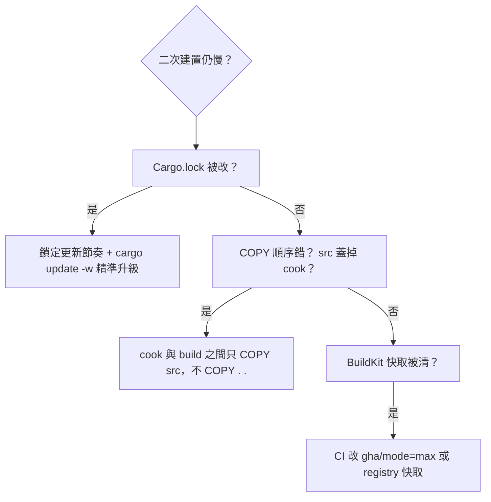

#### 本節小結

- chef 三段式 = planner 生成配方、cacher 預煮依賴、builder 只編業務，**日常改碼僅付增量成本**
- 配合 BuildKit `type=cache` 與 CI 的 GHA/Registry 快取，CI 可從 8 分鐘壓到 1–2 分鐘
- 快取鍵只有一個真理：`Cargo.lock` 沒變，依賴層就不該重建
- 本書後續所有 Rust Dockerfile 皆以此三段式為基底，僅換 runtime（slim/alpine/scratch）

#### 想一想

1. 為什麼 `COPY src ./src` 在 planner 階段是必要的，但在 builder 階段 cook 之前必須避免？`recipe.json` 到底萃取了什麼資訊？
2. BuildKit 的 `type=cache` 與 Registry/GHA 的層快取（Layer Cache）有何差異？什麼時候該用前者、什麼時候該用後者？
3. 如果把 chef 用在 monorepo（含多個 bin + workspace），`recipe.json` 會如何膨脹？你會如何用 `--bin` 與 workspace `exclude` 控制 cook 粒度？


## 三、多樣化 Web 架構的容器化策略


### 3.1 SPA 模式：React + Vite 建置、Nginx 託管

#### 從一個問題開始

後台 Dashboard、資料看板這類高互動頁面，最適合單頁應用（SPA）：Rust 只暴露 REST/WebSocket API，前端是純靜態檔（Static Assets）。問題來了：Node 建置產物該如何進容器，才不會把 300 MB 的 `node_modules` 也搬上生產？答案是前端經典兩段式——**Node 負責建置（Build），Nginx 負責託管（Serve）**。

#### SPA 容器化路線圖

| 階段 | 基底映像檔 | 產出 |
|---|---|---|
| build | `node:20-alpine` + `npm ci` + `vite build` | `dist/`（HTML/JS/CSS，約 1–5 MB） |
| runtime | `nginx:alpine`（約 25 MB） | 80 埠靜態託管 + `/api` 反向代理（Reverse Proxy） |

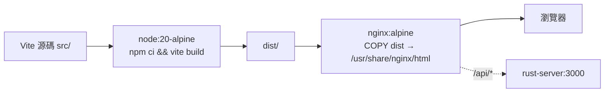

#### 完整可運行範例

```dockerfile
# frontend-spa/Dockerfile
FROM node:20-alpine AS build
WORKDIR /web
COPY package.json package-lock.json ./
RUN npm ci
COPY vite.config.ts tsconfig.json index.html ./
COPY src ./src
COPY public ./public
ARG VITE_API_URL=/api
ENV VITE_API_URL=${VITE_API_URL}
RUN npm run build   # 產出 /web/dist

FROM nginx:alpine AS runtime
COPY nginx.conf /etc/nginx/conf.d/default.conf
COPY --from=build /web/dist /usr/share/nginx/html
EXPOSE 80
CMD ["nginx", "-g", "daemon off;"]
```

```nginx
# frontend-spa/nginx.conf
server {
    listen 80;
    root /usr/share/nginx/html;
    index index.html;
    gzip on;
    gzip_types text/css application/javascript application/json;

    # SPA fallback：前端路由一律回 index.html
    location / {
        try_files $uri $uri/ /index.html;
        add_header Cache-Control "public, max-age=31536000, immutable" always;
    }

    # API 反向代理到 Rust（Compose 內服務名解析）
    location /api/ {
        proxy_pass http://api:3000/;
        proxy_set_header Host $host;
        proxy_set_header X-Forwarded-For $proxy_add_x_forwarded_for;
    }
    location /ws/ {
        proxy_pass http://api:3000/;
        proxy_http_version 1.1;
        proxy_set_header Upgrade $http_upgrade;
        proxy_set_header Connection "upgrade";
    }
}
```

```bash
# 本地驗證（含 API 代理需配合 Compose，或先單測靜態）
docker build -t frontend-spa:1 ./frontend-spa
docker run --rm -p 8080:80 frontend-spa:1 &
curl -s -o /dev/null -w "%{http_code}\n" localhost:8080/
curl -s localhost:8080/api/health || echo "需與 api 同網段（見 4.2）"
```

#### Vite 環境變數陷阱（預告 3.4 節）

| 誤區 | 真相 |
|---|---|
| `VITE_API_URL` 可在運行期改 | `Vite` 以 `VITE_` 前綴在**建置期硬編碼**進 bundle，運行期改環境變數無效 |
| 一個映像檔跑多環境 | 需改用 runtime `config.js` 或 `envsubst`（見 3.4 節），或按環境重建 |

```ts
// src/config.ts：建置期注入，寫法正確但語義是 build-time
export const API_URL = import.meta.env.VITE_API_URL ?? "/api";
```

#### 本節小結

- SPA 容器 = Node 建置 + Nginx 託管，生產層僅約 30 MB，無 Node Runtime
- `try_files ... /index.html` 是 SPA 路由的靈魂；`/api` 與 `/ws` 由 Nginx 反代到 Rust
- `VITE_*` 是建置期變數，多環境部署需 runtime 注入（3.4 節解法）
- 此模式是 4.2 節 `frontend-spa` 服務的直接來源

#### 想一想

1. 為什麼 `npm ci` 比 `npm install` 更適合 Docker 建置？`package-lock.json` 對層快取有何決定性影響？
2. `try_files $uri /index.html` 若漏寫，直接刷新 `/dashboard/users` 會發生什麼？Nginx 回 404 還是 Rust 回 404？
3. 靜態檔 `Cache-Control: immutable` 與 `index.html` 不可快取的搭配策略是什麼？Vite 的 hashed檔名（`app.abc123.js`）在其中扮演什麼角色？


### 3.2 SSR / Fullstack 模式：Next.js standalone、靜態抽離與記憶體考量

#### 從一個問題開始

行銷官網與電商需要 SEO（搜尋引擎優化）與首屏秒開，SPA 的空殼 `index.html` 不夠看——於是有了伺服器端渲染（SSR）與水合（Hydration）。代價是前端不再是靜態檔，而是一個常駐的 Node 伺服器。本節解決三件事：用 standalone 模式瘦身、用靜態資源抽離減壓、用記憶體限制（Memory Limits）避免 K8s OOM。

#### SSR 容器與 SPA 容器的根本差異

| | SPA（3.1） | SSR（本節 Next.js） |
|---|---|---|
| **運行期** | Nginx 靜態，無 JS 執行 | Node Server 常駐，每請求執行 React 渲染 |
| **映像檔大小** | 約 30 MB | 約 150–250 MB（含 Node + standalone + 快取） |
| **記憶體基準** | 約 10 MB | 約 150–300 MB，流量高時上看 1 GB |
| **擴展方式** | CDN 邊緣快取即可 | 需水平擴展 + `memory limits` 精算 |
| **與 Rust 關係** | 瀏覽器直呼 Rust API | Next.js Server 先聚合 Rust API 再吐 HTML（BFF 層） |

```mermaid
flowchart LR
    B[瀏覽器] --> N["Next.js Server:3001<br/>getServerSideProps 聚合"]
    N --> R["rust-server:3000<br/>/api/products"]
    N --> B
    N -.靜態資源._-> C[CDN / Nginx 快取 _next/static]
```

#### 完整 Dockerfile：standalone 模式（可運行）

```dockerfile
# frontend-ssr/Dockerfile
FROM node:20-alpine AS deps
WORKDIR /web
COPY package.json package-lock.json ./
RUN npm ci

FROM node:20-alpine AS build
WORKDIR /web
COPY --from=deps /web/node_modules ./node_modules
COPY . .
# 開啟 standalone 輸出（亦可在 next.config.js 設定 output: 'standalone'）
ENV NEXT_TELEMETRY_DISABLED=1
RUN npm run build

FROM node:20-alpine AS runtime
WORKDIR /web
ENV NODE_ENV=production NEXT_TELEMETRY_DISABLED=1
RUN addgroup -S app && adduser -S app -G app
# standalone 精簡產物：僅需 .next/standalone + static + public
COPY --from=build /web/.next/standalone ./
COPY --from=build /web/.next/static ./.next/static
COPY --from=build /web/public ./public
USER app
EXPOSE 3001
ENV PORT=3001 HOSTNAME=0.0.0.0
# Node 記憶體上限：避免無限膨脹吃掉節點（詳見下表）
CMD ["node", "--max-old-space-size=512", "server.js"]
```

```js
// next.config.js
/** @type {import('next').NextConfig} */
module.exports = {
  output: "standalone",          // 只輸出運行必需檔，體積省 50%+
  poweredByHeader: false,
  async rewrites() {             // /api 轉發 Rust，保持瀏覽器同源
    return [{ source: "/api/:path*", destination: "http://api:3000/:path*" }];
  },
};
```

```bash
docker build -t frontend-ssr:1 ./frontend-ssr
docker run --rm -p 3001:3001 --memory 768m frontend-ssr:1 &
curl -s -o /dev/null -w "%{http_code}\n" localhost:3001/
docker stats --no-stream | head -n 5
```

#### 靜態資源抽離與 memory limits 精算

| 手法 | 做法 | 效果 |
|---|---|---|
| **靜態抽離** | `_next/static/*` 丟 CDN 或前置 Nginx 長快取 | SSR 節點只算動態請求，吞吐翻倍 |
| **Node 堆上限** | `--max-old-space-size=512` + 容器 `memory: 768m` | 堆外留 256 MB 給 V8 外 + 系統，避免 OOMKilled 誤判 |
| **輸出快取** | `next.config.js` 開 `compress`，前置反代快取 HTML 10–60 秒 | 行銷頁 QPS 提升一個數量級 |
| **探針** | Liveness 打 `/api/health`（Node 自身），Readiness 打首頁渲染鏈 | 避免渲染卡死時 K8s 誤殺全部副本 |

```yaml
# K8s resources 片段（對照 Compose 見 4.2）：SSR 要比 Rust 寬 5 倍
resources:
  requests: { memory: "256Mi", cpu: "250m" }
  limits:   { memory: "768Mi", cpu: "1000m" }
```

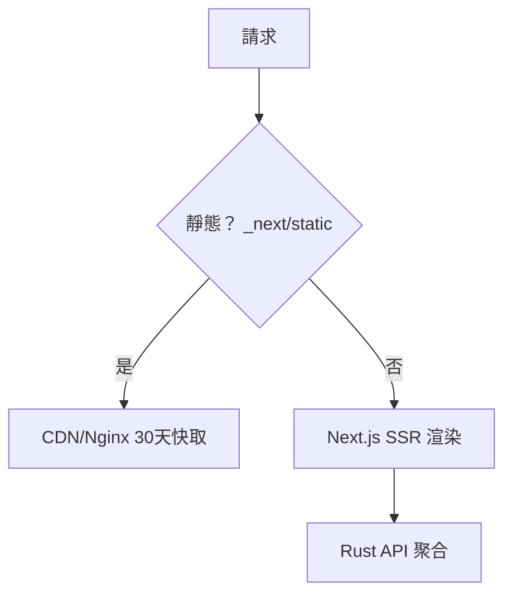

#### serverRuntimeConfig vs 公開變數（銜接 3.4）

```js
// 可在運行期經環境變數改變（不需重建）：僅服務端可讀
module.exports = { serverRuntimeConfig: { rustApi: process.env.RUST_API_URL } };
// NEXT_PUBLIC_* 與 VITE_* 同理是建置期硬編碼，勿放密鑰
```

#### 本節小結

- SSR 用 **standalone 模式**：只搬運行必需檔，映像檔省一半
- SSR 是**常駐 Node 服務**：必須配 `--max-old-space-size` 與 `memory limits`，基準抓 512–768 MB
- `_next/static` 抽到 CDN/反代是第一效能優化，比加副本便宜
- 與 Rust 分工：Next.js 做首屏與 BFF 聚合，Rust 做資料與 WebSocket 真源

#### 想一想

1. 為什麼 SSR 節點的 `limits.memory` 建議比 Node 堆上限多留 30–50%？V8 堆外記憶體（Off-heap）與系統頁快取各吃掉多少？
2. `rewrites` 把 `/api` 轉發到 Rust，與瀏覽器直呼 Rust 跨域（CORS）方案相比，在 Cookie/Session 與快取層面各有何優劣？
3. 若首頁同時聚合 5 個 Rust API，其中一個慢 2 秒，SSR 的 p99 會如何被拖垮？你會用並行 `Promise.all`、超時（Timeout）還是邊緣快取（Stale-While-Revalidate）來解？


### 3.3 MPA / 樣板引擎：Rust + Tera + HTMX，一個二進位檔即全站

#### 從一個問題開始

如果沒有 Node、沒有 `npm build`，網站還能做嗎？能——而且更快、更小、更好維運。多頁應用（MPA）讓 Rust 直接渲染 HTML，HTMX（高互動超文本擴充）讓 `<button hx-get>` 就能局部更新，連一行前端建置都不需要。本節給出兩種容器化路線：樣板包進二進位檔 vs 樣板掛載 Volume，並用 Tera（Rust 樣板引擎）實作完整 CRUD。

#### 為何 MPA + HTMX 值得一學

| | SPA/SSR | MPA + HTMX（本節） |
|---|---|---|
| **建置鏈** | Node + Vite/Next 必備 | 零 Node，`cargo build` 即全站 |
| **映像檔** | 30 MB（SPA）/ 200 MB（SSR） | 約 8–15 MB（musl scratch） |
| **互動寫法** | React state + fetch + 路由 | `<form hx-post="/todos">` 直出 HTML 片段 |
| **SEO** | SPA 弱 / SSR 強 | 天生強（純 HTML） |
| **適合** | 高互動 Dashboard、行銷 SEO | CRUD、內部工具、MVP、邊緣節點 |
| **代價** | 需前後端兩套部署 | 複雜前端互動（拖拽、離線）不如 React |

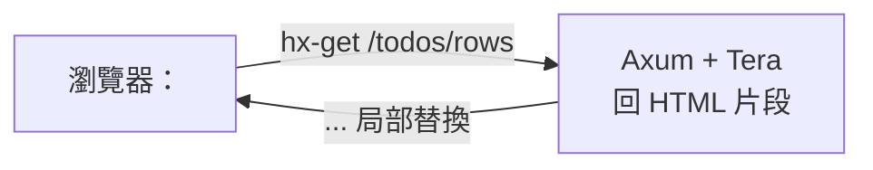

#### 可運行程式碼：Axum + Tera + HTMX 最小 CRUD

```rust
// Cargo.toml: axum = "0.7", tera = "1", tokio = { version = "1", features = ["full"] }
use axum::{Router, routing::get, response::Html};
use tera::{Tera, Context};

#[tokio::main]
async fn main() {
    let mut tera = Tera::new("templates/**/*").unwrap();
    tera.autoescape_on(vec![".html"]);
    let app = Router::new()
        .route("/", get(move || async {
            let mut ctx = Context::new();
            ctx.insert("title", "Todos (MPA)");
            Html(tera.render("index.html", &ctx).unwrap())
        }))
        .route("/health", get(|| async { "ok" }));
    let listener = tokio::net::TcpListener::bind("0.0.0.0:3002").await.unwrap();
    axum::serve(listener, app.into_make_service()).await.unwrap();
}
```

```html
<!-- templates/index.html -->
<!doctype html><html lang="zh-Hant"><head><meta charset="utf-8">
<script src="https://unpkg.com/htmx.org@1.9.10"></script></head>
<body><h1>{{ title }}</h1>
<button hx-get="/todos/rows" hx-target="#list">載入待辦</button>
<div id="list"></div></body></html>
```

```bash
cargo run --bin rust-mpa &
curl -s localhost:3002/ | head -n 12
curl -s localhost:3002/health
```

#### 兩種容器化方案對照（本節核心）

| | 方案 A：包進二進位檔（推薦生產） | 方案 B：Volume 掛載（推薦開發） |
|---|---|---|
| **做法** | `rust-embed` / `include_str!` 編進 binary | 容器跑 `rust-mpa`，樣板經 `-v ./templates:/app/templates` 掛載 |
| **Dockerfile** | `scratch` 單檔，無需複製 templates | 需 `COPY templates` 或掛載，runtime 用 slim 方便除錯 |
| **更新樣板** | 需重建映像檔（不可變基礎設施 Immutable Infra） | 改 HTML 即生效，配合 Compose Watch 熱重載 |
| **體積/安全** | 最小、無路徑遍歷風險 | 靈活但需管檔案權限與掛載路徑 |
| **適用** | 生產、邊緣、GitOps | 本地開發、設計師調版式 |

```rust
// 方案 A：rust-embed（Cargo.toml: rust-embed = "8")
use rust_embed::RustEmbed;
#[derive(RustEmbed)]
#[folder = "templates/"]
struct Assets;
// 讀取：Assets::get("index.html").unwrap().data
```

```dockerfile
# 方案 A Dockerfile：scratch 單檔（templates 已編進 binary）
FROM rust:1.78-alpine AS builder
WORKDIR /app
RUN apk add --no-cache musl-dev && rustup target add x86_64-unknown-linux-musl
COPY Cargo.toml Cargo.lock ./
COPY src ./src
COPY templates ./templates
RUN cargo build --release --target x86_64-unknown-linux-musl && cp target/*/release/rust-mpa /tmp/app
FROM scratch
COPY --from=builder /tmp/app /app
EXPOSE 3002
ENTRYPOINT ["/app"]
```

```yaml
# 方案 B：開發用 Compose 掛載（4.4 節 Watch 前身）
services:
  mpa-dev:
    build: ./rust-mpa
    ports: ["3002:3002"]
    volumes: ["./rust-mpa/templates:/app/templates:ro"]
```

```bash
docker build -t rust-mpa:embed ./rust-mpa
docker images rust-mpa:embed   # 約 8–12 MB
```

#### 本節小結

- MPA + HTMX = **Rust 直出 HTML、hx-* 做局部更新**，零 Node、零建置，映像檔最小
- 生產用**方案 A（embed/include_str!）**：不可變、最小、最安全；開發用**方案 B（Volume）**：改版式即生效
- Tera 記得開 `autoescape` 防 XSS（跨站腳本），HTMX 片段介面與整頁共用同一路由前綴最乾淨
- 4.2 節的 `rust-mpa:3002` 即本節產物，與 SPA/SSR 並列比較最有感

#### 想一想

1. `include_str!` 與 `rust-embed` 在編譯期行為有何差異？新增一個樣板檔時，Cargo 的增量編譯與 Docker 層快取分別如何失效？
2. 方案 B 把 templates 經 Volume 掛入，若掛載路徑權限是 root 而容器以 `USER 65532` 執行，會發生什麼？`:ro` 與 `read_only: true` 又有何不同？
3. HTMX 回傳 HTML 片段 vs 回傳 JSON 由前端渲染，在快取（CDN）、可觀測性（htmx 日誌）與後端測試複雜度上各有何取捨？


### 3.4 環境變數注入：Build-time vs Run-time，前端三模式全解

#### 從一個問題開始

同一個前端映像檔，為何在測試環境呼叫 `api-staging`、上生產卻還是指向舊位址？九成是把**建置期（Build-time）**變數當成**運行期（Run-time）**變數用。本節一次釐清 Vite、SSR、Rust 三者的變數時機，給出每種前端的可運行注入方案。

#### 核心觀念：一張表分清時機

| | Build-time（建置期） | Run-time（運行期） |
|---|---|---|
| **注入時刻** | `docker build` / `vite build` 當下寫死 | `docker run` / K8s Pod 啟動當下讀取 |
| **代表** | `VITE_*`、`NEXT_PUBLIC_*` | 容器 `environment:`、K8s ConfigMap/Secret、`/config.js` |
| **一個映像檔多環境？** | 不行，每環境重建 | 可以，同一映像檔跑遍 dev/staging/prod |
| **密鑰能否放？** | 絕對不行（進 bundle、可被下載） | 僅後端/SSR server 端可讀，前端公開變數仍不行 |
| **Rust 後端** | 極少（`option_env!` 編譯期版本號除外） | 主流：`std::env::var` + `dotenvy` |

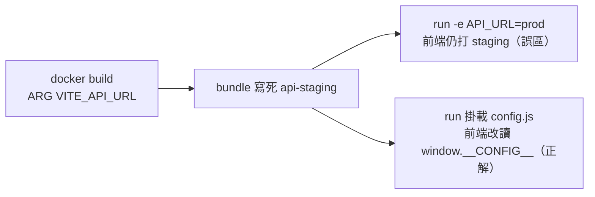

#### 誤區重現：Vite 硬編碼

```ts
// 誤以為運行期可改，實則建置期已寫死
const url = import.meta.env.VITE_API_URL;
```

```bash
docker build --build-arg VITE_API_URL=https://staging-api ./frontend-spa -t spa:staging
docker run -e VITE_API_URL=https://prod-api -p 8080:80 spa:staging
# 瀏覽器仍打 staging——因為 bundle 內已是字串常量，-e 無效
```

#### 正解一：SPA 用 runtime config.js + envsubst

```html
<!-- dist/index.html 引入（Nginx 託管前由 envsubst 生成） -->
<script src="/config.js"></script>
<script>const API_URL = window.__CONFIG__.API_URL;</script>
```

```js
// docker-entrypoint.d/10-config.sh 生成 /usr/share/nginx/html/config.js
cat > /usr/share/nginx/html/config.js <<EOF
window.__CONFIG__ = { API_URL: "${API_URL:-/api}" };
EOF
```

```dockerfile
# frontend-spa/Dockerfile 追加運行期注入
FROM nginx:alpine AS runtime
COPY nginx.conf /etc/nginx/conf.d/default.conf
COPY --from=build /web/dist /usr/share/nginx/html
COPY docker-entrypoint.d/ /docker-entrypoint.d/
ENV API_URL=/api
EXPOSE 80
CMD ["nginx", "-g", "daemon off;"]
```

```bash
docker build -t spa:dynamic ./frontend-spa
docker run --rm -e API_URL=https://prod-api -p 8080:80 spa:dynamic &
curl -s localhost:8080/config.js   # 應見 prod-api，同一映像檔換 -e 即換環境
```

#### 正解二：SSR 用 serverRuntimeConfig + 公開變數分流

| 變數型別 | 讀取位置 | 重建需求 | 放密鑰？ |
|---|---|---|---|
| `serverRuntimeConfig.rustApi` | 僅 Node 服務端（getServerSideProps） | 不需，`docker run -e RUST_API_URL` 即生效 | 可（不進 bundle） |
| `NEXT_PUBLIC_API_URL` | 瀏覽器 bundle | 需，建置期寫死 | 不可 |
| Rust `DATABASE_URL` | Rust 行程啟動時 | 不需，經 Secret/ConfigMap | 可（後端安全） |

```js
// next.config.js + pages/index.js
module.exports = { serverRuntimeConfig: { rustApi: process.env.RUST_API_URL } };
import getConfig from "next/config";
const { serverRuntimeConfig } = getConfig();
const res = await fetch(`${serverRuntimeConfig.rustApi}/products`);
```

```rust
// Rust：運行期讀取 + 啟動即校驗（fail-fast）
use std::env;
fn config() -> (String, String) {
    let database_url = env::var("DATABASE_URL").expect("DATABASE_URL must be set");
    let port = env::var("PORT").unwrap_or("3000".into());
    (database_url, port)
}
```

```yaml
# compose.yaml 同一映像檔跑兩環境（4.2 節實用技）
services:
  spa-staging: { image: spa:dynamic, environment: { API_URL: http://api-staging:3000 } }
  spa-prod:    { image: spa:dynamic, environment: { API_URL: http://api:3000 } }
```

#### 本節小結

- **建置期變數寫死進 bundle**：`VITE_*`、`NEXT_PUBLIC_*` 每環境需重建，絕不放密鑰
- **運行期變數才是多環境正解**：SPA 用 `config.js`/`envsubst`，SSR 用 `serverRuntimeConfig`，Rust 用 `env::var`
- 同一映像檔跑遍所有環境是容器化的基本素養，`docker run -e` 即驗收標準
- 密鑰一律走 K8s Secret / 雲端 Secret Manager，永不進映像檔層（`docker history` 可見即洩漏）

#### 想一想

1. `ARG VITE_API_URL` 會留在 `docker history` 與建置快取中，這對密鑰洩漏與供應鏈（Supply Chain）安全意味著什麼？該用什麼替代？
2. SSR 的 `serverRuntimeConfig` 為何能運行期讀取而 `NEXT_PUBLIC_*` 不行？兩者在 `standalone/server.js` 與瀏覽器 bundle 中的存放位置有何差異？
3. Rust 後端用 `expect("DATABASE_URL must be set")` 在啟動時崩潰（Fail-fast），與啟動後延遲報錯相比，對 K8s 的 CrashLoopBackOff 與 Compose 的 `depends_on` 健康閘門有何好處？


## 四、多容器開發與本地編排（Docker Compose）


### 4.1 Compose 語法：Services、Networks、Volumes 一次搞定

#### 從一個問題開始

`docker run` 啟動一個 Rust 容器很簡單，但全棧有 6 個容器、3 張網段、4 顆 Volume 時，指令會長到無法維護。Compose（Docker Compose）就是全棧的宣告式（Declarative）總譜：一個 `compose.yaml` 描述所有服務（Services）、網路（Networks）、儲存（Volumes），`up/down` 一鍵指揮。本節是 4.2–4.4 節的語法地基。

#### 最小可運行範例：先讓全棧動起來

```yaml
# compose.yaml：v2 規範無需 version 欄位
services:
  api:
    build: ./rust-server
    ports: ["3000:3000"]
    environment:
      DATABASE_URL: postgres://app:secret@db:5432/app
      REDIS_URL: redis://cache:6379
    depends_on:
      db: { condition: service_healthy }
      cache: { condition: service_started }
    networks: [front, back]
    volumes: ["cargo-cache:/usr/local/cargo/registry"]

  db:
    image: postgres:16-alpine
    environment:
      POSTGRES_USER: app
      POSTGRES_PASSWORD: secret
      POSTGRES_DB: app
    volumes: ["pgdata:/var/lib/postgresql/data"]
    networks: [back]
    healthcheck:
      test: ["CMD-SHELL", "pg_isready -U app"]
      interval: 5s
      retries: 10

  cache:
    image: redis:7-alpine
    networks: [back]
    volumes: ["redisdata:/data"]

networks:
  front: {}
  back: {}

volumes:
  pgdata: {}
  redisdata: {}
  cargo-cache: {}
```

```bash
docker compose config        # 渲染驗證（排錯第一步）
docker compose up -d --build
docker compose ps
docker compose logs -f api
docker compose down          # 停機；加 -v 會刪 Volume（資料全失，慎用）
```

#### Services（服務）：本書高頻欄位表

| 欄位 | 作用 | 本書用法示例 |
|---|---|---|
| `build: { context, dockerfile, args, cache_from }` | 建置設定 | Rust 三段 chef 建置、`VITE_API_URL` 傳入 |
| `image:` | 運行或建置標籤 | `rust-server:${TAG:-dev}` |
| `ports: ["宿主:容器"]` | 發布埠 | `["8080:80"]`，生產改 `expose` 內網即可 |
| `environment:` / `env_file:` | 運行期變數（銜接 3.4） | `DATABASE_URL`、`API_URL` |
| `depends_on: { condition: }` | 啟動順序 + 健康閘門 | `service_healthy` 等 DB 就緒，非等埠開 |
| `healthcheck:` | 容器自檢 | `pg_isready` / `curl -f /health` |
| `deploy.resources.limits` | 記憶體/CPU 上限 | SSR `memory: 768M`、Rust `memory: 256M` |
| `restart: unless-stopped` | 崩潰重啟 | 本地開發必備 |
| `develop.watch` | 熱重載（4.4 節） | Rust/src 同步重建、前端 HMR |

#### Networks（網路）：front/back 分流為何重要

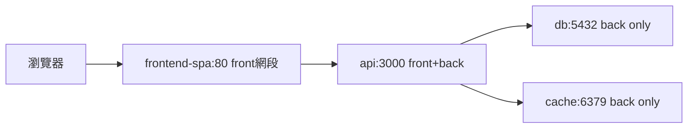

- **front 網段**：瀏覽器可達（frontend、api 的 80/3000），db/cache 不加入，前端直連資料庫在網路層即不可能。
- **back 網段**：僅後端互連，服務名即 DNS（`postgres://db:5432` 無需 IP）。
- 除錯三招：`docker network ls`、`docker compose exec api getent hosts db`、`docker compose exec api wget -qO- http://db:5432`（應連線被拒而非 DNS 失敗）。

#### Volumes（儲存）：具名 vs 綁定掛載

| | 具名 Volume（Named Volume） | 綁定掛載（Bind Mount） |
|---|---|---|
| **寫法** | `pgdata:/var/lib/postgresql/data` | `./rust-server/src:/app/src:ro` |
| **生命週期** | `down -v` 才刪，重啟保留 | 跟隨宿主目錄，刪容器不影響 |
| **用途** | 資料庫資料、cargo 快取 | 原始碼熱重載、掛載設定檔 |
| **效能** | Linux 原生最快；macOS 經 VM，仍優於大量小檔綁定 | macOS 大量小檔（node_modules）綁定會慢，需 `delegated`/named 快取 |
| **備份** | `docker run --rm -v pgdata:/data -v $PWD:/b alpine tar czf /b/pg.tgz /data` | 直接用宿主工具備份 |

#### 本節小結

- Compose 三本柱：**Services 定義算力、Networks 定義可達性、Volumes 定義狀態去留**
- `depends_on + healthcheck` 管順序、`front/back` 網段管安全邊界、具名 Volume 管資料壽命
- `compose config` 先驗證、`ps/logs/exec` 再除錯、`down -v` 前三思
- 下一節 4.2 即用本節語法組出「Rust + 雙前端 + PG + Redis」完整全棧

#### 想一想

1. `depends_on` 只保證啟動順序，為何還要加 `condition: service_healthy`？沒有健康閘門時 Rust 啟動即連 DB 會發生什麼競爭（Race Condition）？
2. 把 `db` 同時加入 `front` 網段會帶來什麼安全風險？服務名 DNS 在跨網段時還能解析嗎？
3. `down -v` 與 `down` 差一個旗標，資料結局卻天差地別；在 CI 與本地開發中，你會分別如何選擇？Volume 備份該多久做一次？


### 4.2 本地全棧：Rust Server + 雙前端 + PostgreSQL + Redis

#### 從一個問題開始

1.2 節承諾「同一個 Rust API 配三種前端」，4.1 節學會 Compose 語法——本節把它們焊接成可一鍵啟動的本地全棧：Rust API（Axum）、SPA（Vite+Nginx）、SSR（Next.js standalone）、MPA（Tera/HTMX），外加 PostgreSQL 與 Redis。`docker compose up` 之後，三種前端同時可點，差異親手可測。

#### 架構總覽

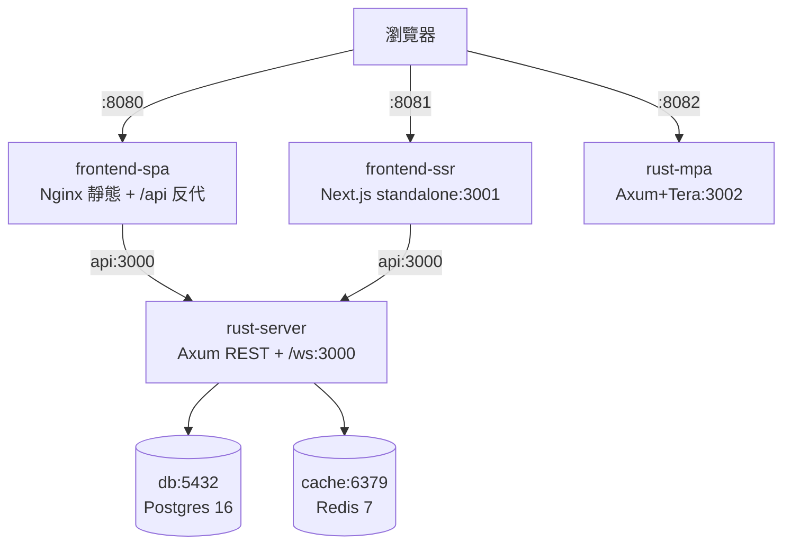

| 服務（Service） | 對外埠 | 鏡像來源 | 記憶體建議 |
|---|---|---|---|
| `api`（Rust Axum） | 3000 | 本地 chef 建置（2.4） | 256 MB |
| `frontend-spa` | 8080→80 | Node 建置 + Nginx（3.1） | 64 MB |
| `frontend-ssr` | 8081→3001 | standalone（3.2） | 768 MB |
| `rust-mpa` | 8082→3002 | embed scratch（3.3） | 64 MB |
| `db` | 5432（可不發布） | postgres:16-alpine | 512 MB |
| `cache` | 6379（可不發布） | redis:7-alpine | 128 MB |

#### 完整 compose.yaml（可運行，本書標準全棧）

```yaml
services:
  api:
    build: { context: ./rust-server }
    image: rust-server:dev
    ports: ["3000:3000"]
    environment:
      DATABASE_URL: postgres://app:secret@db:5432/app
      REDIS_URL: redis://cache:6379
      RUST_LOG: info
    depends_on:
      db: { condition: service_healthy }
      cache: { condition: service_started }
    networks: [front, back]
    healthcheck:
      test: ["CMD-SHELL", "wget -qO- http://localhost:3000/health || exit 1"]
      interval: 10s
      retries: 5
    deploy:
      resources: { limits: { memory: 256M } }

  frontend-spa:
    build:
      context: ./frontend-spa
      args: { VITE_API_URL: /api }
    ports: ["8080:80"]
    environment: { API_URL: http://api:3000 }
    depends_on: [api]
    networks: [front]

  frontend-ssr:
    build: { context: ./frontend-ssr }
    ports: ["8081:3001"]
    environment:
      RUST_API_URL: http://api:3000
      PORT: "3001"
    depends_on:
      api: { condition: service_healthy }
    networks: [front]
    deploy:
      resources: { limits: { memory: 768M } }

  rust-mpa:
    build: { context: ./rust-mpa }
    ports: ["8082:3002"]
    environment: { DATABASE_URL: postgres://app:secret@db:5432/app }
    depends_on:
      db: { condition: service_healthy }
    networks: [front, back]

  db:
    image: postgres:16-alpine
    environment: { POSTGRES_USER: app, POSTGRES_PASSWORD: secret, POSTGRES_DB: app }
    volumes: ["pgdata:/var/lib/postgresql/data", "./db/init.sql:/docker-entrypoint-initdb.d/init.sql:ro"]
    networks: [back]
    healthcheck:
      test: ["CMD-SHELL", "pg_isready -U app"]
      interval: 5s
      retries: 10

  cache:
    image: redis:7-alpine
    command: ["redis-server", "--appendonly", "yes"]
    volumes: ["redisdata:/data"]
    networks: [back]
    healthcheck:
      test: ["CMD", "redis-cli", "ping"]
      interval: 5s
      retries: 10

networks: { front: {}, back: {} }
volumes: { pgdata: {}, redisdata: {} }
```

```bash
docker compose up -d --build
docker compose ps
curl -s localhost:3000/health        # Rust API
curl -s -o /dev/null -w "%{http_code}\n" localhost:8080/   # SPA
curl -s -o /dev/null -w "%{http_code}\n" localhost:8081/   # SSR
curl -s -o /dev/null -w "%{http_code}\n" localhost:8082/   # MPA
docker compose logs -f api db
```

#### 連通驗證：三前端打同一 API

```bash
# 經 SPA 反代打 Rust（Nginx /api/ → api:3000）
curl -s localhost:8080/api/health
# SSR 經 serverRuntimeConfig 聚合（瀏覽器看 HTML 已含資料）
curl -s localhost:8081/ | grep -o "<title>.*</title>" | head -n 2
# MPA 直出 HTML（含 HTMX 標籤）
curl -s localhost:8082/ | grep -o "hx-get" | head -n 3
# 資料庫直連驗證
docker compose exec db psql -U app -c "select 1;"
docker compose exec cache redis-cli ping
```

#### 本節小結

- 一個 `compose.yaml` 同時編排 **1 個 Rust API + 2 個前端服務（spa/ssr）+ 1 個 MPA + PG + Redis**，埠 8080/8081/8082 即三種架構對照實驗室
- 關鍵配線：`depends_on + healthcheck` 保順序、`front/back` 保邊界、`environment` 保多環境（銜接 3.4）
- 記憶體按 3.2 節精算：SSR 768M、Rust 256M，其餘 64–512M
- 下一節 4.3 深入容器間通訊、連接池與探針，把「能跑」變成「穩跑」

#### 想一想

1. `frontend-spa` 的 `VITE_API_URL=/api` 走 Nginx 反代，而 `frontend-ssr` 的 `RUST_API_URL=http://api:3000` 走服務名直連，兩種路徑在 DNS 解析、連接池與超時設定上有何差異？
2. 為何 `db` 的 5432 可以不 `ports` 發布卻仍被 `api` 連上？什麼時候該發布、什麼時候該只留 `expose` 內網？
3. 同時啟動 6 個服務時，Apple Silicon 筆電記憶體告急，你會先降哪個服務的 limits？用 `docker stats` 如何驗證瓶頸真是 SSR 而非 Postgres？


### 4.3 容器間通訊、連接池與 Healthcheck：從能跑到穩跑

#### 從一個問題開始

4.2 節全棧能跑了，但壓測 100 併發就開始 `connection refused`、`too many clients`——問題不在 Rust 不夠快，而在三個被忽略的細節：容器間 DNS 與超時（Timeout）、資料庫連接池（Connection Pool） sizing、健康檢查（Healthcheck） 語義。本節把它們一次補齊。

#### 容器間通訊：DNS、超時、重試三件套

Compose 內建 DNS：服務名即主機名（`db` → `db:5432`）。但 DNS 解析成功不代表連線成功，還需三層防護。

| 層級 | 設定 | 建議值 |
|---|---|---|
| **DNS/連線** | `getent hosts db` 驗證；Rust 用 `tokio::time::timeout` 包建連 | 建連超時 3–5 秒 |
| **HTTP 呼叫** | SSR→Rust 用 `fetch` + `AbortSignal.timeout(3000)` | p99 按 3 秒熔斷（Circuit Breaking） |
| **重試** | 指數退避（Exponential Backoff）+ 抖動（Jitter），僅冪等（Idempotent）GET 可重試 | 最多 3 次，寫入禁自動重試 |

```mermaid
flowchart LR
    S[frontend-ssr] -- "http://api:3000（front網段DNS）" --> A[api]
    A -- "postgres://db:5432（back網段DNS）" --> D[(db)]
    A -- "redis://cache:6379" --> C[(cache)]
    A -.超時3s+重試x3.-> A
```

```bash
# 除錯三招（在 api 容器內執行）
docker compose exec api getent hosts db cache
docker compose exec api wget -qO- --timeout=3 http://frontend-ssr:3001/api/health || echo "ssr not in back網段為正常"
docker compose exec db pg_isready -U app
```

#### 連接池：公式 + 可運行 Rust 程式碼

連接池太小排隊、太大壓垮 DB。實用公式：`pool_size = (cpu_cores × 2) + disk_factor`，本地 4 核 + SSD 抓 10–20；務必設 `max_lifetime` 與 `acquire_timeout`。

```rust
// Cargo.toml: sqlx = { version = "0.7", features = ["postgres", "runtime-tokio"] }, redis = "0.24"
use sqlx::postgres::PgPoolOptions;
use std::time::Duration;

async fn pg_pool(database_url: &str) -> sqlx::PgPool {
    PgPoolOptions::new()
        .max_connections(20)          // 容器 0.5–1 CPU 時 10–20 最穩
        .min_connections(2)           // 保持暖連線，避免冷啟動雪崩
        .acquire_timeout(Duration::from_secs(3))
        .max_lifetime(Duration::from_secs(1800))
        .connect(database_url).await.expect("pg connect")
}
```

```yaml
# compose.yaml 對應：DB 端也要配 max_connections，避免被多副本打爆
services:
  db:
    image: postgres:16-alpine
    command: ["postgres", "-c", "max_connections=100"]
  api:
    environment:
      DATABASE_URL: postgres://app:secret@db:5432/app?pool_max=20
```

| 症狀 | 根因 | 解法 |
|---|---|---|
| `too many clients` | 副本數 × 池大小 > DB 上限 | 縮池或升 DB `max_connections`，K8s 用 PgBouncer |
| 首波請求全超時 | 冷池 + 健康檢查未覆蓋 DB | `min_connections` + Readiness 探針打真實查詢 `select 1` |
| Redis `timeout` 堆積 | 阻塞指令（`KEYS *`）卡連線 | 改 `SCAN` + 設 `default-timeout`，讀寫分離連線池 |

#### Healthcheck：三種探針語義（銜接 K8s）

| 探針 | 問的問題 | 失敗動作 | Compose 寫法 |
|---|---|---|---|
| Liveness（存活） | 行程死鎖了嗎？ | 重啟容器 | `test: wget -qO- /health`，interval 30s |
| Readiness（就緒） | 能接流量了嗎？ | 從負載均衡摘除 | Rust 查 `select 1` + Redis `ping` 都通才 200 |
| Startup（啟動） | 啟動慢的服務給寬限 | 寬限期內不判死 | `start_period: 30s` 給 Rust 跑遷移（Migration） |

```rust
// /health（liveness：輕）與 /ready（readiness：重）分開是生產鐵律
use axum::{Router, routing::get, response::IntoResponse, http::StatusCode};
async fn health() -> &'static str { "ok" }
async fn ready(pool: sqlx::PgPool) -> impl IntoResponse {
    match sqlx::query("SELECT 1").fetch_one(&pool).await {
        Ok(_) => (StatusCode::OK, "ready"),
        Err(_) => (StatusCode::SERVICE_UNAVAILABLE, "not-ready"),
    }
}
```

```yaml
services:
  api:
    healthcheck:
      test: ["CMD-SHELL", "wget -qO- http://localhost:3000/health || exit 1"]
      interval: 10s
      timeout: 3s
      retries: 3
      start_period: 30s
```

```bash
docker compose ps            # healthy / starting / unhealthy 一目了然
docker inspect --format '{{json .State.Health}}' $(docker compose ps -q api) | head -c 600
```

#### 本節小結

- 通訊看三層：**DNS 通 → 超時熔斷 → 冪等重試**，缺一即雪崩
- 連接池公式先行：**池大小 × 副本數 ≤ DB 上限**，`acquire_timeout` 與 `max_lifetime` 必設
- `/health` 與 `/ready` 分家：前者保活、後者保流量品質，`start_period` 給遷移留路
- 這些語義與 K8s Probe 一一對應，現在寫好，遷 K8s 零改寫

#### 想一想

1. 為什麼 Readiness 失敗只摘流量、不重啟容器，而 Liveness 失敗要重啟？若把 DB 查 `select 1` 放在 Liveness 裡，DB 抖動時會發生什麼災難？
2. 連接池 `acquire_timeout=3s` 與 HTTP `timeout=3s` 疊加時，最壞端到端延遲是多少？該如何用超時預算（Timeout Budget）避免重試放大（Retry Amplification）？
3. Redis 做快取（Cache）與做會話（Session）儲存時，連線池與持久化（`appendonly`）策略有何不同？快取穿透（Cache Penetration）時 DB 會發生什麼？


### 4.4 Compose Watch：Rust 與前端 Hot Reload，一存即同步

#### 從一個問題開始

沒有熱重載（Hot Reload）的容器開發是折磨：改一行 Rust 要 `compose down && up --build` 等 3 分鐘，改一行 CSS 也要重建 Nginx。Compose Watch（`develop.watch`，Compose v2.22+）讓「宿主一存檔、容器即同步」：原始碼同步（Sync）、自動重建（Rebuild）、前端 HMR 各就各位。本節給出 Rust + 雙前端的完整 Watch 配置。

#### 三種 Watch 動作對照

| 動作（Action） | 語義 | 適用 |
|---|---|---|
| `sync` | 宿主檔案即時同步進容器，不重建 | Rust `src/`（配 cargo-watch 重編）、前端靜態 |
| `rebuild` | 檔案變動即重建映像檔 | `Cargo.toml`、`package.json` 依賴變動時 |
| `sync+restart` | 同步後重啟行程 | `templates/`（MPA）、`nginx.conf`、`config.js` |

```mermaid
flowchart LR
    E[編輯器存檔] --> W{Compose Watch}
    W -->|src/*.rs sync| C[cargo-watch 重編]
    W -->|Cargo.toml rebuild| B[重建依賴層]
    W -->|templates sync+restart| M[rust-mpa 重啟]
    W -->|web/src sync| H[Vite HMR 秒級更新]
```

#### 完整配置：rust + templates + 雙前端（可運行）

```yaml
services:
  api:
    build: { context: ./rust-server }
    ports: ["3000:3000"]
    environment: { DATABASE_URL: postgres://app:secret@db:5432/app }
    develop:
      watch:
        - { path: ./rust-server/src, target: /app/src, action: sync }
        - { path: ./rust-server/Cargo.toml, target: /app/Cargo.toml, action: rebuild }
        - { path: ./rust-server/Cargo.lock, target: /app/Cargo.lock, action: rebuild }

  rust-mpa:
    build: { context: ./rust-mpa }
    ports: ["8082:3002"]
    volumes: ["./rust-mpa/templates:/app/templates:ro"]  # 版式即時生效（銜接 3.3 方案 B）
    develop:
      watch:
        - { path: ./rust-mpa/src, target: /app/src, action: sync }
        - { path: ./rust-mpa/templates, target: /app/templates, action: sync+restart }

  frontend-spa:
    build: { context: ./frontend-spa }
    ports: ["8080:80", "5173:5173"]  # 5173 給 Vite HMR 直連
    develop:
      watch:
        - { path: ./frontend-spa/src, target: /web/src, action: sync }
        - { path: ./frontend-spa/package.json, target: /web/package.json, action: rebuild }
```

```dockerfile
# rust-server/Dockerfile.dev：開發映像檔內建 cargo-watch
FROM rust:1.78-bookworm
WORKDIR /app
RUN cargo install cargo-watch --locked
COPY Cargo.toml Cargo.lock ./
COPY src ./src
CMD ["cargo", "watch", "-x", "run"]
```

```bash
docker compose up --build --watch   # 前景啟動 Watch（另開終端看日誌）
# 改 rust-server/src/main.rs 存檔 → 觀察 cargo-watch 重編
# 改 frontend-spa/src/App.tsx 存檔 → 瀏覽器 HMR 秒更
# 改 Cargo.toml → 觀察 rebuild 自動重建
docker compose alpha ls 2>/dev/null || docker compose ps
```

#### 開發 vs 生產 Dockerfile 分流

| | `Dockerfile`（生產） | `Dockerfile.dev`（開發） |
|---|---|---|
| **基底** | chef 三段 + slim/scratch（2.4） | `rust:bookworm` 全工具鏈 + cargo-watch |
| **啟動** | `/usr/local/bin/app` 二進位檔 | `cargo watch -x run` |
| **Volume** | 無原始碼，僅具名 Volume 存資料 | 綁定掛載 src + templates |
| **切換** | `compose.yaml` 預設 | `compose.override.yaml` 或 `--file compose.dev.yaml` |

```bash
# 典型分流啟動
docker compose -f compose.yaml -f compose.dev.yaml up --watch      # 開發
docker compose -f compose.yaml up -d --build                        # 類生產驗收
```

> macOS 效能提醒：大量小檔（`node_modules`、`target/`）綁定會慢，務必 `.dockerignore` + 具名 Volume 快取：`cargo-cache:/usr/local/cargo/registry`、`node-modules:/web/node_modules`。

#### 本節小結

- Watch 三動作：**sync 管程式碼、rebuild 管依賴、sync+restart 管樣板與設定**
- Rust 開發映像檔裝 `cargo-watch`，前端靠 Vite HMR，MPA 靠 Volume 掛 templates
- 開發/生產 Dockerfile 分流，`compose.dev.yaml` 疊加 Watch，生產保持不可變
- 至此第 1 部分閉環：1 章原理 → 2 章瘦身加速 → 3 章三前端 → 4 章全棧聯調，下一步即進 K8s

#### 想一想

1. `sync` 把宿主 `target/` 也同步進容器會發生什麼？為什麼 `.dockerignore` 與 Watch 的 `ignore` 清單必須排除 `target/` 與 `node_modules`？
2. Watch 的 `rebuild` 與 2.4 節 chef 的依賴層快取如何協作？改 `Cargo.toml` 一行會重煮全部依賴還是只增量？如何驗證？
3. `cargo watch -x run` 在容器內重編時，Liveness 探針可能誤判重啟，你會如何為開發環境放寬 `start_period`，又不讓寬鬆設定流到生產？


# 第 2 部分：長連線與混合架構的 12-Factor 雲原生改造


## 五、WebSocket 與長連線雲原生挑戰


### 5.1 短連線與長連線：在 K8s 裡完全是兩種生物

#### 從一個問題開始

同一個 Rust Axum 服務，在 Docker Compose 本機測試時 WebSocket 穩如泰山，一上 Kubernetes 卻每分鐘斷線一次，HTTP API 卻毫髮無傷。為什麼？

答案很殘酷：**K8s 的整條網路鏈路，都是為短連線 HTTP 設計的**。你以為的「一條 TCP 連線」，中間其實隔著 kube-proxy、Ingress Controller、Service、甚至雲端 LB，每一層都有自己的超時計時器。短連線每次請求都重建連線，根本不在乎；長連線卻要在這些「陌生人」之間活上幾小時，先天水土不服。

本章是第 2 部分的起點：先認清敵人——短連線與長連線在 K8s 中的行為差異。

#### 連線生命週期對照表

| 維度 | 短連線 HTTP（REST API） | 長連線 WebSocket | SSE（Server-Sent Events） |
|---|---|---|---|
| **連線時長** | ms～秒級，用完即丟 | 分鐘～小時級，升級後常駐 | 分鐘～小時級，單向常駐 |
| **協議** | HTTP/1.1 短請求或 HTTP/2 多路復用 | HTTP 升級（Upgrade）→ TCP 全雙工幀 | 純 HTTP 長輪詢式串流 |
| **K8s 轉發成本** | 低，任意 Pod 都可接 | 高，需固定路由到同一 Pod（見 5.3） | 中，單向但仍佔連線槽 |
| **經過 LB 的感覺** | 無感，重試即可 | 敏感，idle timeout 會主動掐斷 | 敏感，需關閉 buffering |
| **擴縮容影響** | Rolling 更新幾乎無感 | Pod 縮容 = 直接斷線，需優雅停機（見 7.1） | 同左，但瀏覽器會自動重連 |
| **狀態位置** | 無狀態，JWT 即可 | 連線狀態在記憶體，需抽離（見 5.2） | 同左，較輕但仍需重播機制 |
| **可觀測性** | 每請求一條 access log | 一條連線活幾小時，傳統 RED 指標失靈 | 同左，需自訂心跳指標 |

一句話記憶：**短連線是「計程車」，上車下車乾脆俐落；長連線是「包車」，司機（Pod）一換人，整車乘客都得下車。**

#### 升級握手：WS 偽裝成 HTTP 的 3 秒鐘

WebSocket 的狡猾之處在於：它一開始假裝自己是普通 HTTP，騙過中間所有設備後才「變臉」。

```mermaid
sequenceDiagram
    participant C as 瀏覽器 / React
    participant I as Ingress-NGINX
    participant P as Axum Pod
    C->>I: GET /ws HTTP/1.1<br/>Upgrade: websocket<br/>Connection: Upgrade<br/>Sec-WebSocket-Key: xxx
    I->>P: 轉發升級請求（若缺 proxy-set-header 會失敗）
    P-->>I: 101 Switching Protocols<br/>Sec-WebSocket-Accept: yyy
    I-->>C: 101 Switching Protocols
    Note over C,P: 此後升級為 TCP 全雙工幀，不再是 HTTP 語義
    C<->>P: WS Frame（text / binary / ping / pong / close）
```

關鍵細節：

1. **必須是 HTTP/1.1 的 GET**，HTTP/2 下要用 Extended CONNECT（很多舊 Ingress 不支援）。
2. 中間任何一層若不透傳 `Upgrade` / `Connection` 頭，握手直接變成 `400 Bad Request`。
3. 握手成功後，L7 的超時邏輯仍在生效——它看不懂 WS 幀，只覺得「這條 HTTP 連線 idle 好久了」。

#### 60 秒超時陷阱預告

幾乎所有新手都會在 K8s 上踩到同一個坑：**什麼都不做，60 秒左右 WS 準時斷線**。兇手名單：

```yaml
# Ingress-NGINX 預設值（兇手之一）
# nginx.ingress.kubernetes.io/proxy-read-timeout: "60"
# nginx.ingress.kubernetes.io/proxy-send-timeout: "60"
# 雲端 LB（AWS ALB idle timeout 預設 60s）也是同謀
apiVersion: networking.k8s.io/v1
kind: Ingress
metadata:
  name: ws-app
  annotations:
    nginx.ingress.kubernetes.io/proxy-read-timeout: "3600"
    nginx.ingress.kubernetes.io/proxy-send-timeout: "3600"
spec:
  rules:
    - host: ws.example.com
      http:
        paths:
          - path: /ws
            pathType: Prefix
            backend:
              service:
                name: ws-svc
                port:
                  number: 80
```

為什麼 HTTP 沒事？因為它 50ms 就回應了，根本活不到 60 秒。而 WS 的 ping 間隔若設 30 秒、Pong 又被某層吃掉，LB 就會判定 idle 並發 FIN。完整的解法需要三管齊下（應用層心跳 + Ingress 超時 + Pod 優雅停機），分別在 5.2、5.3、7.1 展開。

#### K8s 網路鏈路全景

```mermaid
flowchart LR
    C[Client] --> LB[Cloud LB<br/>idle 60s]
    LB --> ING[Ingress Controller<br/>read/send 60s]
    ING --> SVC[Service ClusterIP<br/>kube-proxy conntrack]
    SVC --> P1[Pod A<br/>Axum WS]
    SVC --> P2[Pod B<br/>Axum WS]
    style LB fill:#f96,stroke:#333
    style ING fill:#f96,stroke:#333
```

每一跳都可能殺死你的長連線，而短連線因為「死得快、重建快」，反而免疫。本節的結論是：**不要把 WS 當成「比較久的 HTTP」，要把它當成「有狀態的 TCP 服務」來設計**——狀態抽離、粘性路由、心跳保活、優雅停機，一個都不能少。

#### 本節小結

- 短連線無狀態、耐斷線；長連線有狀態、怕超時，K8s 預設鏈路對後者不友善
- WS 靠 HTTP Upgrade 握手起家，握手後仍受 L7 超時管制
- 60 秒斷線是 Ingress + LB 預設超時共謀的結果，不是 Rust 的錯
- 後續四節依序解決：狀態同步（5.2）、粘性路由（5.3）、優雅停機（7.1）、探針（7.2）

#### 想一想

1. 為什麼同一個叢集裡 REST API 完全正常，只有 WebSocket 會定時斷線？從鏈路超時角度解釋。
2. SSE 和 WebSocket 都是長連線，如果你的需求只是「伺服器推播股價」，選哪個在 K8s 裡更省心？為什麼？
3. 如果把 Ingress 的 proxy-read-timeout 直接調成 24 小時，會有什麼副作用？有沒有比「調大超時」更好的做法？


### 5.2 WebSocket 狀態抽離與廣播：從單機記憶體到跨 Pod 同步

#### 從一個問題開始

本機一個 Pod 時，聊天室運作完美。上 K8s 擴到 3 個 Pod 後，A 用戶發言只有同 Pod 的人看得到，別的 Pod 一片死寂。為什麼？

因為你的 `Arc<Mutex<HashSet<Socket>>>` 只活在**單個行程的記憶體裡**。Pod A 根本不知道 Pod B 連了誰。12-Factor App 第 6 條早就警告：**行程無狀態，共享狀態一律丟到後端服務**。對 WS 而言，就是把「誰在線、訊息往哪送」抽離到 Redis Pub/Sub。

#### 架構：兩層廣播

```mermaid
flowchart TB
    subgraph PodA[Pod A - Axum]
        B1[(broadcast)] --- W1[WS 1,2]
    end
    subgraph PodB[Pod B - Axum]
        B2[(broadcast)] --- W2[WS 3,4]
    end
    B1 <-->|SUB/PUB| R[(Redis<br/>chat:room:42)]
    B2 <-->|SUB/PUB| R
    C1[Client 1,2] <--> PodA
    C3[Client 3,4] <--> PodB
```

設計原則：

| 層次 | 工具 | 職責 |
|---|---|---|
| Pod 內 | `tokio::sync::broadcast` | 同 Pod 所有 WS 任務扇出，極快（記憶體複製） |
| Pod 間 | Redis Pub/Sub | 跨 Pod 同步，一發全網收到，不持久化 |
| 需持久化時 | Redis Stream / Kafka | 聊天記錄、離線重播，本節不用，只預告 |

為什麼不用 Redis 直接對每個 WS 推？因為每個 Pod 只需一條 Redis 連線訂閱，其餘用 broadcast 扇出，連線數從 O(用戶) 降到 O(Pod)。

#### Rust：訂閱與發布完整程式碼

```rust
use axum::{
    extract::{ws::{Message, WebSocket, WebSocketUpgrade}, State},
    response::IntoResponse, routing::get, Router,
};
use redis::AsyncCommands;
use std::sync::Arc;
use tokio::sync::broadcast;

#[derive(Clone)]
struct AppState {
    tx: broadcast::Sender<String>, // Pod 內扇出
    redis: redis::Client,
}

// 背景任務：Redis SUB → 轉發進 broadcast（每 Pod 一條連線）
async fn redis_subscriber(redis: redis::Client, tx: broadcast::Sender<String>) {
    let mut pubsub = redis.get_async_pubsub().await.expect("pubsub");
    pubsub.subscribe("chat:room:42").await.unwrap();
    let mut stream = pubsub.on_message();
    use futures::StreamExt;
    while let Some(msg) = stream.next().await {
        let payload: String = msg.get_payload().unwrap_or_default();
        let _ = tx.send(payload);
    }
}

async fn handle_socket(mut socket: WebSocket, state: Arc<AppState>) {
    let mut rx = state.tx.subscribe();
    let redis = state.redis.clone();
    loop {
        tokio::select! {
            msg = socket.recv() => {
                match msg {
                    Some(Ok(Message::Text(t))) => {
                        let mut conn = redis.get_multiplexed_async_connection()
                            .await.unwrap();
                        let _: () = conn.publish(
                            "chat:room:42", t.as_str()).await.unwrap();
                    }
                    _ => break, // Close 或斷線即退出
                }
            }
            Ok(text) = rx.recv() => {
                if socket.send(Message::Text(text.into()))
                    .await.is_err() { break; }
            }
        }
    }
}

#[tokio::main]
async fn main() {
    let (tx, _rx) = broadcast::channel::<String>(1024);
    let redis = redis::Client::open("redis://redis:6379").unwrap();
    tokio::spawn(redis_subscriber(redis.clone(), tx.clone()));
    let state = Arc::new(AppState { tx, redis });
    let app = Router::new().route("/ws", get(
        |ws: WebSocketUpgrade, State(s): State<Arc<AppState>>|
        async move { ws.on_upgrade(|skt| handle_socket(skt, s)) }
    )).with_state(state);
    axum::Server::bind(&"0.0.0.0:3000".parse().unwrap())
        .serve(app.into_make_service()).await.unwrap();
}
```

三個實務要點：`broadcast::channel(1024)` 滿了會讓慢接收者收到 `Lagged` 錯誤（記得處理重同步）；`get_multiplexed_async_connection` 讓發布共用連線池；每個 Pod 只開一條 SUB 連線，否則 Redis 連線數爆炸。

#### React 客戶端：重連留給 7.1，這裡先求能收發

```tsx
import { useEffect, useRef, useState } from "react";

export function useChatRoom(url: string) {
  const [messages, setMessages] = useState<string[]>([]);
  const wsRef = useRef<WebSocket | null>(null);
  useEffect(() => {
    const ws = new WebSocket(url);
    wsRef.current = ws;
    ws.onmessage = (e) =>
      setMessages((p) => [...p.slice(-99), e.data]);
    return () => ws.close();
  }, [url]);
  const send = (text: string) => {
    if (wsRef.current?.readyState === WebSocket.OPEN)
      wsRef.current.send(text);
  };
  return { messages, send };
}
```

前端不需要知道 Pod 拓撲——它只連 Ingress 的一個 `/ws` 端點，後端的 Redis 保證無論落到哪個 Pod，訊息都會橫向擴散。

#### 常見誤區

| 誤區 | 後果 | 正解 |
|---|---|---|
| 用 `Mutex<Vec<Socket>>` 存全域連線 | 跨 Pod 失效，擴容即分裂 | Pod 內 broadcast + Pod 間 Redis |
| 每個 WS 開一條 Redis SUB | 1 萬用戶 = 1 萬 Redis 連線，直接打爆 | 每 Pod 一條 SUB，再用 broadcast 扇出 |
| 用 Redis List 當廣播 | 輪詢延遲高、語義不對 | Pub/Sub（即時）或 Stream（需重播） |

#### 本節小結

- WS 連線狀態絕不能留在單 Pod 記憶體，要抽離到 Redis Pub/Sub
- 兩層扇出：Pod 內用 Tokio broadcast，Pod 間用 Redis，一發全網收
- 每 Pod 一條 SUB 連線是連線數與即時性的最佳平衡
- 下一節解決另一個橫向擴展難題：沒有粘性會話時，WS 握手與重連會漂到不同 Pod

#### 想一想

1. 為什麼 Pod 內還要保留一層 Tokio broadcast，而不是讓每個 WS 直連 Redis？從連線數和延遲分析。
2. `broadcast` 滿了導致 `Lagged` 時，聊天室應該補歷史訊息還是直接跳過？什麼場景下必須換成 Redis Stream？
3. 如果 Redis 本身當機，WS 服務應該拒絕新連線還是降級為「單 Pod 模式」？ readiness 探針該怎麼配合（見 7.2）？


### 5.3 負載均衡與 Sticky Sessions：WS 為什麼需要粘性

#### 從一個問題開始

5.2 用 Redis 解決了「廣播」問題，但還有一個更陰險的 bug：客戶端握手連上 Pod A，下一秒重連被 Round-Robin 丟到 Pod B， resume token 對不上，直接被踢下線。HTTP API 從不在乎落到哪個 Pod，為什麼 WS 這麼矯情？

因為 **WS 是有狀態的長連線**。握手時的認證、協商的房間、暫存的未確認訊息，全都綁在那條 TCP 上。HTTP 每次請求自帶 JWT 可以任意漂移；WS 一旦漂移，舊 Pod 的連線上下文就作廢了。解法就是粘性會話（Sticky Sessions / Affinity）：**同一個客戶端，盡量黏在同一個 Pod 上**。

#### 要不要 Sticky？決策表

| 場景 | 需要 Sticky？ | 理由 |
|---|---|---|
| 純 REST API + JWT | 否 | 每次請求自包含，任意 Pod 可處理 |
| WS + Redis Pub/Sub（5.2 架構） | 弱需要 | 廣播已跨 Pod，但重連 resume、本地暫存仍受益 |
| WS + 記憶體暫存房間/遊戲狀態 | 強需要 | 狀態沒抽離，漂移即丟失 |
| SSE 斷線重連帶 Last-Event-ID | 建議 | 黏住可減少跨 Pod 查歷史的成本 |
| gRPC streaming / WebRTC 信令 | 強需要 | 同 WS，長連線語義 |

12-Factor 的理想是「無 sticky」，但現實是：**能把狀態全抽離當然最好，抽不乾淨時就用 affinity 爭取時間**。本書立場：5.2 的 Redis 是正道，sticky 是緩衝墊，兩者並用。

#### 實務一：NGINX Ingress Affinity

```yaml
apiVersion: networking.k8s.io/v1
kind: Ingress
metadata:
  name: ws-app
  annotations:
    # 依 Cookie 黏住客戶端
    nginx.ingress.kubernetes.io/affinity: "cookie"
    nginx.ingress.kubernetes.io/session-cookie-name: "ws-route"
    nginx.ingress.kubernetes.io/session-cookie-expires: "172800"
    nginx.ingress.kubernetes.io/session-cookie-max-age: "172800"
    # WS 必備：超時調大（呼應 5.1）
    nginx.ingress.kubernetes.io/proxy-read-timeout: "3600"
    nginx.ingress.kubernetes.io/proxy-send-timeout: "3600"
    # 上游哈希備援（NGINX 內部按一致性哈希）
    nginx.ingress.kubernetes.io/upstream-hash-by: "$request_uri"
spec:
  ingressClassName: nginx
  rules:
    - host: ws.example.com
      http:
        paths:
          - path: /
            pathType: Prefix
            backend:
              service:
                name: ws-svc
                port: { number: 80 }
```

原理：第一次回應種下 `ws-route` Cookie，之後請求帶 Cookie 就被固定導向同一 Pod。注意 Service 的 `sessionAffinity: ClientIP` 是另一層（kube-proxy 層），只能按 IP 黏，NAT 後面一堆人同 IP 會失衡，一般優先用 Ingress Cookie。

#### 實務二：Envoy / Istio Hash Policy

```yaml
# Istio DestinationRule：按請求頭哈希，適合 WS 帶 token 的場景
apiVersion: networking.istio.io/v1beta1
kind: DestinationRule
metadata:
  name: ws-affinity
spec:
  host: ws-svc
  trafficPolicy:
    loadBalancer:
      consistentHash:
        httpHeaderName: "x-user-id"  # 或 httpCookie: name: ws-route
        minimumRingSize: 1024
```

```mermaid
flowchart LR
    C[Client<br/>Cookie: ws-route=A] --> ING[Ingress / Envoy]
    ING -->|哈希命中| PA[Pod A]
    ING -.->|Pod A 縮容才漂移| PB[Pod B]
    style PA fill:#9f9,stroke:#333
```

Envoy 的一致性哈希（maglev / ring-hash）好處是 Pod 增減時只有最少連線被搬遷，比 NGINX 預設輪詢溫柔得多。

#### 沒有 Sticky 會怎樣？

```mermaid
sequenceDiagram
    participant C as Client
    participant LB as 無 Affinity LB
    participant A as Pod A
    participant B as Pod B
    C->>LB: WS 握手 + resume_token(A 發的)
    LB->>A: 轉到 A，恢復成功
    Note over C,A: 連線建立，遊戲狀態在 A 記憶體
    C->>LB: 網路抖動，自動重連
    LB->>B: 輪詢轉到 B！
    B-->>C: 419 Unknown resume_token，拒絕
    C->>LB: 只好全量重同步（卡頓 3s）
```

這就是線上常見的「每隔幾分鐘卡一下」：不是網路差，是重連漂到陌生 Pod，被迫全量同步。開了 sticky 後，重連大概率回到老 Pod，無縫恢復。

#### 本節小結

- WS 有連線上下文，漂移成本遠高於 HTTP，sticky 是務實之選
- NGINX 用 Cookie affinity，Envoy/Istio 用一致性哈希，原理都是「同客戶端→同 Pod」
- Sticky 是緩衝不是終點，最終仍要用 5.2 的狀態抽離走向無 sticky
- 縮容時 sticky 也救不了你——還得靠 7.1 的優雅停機發 Close Frame 讓客戶端體面搬家

#### 想一想

1. 既然 sticky 這麼方便，為什麼 12-Factor 仍主張無狀態？sticky 在滾動更新和自動擴縮容時有什麼代價？
2. `Service.sessionAffinity: ClientIP` 和 Ingress Cookie affinity 有什麼差別？NAT 環境下哪個會失衡？
3. 如果你的 WS 已經做到 Redis 全抽離，還需要 sticky 嗎？列出「仍需要」和「不需要」的理由各一個。


## 六、全棧應用的無狀態化與 Session 抽離


### 6.1 SPA 無狀態化：把 Session 趕出伺服器記憶體

#### 從一個問題開始

React SPA + Axum 前後端分離，本機用 `MemorySession` 存登入態跑得好好的，一上 K8s 擴到兩個 Pod，用戶瘋狂「被登出」：這次請求落到 Pod A 認得你，下次落到 Pod B 說你是陌生人。

病根相同：**伺服器記憶體裡的 session 是有狀態的**。SPA 改造的第一刀，就是把認證狀態趕出伺服器——搬到客戶端（JWT）或共享後端（Redis，見 6.2）。本節先講最雲原生的路線：JWT 無狀態化。

#### JWT 儲存四策略

| 策略 | 存哪裡 | XSS 風險 | CSRF 風險 | 跨域/SSR 友好度 |
|---|---|---|---|---|
| A. localStorage | JS 可讀 | 高（XSS 直接偷走） | 無 | 高，但最不安全 |
| B. SessionStorage | 分頁級 JS 可讀 | 高（同 A，關頁即失） | 無 | 中，多頁籤不共享 |
| C. JS 記憶體變數 | 變數 | 低（重整即失，需配 Refresh） | 無 | 低，重整就掉線 |
| D. HttpOnly Secure Cookie ⭐ | 瀏覽器自動帶 | 極低（JS 讀不到） | 有（需 SameSite+CSRF token） | 高，本書推薦 |

結論：**Access Token 放記憶體（短命 5～15 分鐘）+ Refresh Token 放 HttpOnly Cookie（長命 7 天）**，兼顧安全與體驗。若一定要跨域（`app.example.com` 調 `api.example.com`），就用 Cross-Domain Cookie（見下）。

#### Cross-Domain Cookie 實務

```mermaid
flowchart LR
    U[瀏覽器<br/>app.example.com] -->|fetch credentials:include| API[api.example.com<br/>Axum]
    API -->|Set-Cookie: Domain=.example.com; Secure; HttpOnly; SameSite=None| U
```

```rust
// Axum：跨域 Cookie + CORS 必須同時配對
use tower_http::cors::{CorsLayer, Any};
use axum::http::{header, Method};

let cors = CorsLayer::new()
    .allow_origin("https://app.example.com".parse().unwrap())
    // credentials:include 時不能用 Any，必須明確列出
    .allow_methods([Method::GET, Method::POST])
    .allow_headers([header::AUTHORIZATION, header::CONTENT_TYPE])
    .allow_credentials(true);
```

前端每個請求都要 `credentials: "include"`，否則 Cookie 不會跨域攜帶。`SameSite=None` 必須配 `Secure`（HTTPS），本機開發記得用 `mkcert` 或退回 `SameSite=Lax` 同站測試。

#### Refresh Token 旋轉（Rotation）

長命 Refresh Token 被偷是最可怕的——攻擊者可無限續命。旋轉策略：**每次用掉舊 Refresh，就發一對全新的（Access + Refresh），舊的立即作廢**，被盜用的 token 重放時會觸發「重用偵測」並全數登出。

```tsx
// React：axios 攔截 401 自動用 Refresh 續命（概念碼）
import axios from "axios";

const api = axios.create({
  baseURL: "https://api.example.com",
  withCredentials: true, // 攜帶 HttpOnly Refresh Cookie
});

let refreshing: Promise<string> | null = null;

api.interceptors.response.use(
  (r) => r,
  async (err) => {
    if (err.response?.status !== 401 || err.config._retry) throw err;
    err.config._retry = true;
    // 併發請求只刷一次 token
    refreshing ??= axios
      .post("https://api.example.com/auth/refresh",
        {}, { withCredentials: true })
      .then((r) => r.data.access_token)
      .finally(() => (refreshing = null));
    const token = await refreshing;
    err.config.headers.Authorization = `Bearer ${token}`;
    return api(err.config);
  }
);
```

#### Axum JWT 驗證中介層

```rust
use axum::{extract::Request, http::{header, StatusCode},
  middleware::Next, response::Response};
use jsonwebtoken::{decode, DecodingKey, Validation, Algorithm};

#[derive(Debug, serde::Deserialize, serde::Serialize)]
struct Claims { sub: String, exp: usize }

pub async fn jwt_auth(
    req: Request, next: Next,
) -> Result<Response, StatusCode> {
    let token = req.headers()
        .get(header::AUTHORIZATION)
        .and_then(|v| v.to_str().ok())
        .and_then(|s| s.strip_prefix("Bearer "))
        .ok_or(StatusCode::UNAUTHORIZED)?;
    let data = decode::<Claims>(
        token,
        &DecodingKey::from_secret(env!("JWT_SECRET").as_ref()),
        &Validation::new(Algorithm::HS256),
    ).map_err(|_| StatusCode::UNAUTHORIZED)?;
    // 可把 Claims 插入 extensions 供 handler 使用
    Ok(next.run(req).await)
}
```

實務清單：密鑰放 K8s Secret（不是程式碼）；`exp` 設 5～15 分鐘；Refresh 的 jti 黑名單放 Redis（登出即廢）；WS 握手時 JWT 放 query 或第一幀（瀏覽器 WS 不支援自訂 header）。

#### 本節小結

- SPA 上 K8s 的第一原則：伺服器不存 session，狀態交給 JWT 或 Redis
- 四策略中推薦「Access 放記憶體 + Refresh 放 HttpOnly Cookie + 旋轉」
- 跨域要同時搞定 CORS、`credentials:include`、`Domain=.example.com` 三件套
- 下一節處理不適合 JWT 的場景：SSR/MPA 需要可主動撤銷的伺服器端 Session

#### 想一想

1. 為什麼 Access Token 要設 5 分鐘這麼短，而 Refresh 卻可以活 7 天？短命和旋轉分別防住了什麼攻擊？
2. localStorage 存 JWT 最方便，為什麼本書不推薦？XSS 和 CSRF 兩種攻擊分別偷的是哪種儲存？
3. WebSocket 握手時瀏覽器不能自訂 `Authorization` 頭，你會怎麼把 JWT 交給 Axum 驗證？各有什麼風險？


### 6.2 SSR / MPA 的伺服器端 Session：Redis 分散式 Session Store

#### 從一個問題開始

6.1 的 JWT 對 SPA 很香，但換成 SSR（Next.js）或傳統 MPA（Rust 模板直出 HTML）就水土不服：每次 SSR 都要驗簽、想主動踢人下線卻發現 JWT 發出去就收不回、Html 直出時還得把 token 塞進 template。怎麼辦？

答案是走回「伺服器端 Session」的老路，但換成雲原生做法：**Session 內容放 Redis，所有 Pod 共享；瀏覽器只拿一串隨機的 session id（Cookie）**。有狀態的部分被抽到 Redis，Pod 本身依然無狀態，隨便擴縮。

#### 原理：一張表就夠了

| 角色 | 存什麼 | 範例 |
|---|---|---|
| 瀏覽器 Cookie | 隨機 `session_id`（簽名防篡改） | `sid=8f3a…c1; HttpOnly; Secure; SameSite=Lax` |
| Redis Hash | `sess:<id>` → `{ user_id, csrf, exp, … }` | `HGETALL sess:8f3a…c1` |
| Pod 記憶體 | 什麼都不存 | 每次請求都查 Redis（或本地快取 5s） |

```mermaid
sequenceDiagram
    participant B as 瀏覽器
    participant P as 任意 Pod (Axum / Next.js)
    participant R as Redis
    B->>P: GET /dashboard<br/>Cookie: sid=8f3a
    P->>R: HGETALL sess:8f3a
    R-->>P: {user_id: 42, exp: ...}
    P-->>B: 200 HTML（直出渲染）
```

漂到哪個 Pod 都一樣，因為真相只有 Redis 知道。這正是 12-Factor「行程無狀態、狀態進後端服務」的標準姿勢。

#### Rust：tower-sessions / axum-session 概念

```rust
use axum::{routing::get, Router, response::Html};
use tower_sessions::{MemoryStore, Session, SessionManagerLayer};
// 實務把 MemoryStore 換成 RedisStore（tower-sessions-redis-store）
use tower_sessions_redis_store::RedisStore;

async fn dashboard(session: Session) -> Html<String> {
    // 查 session（底層自動找 Redis）
    let user: Option<String> = session
        .get("user_id").await.unwrap_or(None);
    match user {
        Some(u) => Html(format!("<h1>Hi, {u}</h1>")),
        None => Html("<h1>請先登入</h1>".into()),
    }
}

#[tokio::main]
async fn main() {
    let pool = redis::Client::open("redis://redis:6379")
        .unwrap()
        .get_multiplexed_async_connection().await.unwrap();
    let store = RedisStore::new(pool);
    let layer = SessionManagerLayer::new(store)
        .with_secure(true)              // HTTPS 才送 Cookie
        .with_same_site_policy(
            tower_sessions::cookie::SameSite::Lax,
        );
    let app = Router::new()
        .route("/dashboard", get(dashboard))
        .layer(layer);
    axum::Server::bind(&"0.0.0.0:3000".parse().unwrap())
        .serve(app.into_make_service()).await.unwrap();
}
```

三個關鍵配置：Cookie 一律 `HttpOnly + Secure + SameSite=Lax`；Redis key 設 TTL（`EXPIRE sess:<id> 3600`，滑動續期）；登出時 `session.destroy()` 刪 Redis——這是 JWT 做不到的「主動撤銷」。

#### Next.js SSR 查 Redis（概念碼）

```ts
// pages/dashboard.tsx：每次 SSR 都以 session id 查 Redis
import { GetServerSideProps } from "next";
import { createClient } from "redis";

export const getServerSideProps: GetServerSideProps = async (ctx) => {
  const sid = ctx.req.cookies["sid"];
  if (!sid) return { redirect: { destination: "/login", permanent: false } };

  const redis = createClient({ url: process.env.REDIS_URL });
  await redis.connect();
  // HGETALL sess:<sid>，命中才渲染
  const sess = await redis.hGetAll(`sess:${sid}`);
  await redis.disconnect();

  if (!sess.user_id) {
    return { redirect: { destination: "/login", permanent: false } };
  }
  return { props: { userId: sess.user_id } };
};
```

SSR 的代價是每次頁面請求多一次 Redis RTT（約 0.5ms 內網），換來的是 SEO、首屏快、模板直出。嫌慢？加 5 秒本地快取或把熱 session 推進 CDN 邊緣即可。

#### JWT vs Redis Session：怎麼選？

| 維度 | JWT 無狀態（6.1） | Redis Session（本節） |
|---|---|---|
| 撤銷 | 難（要等過期或維護黑名單） | 易（刪 key 即登出） |
| 每次請求成本 | 驗簽（CPU） | 查 Redis（網路 RTT） |
| 適合 | SPA / API / WS 握手 | SSR / MPA / 需踢人、權限常變 |
| 擴縮容 | 天然無狀態 | Pod 無狀態（狀態在 Redis） |

```mermaid
flowchart TD
    Q{要 SSR 首屏 / SEO 嗎？}
    Q -- 是 --> R[Redis Session<br/>本節]
    Q -- 否 --> W{要主動撤銷 / 踢人嗎？}
    W -- 是 --> R
    W -- 否 --> J[JWT 無狀態<br/>6.1]
```

#### 本節小結

- SSR/MPA 用「Cookie 只存 sid + 內容全放 Redis Hash」，Pod 保持無狀態
- Rust 用 tower-sessions + RedisStore，Next.js 在 `getServerSideProps` 查 Redis
- 主動撤銷、權限變更頻繁時，Redis Session 完勝 JWT
- 下一節把另一種「假無狀態」趕出去：上傳檔案不進 Pod，直接 Presigned URL 丟物件儲存

#### 想一想

1. Redis Session 每次請求都要查一次 Redis，會不會成為瓶頸？什麼情況下應該加本地快取，又會帶來什麼一致性問題？
2. 為什麼 session id 必須是密碼學隨機數且要簽名？如果 sid 可預測，攻擊者能做什麼？
3. 你的系統同時有 SPA（JWT）和 SSR 管理後台（Redis Session），登出時要怎麼讓兩邊一起失效？


### 6.3 檔案上傳解耦：Presigned URL 直傳物件儲存

#### 從一個問題開始

用戶上傳 500MB 影片，請求黏在 Pod A 慢慢收，Pod 重啟檔案就沒了；擴到 5 個 Pod，每個 Pod 的 `/tmp/uploads` 各存各的，下載時還得問「你當初傳到哪一台？」更慘的是大檔案塞滿 Pod 磁碟，liveness 探針跟著陪葬。

12-Factor 第 4 條說得很直白：**把檔案當成無狀態之外的東西，丟給專門的後端服務**。在 K8s 裡就是：Pod 不碰檔案位元組，用 **Presigned URL** 讓瀏覽器直傳 S3 / MinIO。

#### 直傳流程

```mermaid
sequenceDiagram
    participant B as 瀏覽器
    participant A as Axum Pod（只簽名）
    participant S as S3 / MinIO
    B->>A: POST /upload-url {filename, content_type}
    A->>A: 驗 JWT + 配額 + 生成 key
    A-->>B: presigned PUT URL（15 分鐘有效）
    B->>S: PUT presigned URL（檔案直傳，不經 Pod）
    S-->>B: 200 OK + ETag
    B->>A: POST /upload-complete {key, etag}
    A->>S: HeadObject 校驗存在才入庫
```

Pod 只做「簽名 + 校驗」，幾毫秒就結束；幾個 GB 的流量全走瀏覽器↔物件儲存，Pod 的記憶體和磁碟徹底解放。

| 舊做法（經 Pod 中轉） | 新做法（Presigned 直傳） |
|---|---|
| 大檔案佔滿 Pod 記憶體/磁碟 | Pod 零位元組經手 |
| 跨 Pod 下載要共享卷/NFS | URL 全域可定址，任意 Pod 可簽下載鏈接 |
| 滾動更新丟失 /tmp | 檔案與 Pod 生命週期脫鉤 |

#### Rust：簽發 Presigned URL

```rust
use aws_sdk_s3::{Client, presigning::PresigningConfig};
use axum::{extract::State, Json};
use std::{sync::Arc, time::Duration};

#[derive(serde::Deserialize)]
struct UploadReq { filename: String, content_type: String }

#[derive(serde::Serialize)]
struct UploadRes { put_url: String, key: String }

async fn presign_upload(
    State(s3): State<Arc<Client>>,
    Json(req): Json<UploadReq>,
) -> Json<UploadRes> {
    // key 帶 user 字首隔離 + 時間戳防覆蓋
    let key = format!("uploads/user42/{}-{}",
        chrono::Utc::now().timestamp(), req.filename);
    let cfg = PresigningConfig::builder()
        .expires_in(Duration::from_secs(900)) // 15 分鐘
        .build().unwrap();
    let url = s3.put_object()
        .bucket("myapp")
        .key(&key)
        .content_type(req.content_type)
        .presigned(cfg).await.unwrap();
    Json(UploadRes { put_url: url.uri().to_string(), key })
}
```

要點：`key` 由後端生成（別信前端傳的路徑）；`expires_in` 設 5～15 分鐘；生產環境再加 `content-length-range` 條件擋超大檔；MinIO 完全相容 S3 API，只要把 endpoint 換掉即可。

#### 前端直傳：一行 fetch

```tsx
// 拿到 presigned URL 後直接 PUT，中間不經後端
async function uploadDirect(file: File) {
  const { put_url, key } = await fetch("/api/upload-url", {
    method: "POST",
    headers: { "Content-Type": "application/json" },
    body: JSON.stringify({
      filename: file.name, content_type: file.type,
    }),
  }).then((r) => r.json());

  await fetch(put_url, {
    method: "PUT",
    headers: { "Content-Type": file.type },
    body: file,
  });
  // 通知後端完成（後端 HeadObject 確認後才寫 DB）
  await fetch("/api/upload-complete", {
    method: "POST",
    headers: { "Content-Type": "application/json" },
    body: JSON.stringify({ key }),
  });
}
```

大檔建議切分片（S3 Multipart + presigned part URLs），前端用 `Promise.all` 併發傳 part，斷點續傳只需重傳失敗的 part。

#### MinIO Compose 片段（本機 S3）

```yaml
# docker-compose.yml：本機 MinIO，API 完全相容 S3
services:
  minio:
    image: minio/minio:latest
    command: server /data --console-address ":9001"
    environment:
      MINIO_ROOT_USER: minioadmin
      MINIO_ROOT_PASSWORD: minioadmin123
    ports: ["9000:9000", "9001:9001"]
    volumes: ["minio-data:/data"]
  # Rust 連它：endpoint http://minio:9000, region us-east-1,
  # bucket 事先 mc mb myapp/myapp
volumes:
  minio-data:
```

上 K8s 就換成雲 S3（或叢集內 MinIO Operator），Rust 程式碼一行不用改——這就是物件儲存介面統一的紅利。

#### 本節小結

- Pod 不存檔：Presigned URL 讓瀏覽器直傳 S3/MinIO，Pod 只簽名校驗
- 後端生成 key、限制有效期與大小，前端 PUT 直傳、完成後回調入庫
- MinIO 本機模擬 S3，上雲零改碼
- 第 6 章至此完成無狀態化三件套：JWT（6.1）、Session 外置（6.2）、檔案外置（本節）；第 7 章進入雲原生運維：優雅停機、探針、可觀測性

#### 想一想

1. 為什麼 `key` 一定要後端生成而不能信任前端？如果允許前端指定路徑，會有什麼越權或覆蓋風險？
2. 直傳後還需要 `/upload-complete` 回調嗎？如果瀏覽器傳完就關頁，後端怎麼知道哪些檔案是孤兒？
3. 10GB 影片單 PUT 會超時，你會怎麼設計分片直傳？失敗重試和秒傳（hash 去重）可以怎麼做？


## 七、長連線環境下的生命週期管理與健康檢測


### 7.1 WS 優雅停機：SIGTERM 來時體面說再見

#### 從一個問題開始

`kubectl rollout restart` 一按，幾千條 WS 瞬間全斷，前端滿屏紅色報錯，老闆的 demo 聊天室直接歸零。HTTP 服務滾動更新明明無感，為什麼 WS 每次發版都像斷電？

因為預設行為是：kubelet 發 SIGTERM 後 30 秒發 SIGKILL，而你的 Axum 直接跟著行程陪葬，連一句「我要走了」都沒說。優雅停機要做的就是：**攔截 SIGTERM → 發 Close Frame 請客戶端重連 → 給新連線拒絕、舊連線排空 → 從容退出**。

#### 停機協議總覽

```mermaid
sequenceDiagram
    participant K as kubelet
    participant P as Axum Pod
    participant C as 瀏覽器
    K->>P: SIGTERM（滾動更新開始）
    P->>P: 停止接受新 WS（ readiness 轉不健康）
    P->>C: WS Close Frame 1012 Service Restart
    C->>C: Exponential Backoff 重連
    C->>P: 新 Pod 握手（sticky 失效則落新 Pod）
    P->>K: 舊連線排空完畢，行程退出 0
    Note over K,P: 超過 terminationGracePeriodSeconds 則 SIGKILL
```

| 階段 | 動作 | 超時建議 |
|---|---|---|
| 收到 SIGTERM | 廣播 shutdown 旗標，Endpoint 停止接新連線 | 立即 |
| 通知客戶端 | 全員發 Close Frame（code 1012） | 5s 內 |
| 排空 | 等舊連線自己 close 或處理完手頭訊息 | 20～25s（小於 grace 30s） |
| 強制退出 | 剩餘連線 abort，行程 return | grace 到點前 |

#### Rust：完整 main.rs 優雅停機

```rust
use axum::{extract::{ws::{Message, WebSocket}, State},
    routing::get, Router};
use std::sync::Arc;
use tokio::{sync::{broadcast, Notify}, signal};

#[derive(Clone)]
struct AppState {
    tx: broadcast::Sender<String>,
    shutdown: Arc<Notify>, // 全域停機旗標
}

async fn shutdown_signal(shutdown: Arc<Notify>) {
    // 同時監聽 SIGTERM（K8s）和 Ctrl+C（本機）
    let mut term = signal::unix::signal(
        signal::unix::SignalKind::terminate()).unwrap();
    tokio::select! {
        _ = term.recv() => {},
        _ = signal::ctrl_c() => {},
    }
    shutdown.notify_waiters(); // 叫醒所有 WS 任務
}

async fn handle_socket(mut socket: WebSocket, state: Arc<AppState>) {
    let mut rx = state.tx.subscribe();
    loop {
        tokio::select! {
            // 停機通知：發 Close Frame 請客戶端搬家
            _ = state.shutdown.notified() => {
                let _ = socket.send(Message::Close(Some(
                    axum::extract::ws::CloseFrame {
                        code: 1012, // Service Restart
                        reason: "rolling update".into(),
                    }
                ))).await;
                break;
            }
            msg = socket.recv() => {
                match msg {
                    Some(Ok(Message::Text(t))) => {
                        let _ = state.tx.send(t.to_string());
                    }
                    _ => break,
                }
            }
            Ok(text) = rx.recv() => {
                if socket.send(Message::Text(text.into()))
                    .await.is_err() { break; }
            }
        }
    }
}

#[tokio::main]
async fn main() {
    let (tx, _rx) = broadcast::channel::<String>(1024);
    let shutdown = Arc::new(Notify::new());
    let state = Arc::new(AppState { tx, shutdown: shutdown.clone() });
    let app = Router::new().route("/ws", get(
        |ws: axum::extract::ws::WebSocketUpgrade,
         State(s): State<Arc<AppState>>|
        async move { ws.on_upgrade(|skt| handle_socket(skt, s)) }
    )).with_state(state);
    let listener = tokio::net::TcpListener::bind("0.0.0.0:3000").await.unwrap();
    axum::serve(listener, app)
        .with_graceful_shutdown(shutdown_signal(shutdown))
        .await.unwrap();
}
```

配套 Deployment 別忘了：`terminationGracePeriodSeconds: 30`，`lifecycle.preStop.sleep 5`（等 Endpoint 摘除），`readinessProbe` 在停機期轉失敗。

#### React：Exponential Backoff 自動重連

```ts
// 自動重連的 WS 封裝：1012 來了就體面搬家
export class ReconnectingWS {
  private ws: WebSocket | null = null;
  private retries = 0;
  private closedByUs = false;

  constructor(private url: string, private onMsg: (d: string) => void) {
    this.connect();
  }

  private connect() {
    this.ws = new WebSocket(this.url);
    this.ws.onopen = () => { this.retries = 0; };
    this.ws.onmessage = (e) => this.onMsg(e.data);
    this.ws.onclose = (e) => {
      if (this.closedByUs) return;
      // 1012 滾動更新立即回；異常則指數退避 + 抖動防驚群
      const delay = e.code === 1012 ? 500
        : Math.min(1000 * 2 ** this.retries, 30000);
      this.retries++;
      setTimeout(() => this.connect(),
        delay * (0.8 + Math.random() * 0.4));
    };
  }
  send(d: string) { this.ws?.send(d); }
  close() { this.closedByUs = true; this.ws?.close(); } }
```

退避公式 `min(1s × 2^n, 30s)` + 抖動是業界標準：第一次 1 秒、第二次 2 秒……既不對新 Pod 造成驚群，也不會讓用戶等太久。

#### 本節小結

- WS 滾動更新必斷，優雅停機把「斷電」變成「請搬家」：SIGTERM → Close 1012 → 排空退出
- Rust 用 `Notify` 廣播停機 + `with_graceful_shutdown`，grace 留 30 秒
- 前端用 Exponential Backoff + 抖動重連，1012 立即回、異常則退避
- 下一節補最後一塊拼圖：探針設計錯誤會讓優雅停機形同虛設——長連線阻塞了 liveness 怎麼辦

#### 想一想

1. 為什麼收到 SIGTERM 後要先讓 readiness 失敗、等幾秒才發 Close Frame？直接全斷會有什麼問題？
2. Close code 1012 和 1001 有什麼語義差別？前端收到不同 code，重連策略應該有什麼不同？
3. 如果某條 WS 正在傳 1GB 檔案（沒做 6.3 解耦），排空期 25 秒不夠，你會延長 grace、強制中斷，還是從架構上根治？


### 7.2 健康檢查設計：別讓長連線害死你的 Pod

#### 從一個問題開始

WS 服務上線後出現靈異現象：流量一高，Pod 被頻繁重啟，重啟後更扛不住，進入死亡循環。查日誌沒有 panic，真相是：**liveness 探針去打 `/ws`，探針自己也變成長連線，超時後 kubelet 認為 Pod 已死，直接殺掉**。探針本來是救生員，結果變成兇手。

核心原則：**HTTP 探針走短連線輕量路徑，WS 健康另起爐灶，兩者絕不混用**。

#### 三種探針分工表

| 探針 | 問題 | WS 服務該查什麼 | 失敗後果 |
|---|---|---|---|
| **liveness**（存活） | 行程死鎖了嗎？ | `/healthz`：只回 200，零依賴、不查 DB | 重啟 Pod（最危險，誤判即誤殺） |
| **readiness**（就緒） | 能接流量了嗎？ | `/ready`：查 Redis、查 WS 槽位、停機期回 503 | 從 Endpoint 摘除（可恢復） |
| **startup**（啟動） | 啟動完了嗎？ | 同 `/ready`，給慢啟動寬限 | 啟動期不殺 Pod |

```mermaid
flowchart TD
    K[kubelet] --> L[GET /healthz<br/>liveness]
    K --> R[GET /ready<br/>readiness]
    L -->|200 立回| OK1[存活]
    R --> REDIS[(Redis PING)]
    R --> SLOT{WS 連線數 < 上限？}
    REDIS -- 超時 --> UNREADY[503 摘除]
    SLOT -- 滿了 --> UNREADY
    SLOT -- 有空 --> READY[200 接流量]
```

記住口訣：**liveness 要「傻」，readiness 要「精」，WS 探針要「分開」**。

#### Rust：輕量 /healthz vs 嚴格 /ready

```rust
use axum::{extract::State, http::StatusCode, routing::get, Router};
use std::sync::{Arc, atomic::{AtomicUsize, Ordering}};

#[derive(Clone)]
struct HealthState {
    redis: redis::Client,
    ws_count: Arc<AtomicUsize>, // 目前 WS 連線數
    draining: Arc<std::sync::atomic::AtomicBool>, // 停機中？
}

// liveness：什麼都不查，活著就 200
async fn healthz() -> &'static str { "ok" }

// readiness：查 Redis + 容量 + 停機旗標
async fn ready(
    State(s): State<HealthState>,
) -> Result<&'static str, StatusCode> {
    if s.draining.load(Ordering::Relaxed) {
        return Err(StatusCode::SERVICE_UNAVAILABLE);
    }
    if s.ws_count.load(Ordering::Relaxed) > 9000 {
        return Err(StatusCode::SERVICE_UNAVAILABLE); // 滿載摘除
    }
    let mut conn = s.redis.get_multiplexed_async_connection()
        .await.map_err(|_| StatusCode::SERVICE_UNAVAILABLE)?;
    let _: String = redis::cmd("PING").query_async(&mut conn)
        .await.map_err(|_| StatusCode::SERVICE_UNAVAILABLE)?;
    Ok("ready")
}
```

`healthz` 連 Redis 都不碰——Redis 抖一下不該導致全網 Pod 被重啟，那是 readiness 的工作（摘除等恢復）。

#### 探針 YAML：數字都是血淚

```yaml
livenessProbe:          # 傻探針：慢而寬容，絕不誤殺
  httpGet: { path: /healthz, port: 3000 }
  periodSeconds: 20
  timeoutSeconds: 3
  failureThreshold: 3   # 60s 連續失敗才重啟
readinessProbe:         # 精探針：快而敏感，快速摘除
  httpGet: { path: /ready, port: 3000 }
  periodSeconds: 5
  timeoutSeconds: 2
  failureThreshold: 2
startupProbe:           # 啟動寬限：冷啟動 2 分鐘內不殺
  httpGet: { path: /ready, port: 3000 }
  periodSeconds: 10
  failureThreshold: 12
terminationGracePeriodSeconds: 30
```

WS 額外建議：活躍連線數、訊息延遲做成 Prometheus metrics（見 7.3），不要做成探針——指標是給人看的，探針是給 kubelet 殺 Pod 的，誤殺代價天差地別。

#### 誤區表：這些坑不要再踩

| 誤區 | 症狀 | 正解 |
|---|---|---|
| liveness 打 `/ws` 做真實握手 | 探針連線堆積，超時即誤殺，重啟風暴 | liveness 只打 `/healthz` 純記憶體回應 |
| liveness 查 DB/Redis | 下游抖動 → 全網 Pod 被重啟，雪崩 | 下游檢查只放 readiness |
| readiness 與 liveness 同路徑同閾值 | 啟動慢被殺、滿載被殺，分不清 | 三探針分離，閾值按上表 |
| WS 連線數無上限 | 單 Pod 記憶體爆掉，liveness 跟著超時 | `/ready` 限流 + broadcast 容量告警 |

#### 本節小結

- liveness 只答「行程活著」，零依賴；readiness 才查 Redis 與容量；WS 健康看 metrics 不看探針
- 探針打 WS 握手、liveness 查下游，是兩大重啟風暴元兇
- 停機期 readiness 轉 503，配合 7.1 的 preStop，才能體面排空
- 下一節讓這一切可觀測：tracing JSON 日誌 + trace_id 貫穿 WS 與 HTTP

#### 想一想

1. 為什麼 liveness 查 Redis 是危險的？描述一次「Redis 抖 10 秒 → 全網 Pod 重啟」的雪崩鏈路。
2. 你的 WS 服務啟動要預熱 90 秒（載入模型），startupProbe、readinessProbe、livenessProbe 該怎麼配才不會被誤殺？
3. 如果單 Pod WS 上限 9000，HPA 應該看 CPU 還是看「每 Pod 連線數」擴容？自訂 metrics 要怎麼接？


### 7.3 雲原生可觀測性：讓每條 WS 都有跡可循

#### 從一個問題開始

線上用戶說「剛剛聊天室卡了 3 秒」，你打開日誌，幾千條 WS 交織在一起，根本分不清哪條是哪個用戶、卡在哪一跳。HTTP 有 request id、日誌有狀態碼，WS 一連幾小時，傳統「一行 access log」徹底失靈。

解法是三件套：**結構化日誌（JSON stdout）+ 分散式追蹤（trace_id）+ 指標（metrics）**。本節講前兩者，metrics 點到為止——目標是：任何一條 WS 訊息，都能從前端一路追到 Redis 再回來。

#### 架構：trace_id 貫穿全鏈路

```mermaid
flowchart LR
    F[React 前端<br/>trace_id: a1b2] -->|WS 幀帶 trace_id<br/>或握手 query| P[Axum Pod<br/>tracing span]
    P -->|tracing-json<br/>stdout| L[Loki / ELK]
    P -->|publish 攜帶 trace_id| R[(Redis)]
    R --> Q[Pod B<br/>同 trace_id 繼續 span]
    Q -->|廣播幀| G[對端前端]
    style P fill:#bbf,stroke:#333
    style Q fill:#bbf,stroke:#333
```

| 層 | 做法 | 關鍵欄位 |
|---|---|---|
| 前端 | 每次 `send` 生成或沿用 trace_id，寫進訊息 envelope | `trace_id, user_id, ts` |
| WS 握手 | query `?trace_id=` 或首幀認證，建立 root span | `conn_id, pod, user_id` |
| Rust | `tracing` JSON 輸出到 stdout，Fluent Bit 收走 | `level, trace_id, span, latency_ms` |
| 跨 Pod | Redis payload 包一層 envelope 帶 trace_id | 同上，下游 span 接力 |

#### Rust：tracing JSON stdout

```rust
use tracing::{info, instrument};
use tracing_subscriber::{fmt, EnvFilter};

// main() 開頭初始化：JSON + 行號 + 環境變數控級別
fn init_tracing() {
    tracing_subscriber::fmt()
        .json()                    // 雲原生標配：stdout JSON
        .with_current_span(true)
        .with_span_list(true)
        .with_filter(EnvFilter::from_default_env())
        .init();
}

#[instrument(skip(socket, state),
    fields(conn_id = %conn_id, user_id = %user_id))]
async fn handle_socket(
    mut socket: WebSocket,
    state: Arc<AppState>,
    conn_id: String,
    user_id: String,
) {
    // 一條訊息一個 span，latency 自動記錄
    while let Some(Ok(Message::Text(t))) = socket.recv().await {
        let span = tracing::info_span!("ws_msg",
            trace_id = tracing::field::Empty);
        let _g = span.enter();
        span.record("trace_id", &extract_trace(&t));
        info!(bytes = t.len(), "ws recv");
        let _ = state.tx.send(t.to_string());
    }
    info!("ws closed");
}
```

輸出範例（Fluent Bit 直接收走丟 Loki）：

```json
{"timestamp":"2026-09-16T08:00:01Z","level":"INFO",
 "span":{"name":"ws_msg"},"fields":
 {"trace_id":"a1b2c3","conn_id":"c-9182","user_id":"42",
  "bytes":128,"message":"ws recv"},
 "target":"ws_app"}
```

#### 前端結構化日誌：別再 console.log 字串

```ts
// 統一 envelope：每個動作都帶 trace_id
type Envelope = {
  trace_id: string;
  type: "chat" | "ping" | "ack";
  payload: unknown;
  ts: number;
};

function newTrace(): string {
  return crypto.randomUUID().replaceAll("-", "").slice(0, 16);
}

export function sendTraced(
  ws: WebSocket, type: Envelope["type"], payload: unknown,
  trace_id = newTrace(),
) {
  const env: Envelope = { trace_id, type, payload, ts: Date.now() };
  ws.send(JSON.stringify(env));
  // 同時送一份給日誌後端（取樣 1%，避免爆量）
  if (Math.random() < 0.01) {
    navigator.sendBeacon("/api/client-log",
      JSON.stringify({ ...env, user_agent: navigator.userAgent }));
  }
}
```

心跳建議：客戶端每 25 秒發 `ping` envelope，服務端回 `pong` 並記 `latency_ms` histogram——5.1 的 60 秒超時陷阱，靠這個指標第一時間現形。

#### 日誌欄位規範表

| 欄位 | 必填 | 說明 |
|---|---|---|
| `timestamp` | 是 | RFC3339 UTC，跨 Pod 對齊唯一依據 |
| `level` | 是 | `TRACE/DEBUG/INFO/WARN/ERROR`，生產預設 INFO |
| `trace_id` | 是 | 16 位隨機，全鏈路同一值，前後端共用 |
| `conn_id` | WS 必填 | 單條連線唯一，握手時生成 |
| `user_id` | 有則填 | 脫敏：只記 id 不記個資 |
| `latency_ms` | 效能點必填 | recv→send 耗時，P99 告警源 |
| `pod` | 是 | `POD_NAME` 環境變數注入，定位到具體 Pod |

#### 本節小結

- WS 可觀測性 = JSON 結構化日誌 + trace_id 貫穿 + 心跳延遲指標
- Rust 用 `tracing` JSON 到 stdout，交給 Fluent Bit/Loki，不要自己寫檔案
- 前端用 envelope 包 trace_id，`sendBeacon` 取樣回傳，避免日誌反壓
- 第 2 部分完結：5 章馴服長連線、6 章無狀態化、7 章優雅運維——下一部分進入流量治理與安全

#### 想一想

1. 為什麼容器裡的日誌要打到 stdout 而不是寫檔案？寫檔案在 K8s 裡會遇到什麼麻煩（想想 Pod 重啟與磁碟）？
2. trace_id 應該在前端生成還是後端生成？WS 重連後應該換新 trace 還是沿用舊的？為什麼？
3. 前端日誌全量回傳會打爆後端，取樣 1% 又怕漏掉關鍵報錯，你會怎麼設計「正常取樣 + 出錯全量」的策略？


# 第 3 部分：Kubernetes 編排與長連線流量治理


## 八、單機 Kubernetes 開發環境：Kind


### 8.1 Kind 的 DinD 原理：把 Kubernetes 裝進 Docker

本節把 Kind（Kubernetes in Docker）的底層原理一次講透：為何一個 `docker run` 就能長出一座叢集，以及這對本書 Rust WebSocket / SSR 實驗有何意義。

#### 為何需要本地叢集

學到第 7 章，你的 Rust Backend、SSR Frontend、SPA 都已容器化。但 Docker Compose 只能表達「一組容器」，無法表達 Kubernetes 的 Deployment、Service、Ingress。本機需要一座便宜、可丟棄、與正式環境 API 相容的叢集。

| 方案 | 節點載體 | 啟動速度 | 多節點 | 適合情境 |
|---|---|---|---|---|
| minikube | VM / Docker driver | 中 | 支援但較重 | 單機體驗 kubectl |
| k3d（k3s in Docker） | Docker 容器 | 快 | 支援 | 輕量發行版測試 |
| **Kind** | **Docker 容器** | 快 | 支援，CNCF 一致性佳 | CI、本書主力 |
| 雲端 GKE / EKS | 真實 VM | 慢、要錢 | 原生 | 正式環境 |

本書選 Kind：官方 SIG-testing 維護、kubeadm 部署的標準 kubelet，與雲端行為最接近。

#### DinD：容器裡跑 systemd 與 kubelet？

Kind 的核心戲法是 **Docker in Docker（DinD）** 的變體——更精確說是「容器扮演整台機器」：

```mermaid
flowchart TB
    subgraph Host["宿主機 Docker Engine"]
        C1["kind-control-plane 容器<br/>kube-apiserver + etcd + kubelet + containerd"]
        W1["kind-worker 容器<br/>kubelet + containerd"]
        W2["kind-worker2 容器<br/>kubelet + containerd"]
    end
    C1 --- W1
    C1 --- W2
```

每個 Kind 節點都是一個特權容器，裡面跑 `systemd`（或直接跑 entrypoint）、`kubelet`、`containerd`，再用 `kubeadm` 把它們組成叢集。`docker ps` 會看到 `kind-control-plane` 這種巨大容器——它本質是一台「假 VM」。

關鍵掛載與權限：

```yaml
# kind node 容器背後的等效概念（示意，非手寫）
 privileged: true
 volumes:
   - /lib/modules:/lib/modules  # kubelet 需要的 kernel 模組視圖
 tmpfs:
   - /run
   - /tmp
```

#### Kind 的網路模型

所有節點容器掛在同一個 Docker bridge 網路（預設 `kind`）上，彼此用容器 IP 直連。Pod 網路（預設 kindnet CNI）再疊一層 overlay。這帶來兩個實務含義：

1. **從宿主機看不到 Pod IP**：只能經由節點的 Port Mapping 或 Ingress 進入（8.4 節實作）。
2. **跨節點 Pod 通訊走 Docker 網路**：效能略低於真機，但驗證 WebSocket 路由、Ingress 超時已足夠。

```mermaid
sequenceDiagram
    participant B as 瀏覽器 localhost:8080
    participant N as kind-worker（port mapping)
    participant I as Ingress Controller Pod
    participant S as Rust Backend Pod
    B->>N: HTTP / ws://
    N->>I: NodePort / hostPort 轉發
    I->>S: ClusterIP kube-proxy 轉發
```

#### Kind 映像的祕密：node-image

`kindest/node:v1.29.x` 不是普通映像，它預裝了該版本的 kubelet、kubeadm、containerd 與 CNI。`kind create cluster --image` 實際就是選 Kubernetes 版本：

```bash
kind create cluster --image kindest/node:v1.29.2 --name rust-lab
kubectl get nodes -o wide
docker exec kind-control-plane crictl images | head
```

| 元件 | 位置 | 說明 |
|---|---|---|
| kube-apiserver / etcd | control-plane 容器內 static pod | 只存在 control-plane 節點 |
| kubelet / containerd | 各節點容器內的 daemon | 直接跑在容器 PID 空間 |
| kindnet CNI | DaemonSet | 提供 Pod IP 分配 |

#### 本節小結

- Kind 用**特權容器扮演整台節點**，再以 kubeadm 組成標準叢集，與雲端 API 相容。
- 所有節點共享 Docker bridge 網路，Pod IP 從宿主機不可直達，必須靠映射進入。
- `kindest/node` 映像版本即 Kubernetes 版本，升級即換映像重建。

#### 想一想

1. 為何 Kind 節點容器需要 `--privileged`？若拿掉會壞掉哪個環節？
2. Kind 的 Pod 跨節點封包經過幾層封裝？這對 WebSocket 延遲測量有何影響？
3. 比較 Kind 與 minikube 的節點載體差異，各適合哪種 CI 情境？


### 8.2 Kind YAML 實戰：1 Control-Plane + 2 Workers

上一節懂了原理，本節動手：用一份宣告式 YAML 建出全書通用的實驗叢集——1 個控制面、2 個工作節點，並驗證到可部署狀態。

#### 叢集規格設計

| 角色 | 數量 | 用途 |
|---|---|---|
| control-plane | 1 | API Server、etcd、scheduler（實驗不做 HA） |
| worker | 2 | 跑 Rust Backend、SSR Frontend、SPA、Ingress |
| ingress 預留 | 見 8.4 節 | worker 需開 port mapping，本節先建骨架 |

> 筆電記憶體 < 8GB 者可先用 1 worker；但 2 workers 才能演示 Pod 分散與 Rolling Update，本書以 2 個為準。

#### 完整 kind-config.yaml

```yaml
kind: Cluster
apiVersion: kind.x-k8s.io/v1alpha4
name: rust-lab
nodes:
  - role: control-plane
    image: kindest/node:v1.29.2
    kubeadmConfigPatches:
      - |
        kind: InitConfiguration
        nodeRegistration:
          kubeletExtraArgs:
            node-labels: "ingress-ready=true"
  - role: worker
    image: kindest/node:v1.29.2
    extraPortMappings:
      - containerPort: 80
        hostPort: 8080
        protocol: TCP
      - containerPort: 443
        hostPort: 8443
        protocol: TCP
  - role: worker
    image: kindest/node:v1.29.2
```

`kubeadmConfigPatches` 的 `ingress-ready=true` 是給 Ingress Controller 做 nodeSelector 用的（8.4 節）；`extraPortMappings` 把宿主機 8080/8443 刺進 worker，瀏覽器才能進入。

#### 建立與驗證流程

```mermaid
flowchart LR
    A[kind create cluster<br/>--config kind-config.yaml] --> B[kubeadm init + join]
    B --> C[kindnet CNI + CoreDNS 就緒]
    C --> D[kubectl get nodes 驗證]
    D --> E[部署測試 Pod 驗證跨節點網路]
```

```bash
kind create cluster --config kind-config.yaml
kubectl cluster-info --context kind-rust-lab
kubectl get nodes -o wide
kubectl wait --for=condition=Ready nodes --all --timeout=120s
```

預期輸出要點：

| 檢查 | 指令 | 通過標準 |
|---|---|---|
| 節點 Ready | `kubectl get nodes` | 3 節點皆 Ready，ROLES 正確 |
| 系統 Pod | `kubectl get pods -n kube-system` | CoreDNS、kindnet Running |
| 跨節點網路 | 部署兩個 busybox 分處不同 worker 互 ping | Pod IP 可通 |

跨節點驗證小實驗：

```bash
kubectl run net-a --image=busybox --overrides='{"spec":{"nodeName":"rust-lab-worker"}}' -- sleep 3600
kubectl run net-b --image=busybox --overrides='{"spec":{"nodeName":"rust-lab-worker2"}}' -- sleep 3600
kubectl exec net-a -- ping -c 3 $(kubectl get pod net-b -o jsonpath='{.status.podIP}')
```

#### 常見失敗排除

| 症狀 | 原因 | 解法 |
|---|---|---|
| `port is already allocated` | 8080 被佔用 | 改 hostPort 或停用本機服務 |
| 節點 NotReady 久 | 映像未拉取完、記憶體不足 | `docker pull kindest/node:v1.29.2` 預拉，關閉重型 App |
| `kind` 叢集殘留 | 重複 create | `kind delete cluster --name rust-lab` 後重建 |

#### 本節小結

- 一份 `kind-config.yaml` 即叢集即程式碼：版本、拓撲、port mapping 全宣告。
- 建完必做三驗證：節點 Ready、系統 Pod、跨節點 Pod 互通。
- `ingress-ready` 標籤與 port mapping 是為第 10 章 Ingress 鋪路。

#### 想一想

1. 為何 control-plane 只用 1 個？正式環境 HA 需要幾個 control-plane，為什麼？
2. `extraPortMappings` 綁定的是哪個 worker？若 Ingress Pod 被调度到另一個 worker 會發生什麼？
3. Kind 叢集刪除後，裡面的 Pod 資料去哪了？這對照出什麼樣的環境定位？


### 8.3 kind load docker-image：把本機映像送進叢集

Kind 節點是隔離的 containerd，宿主機 `docker build` 好的 Rust 映像，叢集內 Pod 預設拉不到。本節解決「映像怎麼進去」。

#### 問題：兩個鏡像倉庫的世界

```mermaid
flowchart LR
    subgraph Host["宿主機"]
        D[Docker daemon<br/>myapp:ws-v1]
    end
    subgraph Kind["Kind 節點"]
        C1[worker containerd<br/>看不到 myapp:ws-v1]
        C2[worker2 containerd<br/>也看不到]
    end
    D -. 拉不到 .-> C1
```

直覺解法有兩條路線：

| 方案 | 做法 | 優點 | 缺點 |
|---|---|---|---|
| `kind load` | 把 tar 包打進各節點 containerd | 無需 registry、最快 | 每重建叢集要重 load，不適合多人 |
| 本地 registry | 起 `registry:2` 容器並聯入 `kind` 網路 | 接近正式流程、可推播版本 | 要多維護一個服務與 hosts 解析 |

本書策略：**開發期用 `kind load`，第 11 章後切 registry 練 CI 流程**。

#### kind load 實戰

```bash
# 1. 本機建好 Rust Backend 映像（第 4 章 Dockerfile）
docker build -t rust-ws-backend:v1 ./backend
docker build -t rust-ssr-frontend:v1 ./ssr
docker build -t spa-nginx:v1 ./spa

# 2. 灌進叢集各節點
kind load docker-image rust-ws-backend:v1 --name rust-lab
kind load docker-image rust-ssr-frontend:v1 --name rust-lab
kind load docker-image spa-nginx:v1 --name rust-lab

# 3. 驗證節點真的有
docker exec rust-lab-worker crictl images | grep rust
docker exec rust-lab-worker2 crictl images | grep rust
```

對應 Pod 必須設 `imagePullPolicy: Never`（或 `IfNotPresent`），否則 kubelet 會去遠端拉 `v1` 而失敗：

```yaml
apiVersion: apps/v1
kind: Deployment
metadata:
  name: ws-backend
spec:
  template:
    spec:
      containers:
        - name: backend
          image: rust-ws-backend:v1
          imagePullPolicy: Never  # 關鍵：只用節點本地的 load 結果
```

#### 與 Registry 流程對比

```mermaid
sequenceDiagram
    participant Dev as 開發者
    participant Reg as 本地 registry:5001
    participant K as Kind 節點
    Dev->>Reg: docker push localhost:5001/rust-ws:v2
    K->>Reg: containerd 拉取 rust-ws:v2
    Note over Dev,K: kind load 則是 Dev 直接 docker save/load 進 K，無中間站
```

本地 registry 啟動骨架（進階練習）：

```yaml
# registry 容器接到 kind 網路
# docker run -d --name kind-registry -p 5001:5000 \
#   --network kind registry:2
# kind 配置需加 containerdConfigPatches 指向 kind-registry:5000
```

| 維度 | kind load | registry |
|---|---|---|
| 速度 | 最快（tar 直灌） | 多一次 push/pull |
| 版本管理 | 手動 tag，易混亂 | tag + digest 可追溯 |
| 多人協作 | 差 | 好 |

#### 本節小結

- Kind 節點的 containerd 與宿主機 Docker 彼此隔離，看不到對方映像。
- `kind load docker-image` 是開發期最快橋樑，記得配 `imagePullPolicy: Never`。
- 要練 CI / 多人協作，盡早切到本地 registry，對接正式 Harbor / ECR 心智相同。

#### 想一想

1. `kind load` 背後是 `docker save` + `ctr import` 嗎？去查文件驗證你的猜測。
2. 為何 `imagePullPolicy: Always` 會讓 load 來的 `:v1` 部署失敗？
3. 若 worker 有 5 個，load 要灌幾次？這暗示了什麼擴展性問題？


### 8.4 Kind Port Mapping 與 NGINX Ingress 安裝

Pod IP 從宿主機不可達（8.1 節），本節打通「瀏覽器 → 叢集」的第一條路：port mapping 進 worker，再裝 NGINX Ingress Controller 做統一入口。

#### Port Mapping 回顧

8.2 節的 `extraPortMappings` 已把宿主機 `8080→worker:80`、`8443→worker:443`。驗證：

```bash
docker port rust-lab-worker
# 應見 80/tcp -> 0.0.0.0:8080, 443/tcp -> 0.0.0.0:8443
curl -i http://localhost:8080/  # Ingress 裝好前預期 404 / 連線拒絕
```

```mermaid
flowchart LR
    B[瀏覽器 localhost:8080] -->|hostPort| W[rust-lab-worker:80]
    W --> I[Ingress Controller Pod]
    I --> S[後端 Service ClusterIP]
```

| 進入方式 | 適用 | 缺點 |
|---|---|---|
| `kubectl port-forward` | 除錯單 Pod | 手動、只綁一個進程 |
| NodePort Service | 快速暴露 | 埠號高位、無路由 |
| **Ingress + port mapping** | **本書標準** | 需先裝 Controller |

#### 安裝 NGINX Ingress（Kind 版）

Kind 官方推薦的安裝要打 patch，把 Controller 綁到 `ingress-ready` 節點並用 hostPort：

```bash
kubectl apply -f https://raw.githubusercontent.com/kubernetes/ingress-nginx/main/deploy/static/provider/kind/deploy.yaml
kubectl wait --namespace ingress-nginx \
  --for=condition=ready pod \
  --selector=app.kubernetes.io/component=controller \
  --timeout=180s
kubectl get pods -n ingress-nginx -o wide
```

驗證用的最小 Ingress：

```yaml
apiVersion: networking.k8s.io/v1
kind: Ingress
metadata:
  name: rust-demo
  annotations:
    nginx.ingress.kubernetes.io/rewrite-target: /
spec:
  ingressClassName: nginx
  rules:
    - host: ws.local
      http:
        paths:
          - path: /
            pathType: Prefix
            backend:
              service:
                name: spa
                port:
                  number: 80
```

```bash
# 本機解析（實驗用）
echo "127.0.0.1 ws.local" | sudo tee -a /etc/hosts
curl -H "Host: ws.local" http://localhost:8080/
```

#### 安裝狀態檢查表

| 檢查 | 指令 | 預期 |
|---|---|---|
| Controller Running | `kubectl get pods -n ingress-nginx` | controller + admission Running |
| Ingress 有 Address | `kubectl get ingress` | ADDRESS 有值（Kind 顯示 localhost） |
| Host 穿透 | `curl -H "Host: ws.local" localhost:8080` | 後端回應，非 404 |
| HTTPS 預留 | `curl -k https://localhost:8443` | 預設假憑證回應（未配 TLS 前） |

失敗多半是 port mapping 綁錯 worker 而 Controller 跑去另一個 worker——解法是檢查 `nodeSelector: ingress-ready=true` 是否生效（`kubectl describe pod -n ingress-nginx`）。

#### 本節小結

- Port mapping 是 Kind 唯一穩定的宿主機入口，8080/8443 對應 80/443。
- NGINX Ingress 用 Kind 專用 manifest 安裝，靠 `ingress-ready` 標籤固定節點。
- 裝完立刻用最小 Ingress + `curl -H Host` 驗證，後續 10.2 節才調 WebSocket 超時。

#### 想一想

1. 為何 Ingress Controller 在 Kind 下要用 hostPort 而非 LoadBalancer？
2. 若把 `ws.local` 換成真實網域，還需要改哪幾層（hosts、TLS、DNS）？
3. `kubectl port-forward svc/spa 8080:80` 與本節方案有何本質差別？


## 九、K8s 核心資源管理與部署


### 9.1 Deployment 部署三種前端架構：Rust Backend、SSR、SPA

本節把第 5–7 章的三種 Web 形態一起搬上 Kubernetes：Rust WebSocket 後端、Node SSR 前端、靜態 SPA，各給 Deployment + Service 要點。

#### 三者部署總覽

| 應用 | 映像特性 | 副本數建議 | Service 類型 |
|---|---|---|---|
| Rust Backend（axum + WS） | 靜態編譯、體積極小、無狀態 | 2–3 | ClusterIP（只給 Ingress 用） |
| SSR Frontend（Node/Nuxt/Next） | 需 Node runtime、記憶體大戶 | 2 | ClusterIP |
| SPA（nginx 託管 dist/） | 純靜態、最省資源 | 2 | ClusterIP |

```mermaid
flowchart LR
    B[瀏覽器] --> IG[Ingress nginx]
    IG -->|/api, /ws| S1[Service ws-backend:8000]
    IG -->|SSR 頁面| S2[Service ssr:3000]
    IG -->|/ 靜態| S3[Service spa:80]
    S1 --> P1[Pod axum x2]
    S2 --> P2[Pod node SSR x2]
    S3 --> P3[Pod nginx x2]
```

#### Rust Backend Deployment 要點

```yaml
apiVersion: apps/v1
kind: Deployment
metadata:
  name: ws-backend
spec:
  replicas: 3
  selector:
    matchLabels: { app: ws-backend }
  template:
    metadata:
      labels: { app: ws-backend }
    spec:
      containers:
        - name: backend
          image: rust-ws-backend:v1
          imagePullPolicy: Never
          ports:
            - containerPort: 8000
          env:
            - name: REDIS_URL
              value: "redis://redis:6379"
          readinessProbe:
            httpGet: { path: /healthz, port: 8000 }
            periodSeconds: 5
---
apiVersion: v1
kind: Service
metadata:
  name: ws-backend
spec:
  selector: { app: ws-backend }
  ports:
    - port: 8000
      targetPort: 8000
```

Rust 二進位啟動快、失憶也無妨（連線狀態放 Redis，見 9.3），故可放心多副本 + 快速滾動。

#### SSR Frontend：記得給記憶體

```yaml
apiVersion: apps/v1
kind: Deployment
metadata:
  name: ssr-frontend
spec:
  replicas: 2
  selector:
    matchLabels: { app: ssr }
  template:
    metadata:
      labels: { app: ssr }
    spec:
      containers:
        - name: ssr
          image: rust-ssr-frontend:v1
          imagePullPolicy: Never
          ports:
            - containerPort: 3000
          resources:
            requests: { memory: "512Mi", cpu: "250m" }
            limits: { memory: "1Gi", cpu: "1000m" }  # 警示：Node SSR 務必設 memory limit
          readinessProbe:
            httpGet: { path: /, port: 3000 }
            periodSeconds: 10
---
apiVersion: v1
kind: Service
metadata:
  name: ssr
spec:
  selector: { app: ssr }
  ports:
    - port: 3000
      targetPort: 3000
```

> ⚠️ SSR 是 Node 進程，每請求都跑渲染，記憶體膨脹是常態。不設 `limits.memory`，一個慢頁面就能拖垮整個 worker；設了則觸發 OOMKilled 早發現。11.1 節有配額警示表。

#### SPA Deployment：最單純

```yaml
apiVersion: apps/v1
kind: Deployment
metadata:
  name: spa
spec:
  replicas: 2
  selector:
    matchLabels: { app: spa }
  template:
    metadata:
      labels: { app: spa }
    spec:
      containers:
        - name: web
          image: spa-nginx:v1
          imagePullPolicy: Never
          ports:
            - containerPort: 80
---
apiVersion: v1
kind: Service
metadata:
  name: spa
spec:
  selector: { app: spa }
  ports:
    - port: 80
      targetPort: 80
```

#### 本節小結

- 三種架構皆用 Deployment + ClusterIP Service，統一由 Ingress 對外。
- Rust 後端無狀態可多副本；SSR 務必設 memory limit；SPA 資源需求最低。
- `readinessProbe` 是滾動更新不踢掉正常流量的前提（11.3 節延伸）。

#### 想一想

1. 為何三個 Service 都用 ClusterIP 而非 NodePort？入口統一有什麼好處？
2. SSR 的 memory limit 設太小會發生什麼？如何從 `kubectl describe pod` 看出？
3. Rust Backend 為何敢設 3 副本？有狀態的 WebSocket 連線資訊放哪了？


### 9.2 ConfigMap 與 Secret：把 run-time 配置動態注入

映像應該 build 一次、到處運行；環境差異（API 位址、WS 位址、金鑰）要在 run-time 注入。本節用 ConfigMap 放明文配置、Secret 放敏感值。

#### 配置分層心智模型

| 類型 | 放什麼 | 範例 | 掛載方式 |
|---|---|---|---|
| ConfigMap | 非敏感、會隨環境變的字串 | `WS_URL`、`API_BASE`、`RUST_LOG` | env / volume |
| Secret | 密碼、token、TLS key | `DATABASE_URL` 含密碼、`JWT_SECRET` | env / volume（base64） |
| 映像內建 | 不變的預設 | 預設 port 8000 | 直接寫程式碼 |

```mermaid
flowchart LR
    CM[ConfigMap<br/>WS_URL wss://...] --> D[Deployment env]
    SE[Secret<br/>db-password] --> D
    D --> P[Pod 進程<br/>讀環境變數]
```

反模式：把 `WS_URL=wss://prod.example.com` 烘進前端映像——結果 dev、staging、prod 各要 build 一次，違背不可變映像原則。

#### WS_URL 範例：前端 run-time 配置

SPA 在瀏覽器執行，`window.location` 才能決定連哪條 WS。做法是 ConfigMap 供 env，入口腳本渲染成 `config.js`：

```yaml
apiVersion: v1
kind: ConfigMap
metadata:
  name: web-config
data:
  WS_URL: "ws://ws.local:8080/ws"
  API_BASE: "http://ws.local:8080/api"
  RUST_LOG: "info"
---
apiVersion: apps/v1
kind: Deployment
metadata:
  name: spa
spec:
  template:
    spec:
      containers:
        - name: web
          image: spa-nginx:v1
          envFrom:
            - configMapRef:
                name: web-config  # 全量注入為環境變數
```

SSR / Backend 取用单个鍵則用 `valueFrom` 更精確：

```yaml
# Pod 規格片段
env:
  - name: WS_URL
    valueFrom:
      configMapKeyRef:
        name: web-config
        key: WS_URL
  - name: DB_PASSWORD
    valueFrom:
      secretKeyRef:
        name: pg-secret
        key: password
```

#### Secret 實戰

```bash
# 不要把密碼寫進 YAML 明文提交！
kubectl create secret generic pg-secret \
  --from-literal=password='S3cr3t-pg-pw' \
  --dry-run=client -o yaml > pg-secret.yaml
kubectl apply -f pg-secret.yaml
```

```yaml
apiVersion: v1
kind: Secret
metadata:
  name: pg-secret
type: Opaque
data:
  password: UzNjcjN0LXBnLXB3  # base64，僅防誤看非加密！
```

| 注意事項 | 說明 |
|---|---|
| base64 ≠ 加密 | etcd 預設明文，需開 EncryptionConfiguration |
| 更新不自動重載 | env 注入要重建 Pod；volume 掛載約 1 分鐘同步 |
| 前端不可放 Secret | SPA 的 env 會進瀏覽器，機密只能放後端 |

#### 本節小結

- ConfigMap 管明文 run-time 配置（如 `WS_URL`），Secret 管密碼類，映像保持環境無關。
- `envFrom` 適合整包注入，`valueFrom` 適合精確取鍵。
- Secret 只是 base64 包裝，正式環境要加密 etcd 並用 RBAC 限縮讀取。

#### 想一想

1. 為何 SPA 的 `WS_URL` 不能在 `docker build` 時寫死？列出 dev/staging/prod 三環境的後果。
2. 修改 ConfigMap 後，已在跑的 Pod 會自動生效嗎？env 與 volume 兩種掛載有何差別？
3. `kubectl get secret pg-secret -o yaml` 看得到什麼？這對「誰能讀 Secret」有何啟示？


### 9.3 StatefulSet + PV/PVC：託管 PostgreSQL 與 Redis

Backend、SSR、SPA 都是無狀態的；但 PostgreSQL 與 Redis 有狀態——需要穩定身份與穩定磁碟。本節用 StatefulSet + volumeClaimTemplates 解決。

#### 為何不用 Deployment 裝資料庫

| 需求 | Deployment | StatefulSet |
|---|---|---|
| Pod 名稱 | 隨機 hash（`pg-7d9c8-abc`） | 穩定序號（`pg-0`、`pg-1`） |
| 磁碟 | 共用或丟失 | 每副本專屬 PVC（模板自動建） |
| 啟停順序 | 並行 | 依序 0→1→2，刪除反向 |
| 適用 | 無狀態 Web | 資料庫、叢集型中介軟體 |

```mermaid
flowchart TB
    SS[StatefulSet pg] --> P0[Pod pg-0 + PVC pg-data-pg-0]
    SS --> P1[Pod pg-1 + PVC pg-data-pg-1]
    P0 --> PV0[PV kind storage]
    P1 --> PV1[PV kind storage]
```

#### PostgreSQL 實戰（含 volumeClaimTemplates）

```yaml
apiVersion: apps/v1
kind: StatefulSet
metadata:
  name: pg
spec:
  serviceName: pg-headless  # 必須先建無頭 Service
  replicas: 1               # 實驗單副本；HA 見正式章節
  selector:
    matchLabels: { app: pg }
  template:
    metadata:
      labels: { app: pg }
    spec:
      containers:
        - name: postgres
          image: postgres:16
          ports:
            - containerPort: 5432
          env:
            - name: POSTGRES_PASSWORD
              valueFrom:
                secretKeyRef: { name: pg-secret, key: password }
          volumeMounts:
            - name: pg-data
              mountPath: /var/lib/postgresql/data
  volumeClaimTemplates:  # 每副本自動長出一塊 PVC
    - metadata:
        name: pg-data
      spec:
        accessModes: ["ReadWriteOnce"]
        resources:
          requests: { storage: 2Gi }
---
apiVersion: v1
kind: Service
metadata:
  name: pg-headless
spec:
  clusterIP: None  # 無頭服務：直接以 pg-0.pg-headless 解析
  selector: { app: pg }
  ports:
    - port: 5432
```

Kind 預設帶 `standard` StorageClass（rancher local-path），PVC 會自動綁 PV，無需手建。`kubectl get pvc` 應見 `pg-data-pg-0 Bound`。

#### Redis 雙用途：pub/sub 與 session store

本書 Redis 一魚兩吃，這正是 WebSocket 多副本能水平擴展的關鍵：

| 用途 | 機制 | 說明 |
|---|---|---|
| pub/sub 廣播 | `PUBLISH room:42 msg` | A Pod 收到的聊天訊息，經 Redis 轉給持有其他連線的 B Pod |
| session / 連線索引 | `SET sess:<id> podIP`、Presence Set | 配合 7.1 重連，客戶端斷線重連可找回房間 |

```yaml
apiVersion: apps/v1
kind: StatefulSet
metadata:
  name: redis
spec:
  serviceName: redis-headless
  replicas: 1
  selector:
    matchLabels: { app: redis }
  template:
    metadata:
      labels: { app: redis }
    spec:
      containers:
        - name: redis
          image: redis:7-alpine
          ports:
            - containerPort: 6379
          args: ["--appendonly", "yes"]
          volumeMounts:
            - name: redis-data
              mountPath: /data
  volumeClaimTemplates:
    - metadata:
        name: redis-data
      spec:
        accessModes: ["ReadWriteOnce"]
        resources:
          requests: { storage: 1Gi }
```

Rust 後端連 `redis://redis-headless:6379`（Service 名_REQ_，StatefulSet 縮放也不變）。

#### 本節小結

- 有狀態服務用 StatefulSet：穩定名稱 + `volumeClaimTemplates` 每副本專屬磁碟。
- Kind 的 `standard` StorageClass 讓 PVC 自動綁定，實驗零成本。
- Redis 同時是 pub/sub 廣播匯流排與 session store，是 WS 多副本架構的地基。

#### 想一想

1. 刪除 `pg-0` Pod 後，它的資料還在嗎？PVC 與 Pod 的生命週期有何不同？
2. 若把 Redis 換成 Deployment + 單一 PVC，會失去什麼保證？
3. pub/sub 與 session store 若拆成兩個 Redis 實例，各自的持久化策略該怎麼定？


## 十、K8s 網絡、長連線流量路由與 Ingress 實戰


### 10.1 Service 模型：ClusterIP、NodePort、LoadBalancer

Ingress 之前，先把 Kubernetes 三種 Service 模型一次搞懂：它們解決的是「Pod 會死、IP 會變，客戶端要打哪裡」的問題。

#### 核心抽象：穩定的虛擬 IP

```mermaid
flowchart LR
    C[客戶端] --> V[Service 固定 IP:port]
    V --> E1[Pod 10.244.1.3 動態]
    V --> E2[Pod 10.244.2.7 動態]
    V --> E3[Pod 10.244.1.9 動態]
```

Pod 重建 IP 就變，Service 用 label selector 維護一份動態 Endpoints 清單，對外永遠同一個入口。

| 類型 | 可達範圍 | 實作 | 本書用途 |
|---|---|---|---|
| ClusterIP | 僅叢集內 | kube-proxy 虛擬 IP | 預設：Backend、SSR、SPA、DB 全用它 |
| NodePort | 叢集外經 `節點IP:30000+` | 每節點開同一個高位埠轉 ClusterIP | 除錯、Kind 無 Ingress 時的逃生門 |
| LoadBalancer | 叢集外經雲端 LB | 雲供應商配公網 LB 指回 NodePort | 正式環境；Kind 不支援（需 MetalLB） |

```yaml
apiVersion: v1
kind: Service
metadata:
  name: ws-backend
spec:
  type: ClusterIP        # 預設值，可省略
  selector: { app: ws-backend }
  ports:
    - port: 8000         # Service 自己的埠
      targetPort: 8000   # Pod 容器的埠
---
apiVersion: v1
kind: Service
metadata:
  name: ws-debug
spec:
  type: NodePort
  selector: { app: ws-backend }
  ports:
    - port: 8000
      targetPort: 8000
      nodePort: 30080    # 30000–32767，需經 worker 節點 IP 進入
```

#### kube-proxy 做了什麼

```mermaid
sequenceDiagram
    participant K as 客戶端 Pod
    participant KP as kube-proxy / iptables
    participant P as 後端 Pod 群
    K->>KP: 打 Service 10.96.5.5:8000
    KP->>P: 按機率 / 連線數轉發到某 Pod
    Note over KP,P: 預設輪詢；WS 長連線一旦建立就黏住該 Pod
```

注意：Service 層的負載均衡只在**建連瞬間**生效。WebSocket 握手後 TCP 長駐同一 Pod——這就是 10.2 節要用 sticky session（affinity）的原因，也是 11.2 節 HPA 難做的原因。

#### 選擇決策表

| 情境 | 選誰 | 理由 |
|---|---|---|
| Pod 互叫（Backend→Redis） | ClusterIP | 內網最便宜、最安全 |
| 本書對外統一入口 | Ingress + ClusterIP | 一個 80/443 進，按 Host/Path 路由 |
| Kind 無 Ingress 臨時除錯 | NodePort | 不用裝 Controller 也能從外打進 |
| 雲端正式對外 | LoadBalancer 或 Ingress | 需公網 IP 與 TLS 終止 |

```bash
kubectl get svc
kubectl get endpoints ws-backend  # 看 Service 背後實際 Pod IP 清單
kubectl describe svc ws-backend
```

#### 本節小結

- Service 是「動態 Pod 群的穩定門面」，三類型差在**可達範圍**。
- 本書一律 ClusterIP 對內，統一由 Ingress 對外；NodePort 只作除錯。
- Service 只均衡**建連瞬間**，WS 長連線的黏性問題留給 Ingress affinity。

#### 想一想

1. Pod 重建後 IP 變了，正在連線的客戶端會怎樣？Service 能幫上忙嗎？
2. NodePort 的埠範圍為何限在 30000–32767？這帶來什麼使用限制？
3. 在 Kind 裡建 LoadBalancer 類型會發生什麼？為什麼需要 MetalLB 這類外掛？


### 10.2 Ingress 超時與 WebSocket 支持（核心節）

這是全書最重要的流量治理節：NGINX Ingress 預設 60 秒無流量就斷代理連線，WebSocket 閒置聊天室會集體斷線。本節給出可直接套用的實戰 YAML。

#### 斷線案發現場

症狀：WS 連上後約 60 秒準時 `1006 Abnormal Closure`，短輪詢正常，SSR 頁面正常。原因鏈：

```mermaid
flowchart LR
    B[瀏覽器 WS] <-->|長連線| N[NGINX Ingress<br/>proxy-read-timeout 60s 預設]
    N <-->|長連線| P[Rust Backend Pod]
```

瀏覽器↔Ingress、Ingress↔Pod 是**兩段獨立 TCP**。任一段超時，整條 WS 即斷。預設值：

| 參數 | 預設 | 對 WS 的意義 |
|---|---|---|
| `proxy-connect-timeout` | 5s | 建連握手容忍，WS 可不動 |
| `proxy-send-timeout` | 60s | Ingress→Pod 寫超時，閒置即殺 |
| `proxy-read-timeout` | 60s | Pod→Ingress 讀超時，**主兇** |
| 後端 keepalive | 常被忽略 | 無心跳的閒房必死 |

#### NGINX 實戰 YAML：超時 + WS 升級 + 黏性

```yaml
apiVersion: networking.k8s.io/v1
kind: Ingress
metadata:
  name: ws-app
  annotations:
    nginx.ingress.kubernetes.io/proxy-read-timeout: "3600"
    nginx.ingress.kubernetes.io/proxy-send-timeout: "3600"
    nginx.ingress.kubernetes.io/proxy-connect-timeout: "10"
    # WebSocket 升級頭（新版 Controller 內建，但顯式寫出最穩）
    nginx.ingress.kubernetes.io/proxy-http-version: "1.1"
    nginx.ingress.kubernetes.io/configuration-snippet: |
      proxy_set_header Upgrade $http_upgrade;
      proxy_set_header Connection "upgrade";
    # 多副本 WS 必備：同一客戶端黏同一 Pod（見 11.2 討論）
    nginx.ingress.kubernetes.io/affinity: "cookie"
    nginx.ingress.kubernetes.io/session-cookie-name: "ws-route"
    nginx.ingress.kubernetes.io/session-cookie-expires: "3600"
    nginx.ingress.kubernetes.io/session-cookie-max-age: "3600"
spec:
  ingressClassName: nginx
  rules:
    - host: ws.local
      http:
        paths:
          - path: /ws
            pathType: Prefix
            backend:
              service: { name: ws-backend, port: { number: 8000 } }
          - path: /
            pathType: Prefix
            backend:
              service: { name: spa, port: { number: 80 } }
```

驗證三步：

```bash
kubectl describe ingress ws-app
# 用 wscat 掛 90 秒不發話，應不斷
npx wscat -c ws://ws.local:8080/ws --header "Host: ws.local"
kubectl logs -n ingress-nginx deploy/ingress-nginx-controller | grep -i timeout
```

#### Envoy（Istio / Contour）對照：idle_timeout

若用 Envoy 系閘道，對應旋鈕是 `idle_timeout`（預設 1h 但常被 Helm chart 改小）與 `stream_idle_timeout`：

```yaml
# 以 Istio VirtualService + EnvoyFilter 概念示意
apiVersion: networking.istio.io/v1beta1
kind: VirtualService
metadata:
  name: ws-route
spec:
  hosts: ["ws.local"]
  http:
    - match: [{ uri: { prefix: /ws } }]
      timeout: 0s              # 0 = 永不因路由超時斷流
      route:
        - destination: { host: ws-backend }
---
# Envoy 原生：HTTP 連線管理器
# http_connection_manager:
#   stream_idle_timeout: 0s    # WS 隧道要關掉空閒斷流
#   idle_timeout: 3600s
```

| 閘道 | 旋鈕 | 建議值 | 備註 |
|---|---|---|---|
| NGINX Ingress | proxy-read/send-timeout | 3600s | 本書預設方案 |
| Envoy / Istio | stream_idle_timeout | 0s（關閉） | 隧道型 WS 專用 |
| 應用層心跳 | ping/pong 25–30s | 見 7.1 | 即使超時調大也要有 |

> 治本組合：**閘道超時調大 + 應用層 ping/pong（7.1 節）+ 多副本 affinity**。只調大超時不加心跳，中間 NAT 仍會靜默丟連線。

#### 本節小結

- 60 秒斷線主兇是 `proxy-read/send-timeout` 預設，WS 閒房首當其衝。
- NGINX 解法：超時調 3600s + 顯式 Upgrade 頭 + cookie affinity。
- Envoy 解法：`stream_idle_timeout: 0s`；任何閘道都要配應用層心跳才算治本。

#### 想一想

1. 為何調大超時後仍建議 25 秒 ping 一次？NAT 與 LB 的空閒回收如何思考？
2. cookie affinity 解決了什麼問題，又帶來什麼擴縮容代價（呼應 11.2）？
3. 若 `/ws` 與 `/` 共用一個 Ingress，超時註解會誤傷短請求嗎？如何拆分？


### 10.3 CORS、HTTP/2 與 HTTP/3 QUIC 實踐

流量進了 Ingress，還有三道現代 Web 門檻：跨域（CORS）、多路複用（h2）、與 UDP 新貴（h3/QUIC）。本節把它們與 `wss` 的關係一次釐清。

#### CORS：誰該負責擋

瀏覽器同源政策擋的是 **fetch/XHR**，由後端回 `Access-Control-Allow-Origin` 放行；WebSocket 握手雖是 HTTP Upgrade，但**不受 CORS 預檢約束**（要靠後端自行驗 `Origin`）。

| 情境 | 機制 | 配置位置 |
|---|---|---|
| SPA `fetch(api.local)` | CORS 預檢 OPTIONS | Rust 後端或 Ingress annotation |
| WS `new WebSocket()` | 無預檢，後端驗 Origin | axum `Origin` 檢查中介層 |
| SSR 同源代理 | 無跨域（server 端轉發） | SSR server 內 `API_BASE` 直連 ClusterIP |

```yaml
# 若選 Ingress 統一加 CORS（簡單場景）
apiVersion: networking.k8s.io/v1
kind: Ingress
metadata:
  name: api
  annotations:
    nginx.ingress.kubernetes.io/enable-cors: "true"
    nginx.ingress.kubernetes.io/cors-allow-origin: "https://spa.local"
    nginx.ingress.kubernetes.io/cors-allow-methods: "GET, POST, OPTIONS"
    nginx.ingress.kubernetes.io/cors-allow-credentials: "true"
spec:
  ingressClassName: nginx
  rules:
    - host: api.local
      http:
        paths:
          - path: /
            pathType: Prefix
            backend:
              service: { name: ws-backend, port: { number: 8000 } }
```

Rust 端 Origin 自驗概念（tower 中介層）：只允許 `https://spa.local`、`https://ws.local` 發起 `/ws` 升級。

#### HTTP/2 與 HTTP/3 QUIC

```mermaid
flowchart TB
    subgraph H1["HTTP/1.1"]
        A1[6 連線限制<br/>隊頭阻塞]
    end
    subgraph H2["HTTP/2 TCP"]
        A2[單連線多路複用<br/>仍受 TCP 丟包牽連]
    end
    subgraph H3["HTTP/3 QUIC UDP"]
        A3[連線遷移 + 0-RTT<br/>弱網切換不斷]
    end
    H1 --> H2 --> H3
```

| 版本 | 傳輸 | 對本書的意義 |
|---|---|---|
| h1 | TCP | WS 跑在 h1 Upgrade 上，最成熟 |
| h2 | TCP 多路複用 | SSR 大量小資源加速；**h2 不直接載 WS**（RFC 8441 擴展少見） |
| h3/QUIC | UDP | 行動弱網體驗好；Ingress 需開 UDP 443，Kind 實驗可先關 |

NGINX Ingress 開 h2 很簡單（預設多半已開），h3 則需額外 UDP 映射——Kind 實驗建議先掌握 h2 即可：

```yaml
# kind worker 追加工 UDP 映射（h3 用，選配）
# extraPortMappings:
#   - containerPort: 443
#     hostPort: 8443
#     protocol: UDP
```

#### wss 與 TLS 的關係

| 問題 | 答案 |
|---|---|
| `ws://` vs `wss://` | 差在有無 TLS；`wss` = WS over TLS，預設 443 |
| TLS 在哪終止 | 本書在 Ingress 終止，Ingress→Pod 走明文 ClusterIP |
| h2/h3 需要 TLS 嗎 | 瀏覽器實作上 h2/h3 幾乎強制 TLS（h2c 除外） |
| 證書 | Kind 用自簽或 mkcert；正式用 cert-manager + Let's Encrypt |

```mermaid
sequenceDiagram
    participant B as 瀏覽器
    participant I as Ingress（TLS 終止）
    participant P as Pod（明文）
    B->>I: wss://ws.local/ws（TLS）
    I->>P: ws://10.244.x.x:8000/ws（內網明文）
```

#### 本節小結

- CORS 管 fetch，不直接管 WS；WS 安全靠後端驗 `Origin`。
- SSR 吃 h2 紅利最大；WS 主流仍跑 h1 Upgrade；h3/QUIC 是弱網未來。
- `wss` 即 TLS 上的 WS，本書在 Ingress 終止 TLS，內網保持明文高效。

#### 想一想

1. 為何 WebSocket 握手沒有 CORS 預檢？這是安全漏洞嗎？後端該怎麼補？
2. 你的 SSR 頁面有 50 個小資源，h2 相對 h1 快在哪裡？
3. 在 Kind 裡開 h3 需要動哪幾層（worker UDP 映射、Controller 參數、瀏覽器）？


## 十一、長連線架構下的資源調度與自動擴縮容


### 11.1 Requests / Limits 與 QoS：別讓 SSR 吃掉整台 Worker

資源不設限的叢集，就是第一個爆記憶體的 Pod 拖全機下水的叢集。本節講 `requests/limits` 與 QoS，並警告 SSR 的高記憶體特性。

#### requests vs limits

| 欄位 | 語義 | 排程用 | 超用後果 |
|---|---|---|---|
| `requests` | 保證額度，排程依據 | 是 | — |
| `limits` | 上限，cgroup 硬牆 | 否 | CPU 被節流；記憶體超用被 OOMKilled |

```yaml
resources:
  requests: { cpu: "250m", memory: "512Mi" }
  limits: { cpu: "1000m", memory: "1Gi" }
```

- CPU 是**可壓縮資源**：超用只變慢（throttle）。
- 記憶體是**不可壓縮資源**：超用直接殺進程，毫無商量。

```mermaid
flowchart TB
    S[Scheduler<br/>看 requests 找有空位節點] --> K[kubelet + cgroup<br/>按 limits 執法]
    K --> O1[CPU 超用：節流變慢]
    K --> O2[記憶體超用：OOMKilled]
```

#### QoS 三等級

| QoS | 條件 | 記憶體壓力時誰先死 |
|---|---|---|
| Guaranteed | 每容器 request == limit（含全設） | 最後死 |
| Burstable | 部分設、或 request < limit | 中間 |
| BestEffort | 全不設 | 第一個死 |

```bash
kubectl describe pod ssr-frontend-xxx | grep -A 3 QoS
kubectl top pods  # 需 metrics-server，Kind 可另裝
```

本書建議：**Backend/SSR 一律 Burstable 起跳並給 memory limit；DB 給 Guaranteed；BestEffort 只留給一次性 Job**。

#### SSR 高記憶體配額警示表

Node SSR 每請求都在 heap 裡渲染整頁，以下是本書實驗建議（Kind 單 worker 約 4GB 可用）：

| 應用 | requests | limits | 警示 |
|---|---|---|---|
| Rust Backend | cpu 100m / mem 128Mi | cpu 500m / mem 256Mi | 靜態二進位，極省 |
| SPA nginx | cpu 50m / mem 64Mi | cpu 200m / mem 128Mi | 純靜態 floor 價 |
| SSR Node ⚠️ | cpu 250m / mem 512Mi | cpu 1000m / mem 1Gi | 高併發渲染易膨脹，**limit 必設** |
| PostgreSQL | cpu 250m / mem 512Mi | 同 request（Guaranteed） | 避免被鄰居擠死 |
| Redis | cpu 100m / mem 256Mi | cpu 500m / mem 512Mi | maxmemory 另在 redis.conf 限 |

> 真實事故：SSR 未設 limit，某慢查詢頁把 heap 撐到 3GB，worker 記憶體耗盡，kubelet 連殺 Backend 與 CoreDNS——整叢集陪葬。設 limit 讓它只死自己，重啟即恢復。

#### OOMKilled 診斷三步

```bash
kubectl describe pod ssr-frontend-xxx | grep -i -A 2 oom
kubectl get events --sort-by=.lastTimestamp | grep -i oom
kubectl top pods  # 對照 requests 看誰是兇手
```

| 訊號 | 含義 | 下一步 |
|---|---|---|
| exit 137 + OOMKilled | 超過 memory limit | 先查 heap / 慢頁，再考慮調大 limit |
| Evicted + 記憶體壓力 | 節點被擠爆，QoS 低者先死 | 補 requests/limits，把關鍵服務升 Guaranteed |
| CPUThrottle 高 | CPU 被節流 | 放寬 cpu limit 或加副本分攤 |

```yaml
# 除錯期暫時放寬並加探針（找到 leak 後記得收回）
resources:
  requests: { memory: "512Mi", cpu: "250m" }
  limits: { memory: "2Gi", cpu: "1000m" }
env:
  - name: NODE_OPTIONS
    value: "--max-old-space-size=1536"
```

#### 本節小結

- `requests` 決定排到哪，`limits` 決定怎麼死；記憶體超用即 OOMKilled。
- QoS 決定驅逐順序：重要服務要 Guaranteed/Burstable，拒絕 BestEffort 上正式。
- SSR Node 是記憶體大戶，limit 是保命符，不是選配。

#### 想一想

1. CPU 超用與記憶體超用的後果有何本質不同？為什麼這樣設計？
2. 你的 SSR Pod 一直 `OOMKilled`（exit 137），你會先調大 limit 還是先查 leak？依據是什麼？
3. 為何建議資料庫用 Guaranteed？它被驅逐與 Web 被驅逐的代價差在哪？


### 11.2 WebSocket 擴縮容瓶頸：基於 Active 連線數的 Custom Metrics HPA

WebSocket 是長連線：連上後 CPU 幾乎為零、記憶體只多幾 KB。預設 CPU/Memory HPA 對它完全無感——10k 閒置連線與 100 條活躍連線看起來一樣「閒」。本節改用連線數擴縮。

#### 為何 CPU/Memory HPA 失靈

| 指標 | WS 閒置房行為 | 結果 |
|---|---|---|
| CPU | 0–5%，無訊息就不動 | 永遠不觸發擴容，真爆時已來不及 |
| Memory | 每連線數 KB 緩增 | 閾值難設，設低誤殺、設高不動 |
| **Active 連線數** | 線性反映負載真相 | **正確訊號**，每 Pod 上限如 2k 即擴 |

```mermaid
flowchart LR
    P[Rust Pod<br/>暴露 ws_connections gauge] --> S[ServiceMonitor<br/>Prometheus 抓取]
    S --> PR[Prometheus] --> AD[Prometheus Adapter<br/>轉為 custom.metrics API]
    AD --> H[HPA<br/>按 ws_connections 擴縮]
    H --> D[Deployment ws-backend]
```

#### Rust 暴露 gauge（概念碼）

用 `prometheus` crate 註冊一個 Gauge，握手成功 `inc()`、斷開 `dec()`：

```rust
use prometheus::{register_int_gauge, IntGauge};
use std::sync::LazyLock;

static WS_CONNECTIONS: LazyLock<IntGauge> =
    LazyLock::new(|| register_int_gauge!(
        "ws_connections", "current active websocket connections"
    ).unwrap());

// axum WS 升級成功後：
// WS_CONNECTIONS.inc();
// 連線結束（Drop / close 幀）：
// WS_CONNECTIONS.dec();

/// 給 Prometheus 抓的端點，與業務埠分開最乾淨
async fn metrics_handler() -> String {
    use prometheus::Encoder;
    let encoder = prometheus::TextEncoder::new();
    let families = prometheus::gather();
    let mut buf = Vec::new();
    encoder.encode(&families, &mut buf).unwrap();
    String::from_utf8(buf).unwrap()
}
```

```yaml
# ServiceMonitor：告訴 Prometheus 去抓 /metrics
apiVersion: monitoring.coreos.com/v1
kind: ServiceMonitor
metadata:
  name: ws-backend
spec:
  selector:
    matchLabels: { app: ws-backend }
  endpoints:
    - port: metrics   # Service 需另開 9090 埠名 metrics
      path: /metrics
      interval: 15s
```

#### HPA YAML 骨架（custom metrics）

```yaml
apiVersion: autoscaling/v2
kind: HorizontalPodAutoscaler
metadata:
  name: ws-backend
spec:
  scaleTargetRef:
    apiVersion: apps/v1
    kind: Deployment
    name: ws-backend
  minReplicas: 2
  maxReplicas: 10
  metrics:
    - type: Pods
      pods:
        metric:
          name: ws_connections   # 經 Adapter 暴露的自訂指標
        target:
          type: AverageValue
          averageValue: "1500"   # 每 Pod 平均 1500 連線即擴
  behavior:
    scaleDown:
      stabilizationWindowSeconds: 300  # WS 縮容要慢，避免抖動踢人
```

| 參數 | 建議 | 理由 |
|---|---|---|
| target 1500–2000/Pod | 壓測定（見下） | 留 headroom 給突發與滾動 |
| scaleDown 穩定窗 300s | 保守 | 縮容即斷連（除非 11.3 遷移），寧慢勿快 |
| 仍保留 CPU HPA 並列 | 可選 | 防「連線少但訊息洪峰」的廣播風暴 |

壓測定目標：用 k6 / locust 灌 WS，觀察單 Pod 在 P99 延遲惡化前的連線數，打 7 折即 target。

#### 本節小結

- WS 長連線讓 CPU/Memory HPA 失明，**Active 連線數才是真相**。
- 鏈路：Rust gauge → ServiceMonitor → Prometheus → Adapter → HPA。
- 縮容要保守（300s 穩定窗），目標值用壓測打折取得。

#### 想一想

1. 一個 Pod 掛著 5k 閒置連線但 CPU 2%，HPA 該擴嗎？為什麼？
2. `ws_connections` 用 Gauge 而非 Counter 的理由是什麼？斷線沒 `dec()` 會怎樣？
3. 縮容刪除 Pod 時，既有連線會怎樣？這與 11.3 節有何關聯？


### 11.3 Rolling Update 與長連線平滑遷移

Deployment 預設滾動更新對短請求無感，對 WebSocket 卻是「逐個殺連線」。本節讓更新殺人不眨眼變成優雅交接。

#### 滾動參數：一次換多少

```yaml
apiVersion: apps/v1
kind: Deployment
metadata:
  name: ws-backend
spec:
  replicas: 3
  strategy:
    type: RollingUpdate
    rollingUpdate:
      maxSurge: 1          # 最多比期望多 1 個（先起新再殺舊）
      maxUnavailable: 0    # 更新期間一個都不能少（WS 必備）
  template:
    spec:
      terminationGracePeriodSeconds: 60  # 給舊 Pod 60 秒送別
      containers:
        - name: backend
          image: rust-ws-backend:v2
          ports:
            - containerPort: 8000
          readinessProbe:    # 新 Pod 真能接 WS 才進 Service
            httpGet: { path: /healthz, port: 8000 }
            periodSeconds: 5
          lifecycle:
            preStop:
              exec:
                command: ["/bin/sh", "-c", "sleep 20"]  # 先等 20s，讓 Ingress 摘掉自己
```

| 參數 | 值 | 作用 |
|---|---|---|
| maxSurge 1 | 先起後殺 | 舊連線有地方去 |
| maxUnavailable 0 | 零中斷 | 任何時刻容量不縮水 |
| preStop sleep 20 | 延遲 SIGTERM 後的自殺 | 等 Endpoints 摘除 + 通知客戶端 |
| grace 60s | 送別上限 | 超時即 SIGKILL，不可無限 |

#### 完整遷移時序（配合 7.1 重連）

```mermaid
sequenceDiagram
    participant K as kube-controller
    participant Old as 舊 Pod
    participant New as 新 Pod
    participant C as 瀏覽器（7.1 重連+退避）
    K->>New: 起新 Pod，readiness 通過後進 Endpoints
    K->>Old: 發 SIGTERM（preStop sleep 20s 開始）
    Old->>C: 發 close 幀 + {retry_after_ms}（禮貌道別）
    Note over Old: 停止接新連線，舊連線寬限 60s 內自然收尾
    C->>New: 退避重連（jitter），經 Ingress 到新 Pod
    Old->>K: 所有連線關閉或 grace 到期，退出
```

Rust 舊 Pod 收到 SIGTERM 後的三件事（tokio signal）：

```rust
// 概念：axum 優雅關機骨架
// 1. 停止 listener 接新連線
// 2. 對既有 WS 發 close 幀（帶上重連提示）
// 3. tokio::select! 等待全關或 50s 超時後強制結束
```

```bash
kubectl rollout status deploy/ws-backend
kubectl rollout history deploy/ws-backend
kubectl rollout undo deploy/ws-backend --to-revision=1  # 出事回滾
```

#### 上線檢查清單

| 檢查 | 方法 |
|---|---|
| 更新期間零失敗 | k6 掛 500 條 WS 做 rolling，看 1006 數是否≈0（應為禮貌 close + 秒級重連） |
| 舊 Pod 真的等了 | `kubectl get events` 看 Killing 時間差 ≈ preStop + draining |
| 新版 Readiness 有效 | 故意推壞映像 `:bad`，看 rollout 是否卡住而非全滅 |
| 回滾演練 | 每月做一次 `rollout undo`，確認 run-book 可用 |

#### 本節小結

- WS 的滾動更新要 `maxUnavailable: 0` + `preStop sleep` + `grace 60s` 三件套。
- 舊 Pod 要主動發 close 禮貌道別，客戶端靠 7.1 重連秒回新 Pod。
- 沒演練過回滾的更新策略，等於沒有策略。

#### 想一想

1. `maxUnavailable: 0` 配 `maxSurge: 0` 會怎樣？滾動還動得起來嗎？
2. preStop 的 sleep 若比 Ingress 摘除 Endpoints 還短，會發生什麼 race？
3. 客戶端沒有 7.1 重連機制時，服務端再優雅又如何？誰是真正的最後一哩？


# 第 4 部分：高級主題與生產環境落地


## 十二、GitOps 與自動化部署流水線（CI/CD）


### 12.1 GitHub Actions 自動建置 Rust 與多前端鏡像並推送至 Registry

#### 從一個問題開始

全端專案有三種產物：Rust 後端、SSR 前端、SPA/MPA 前端。每次手動 `docker build && docker push`，遲早會推錯 tag、漏架構、忘記加速。本節用一條 GitHub Actions（GHA）管線一次解決。

#### 鏡像矩陣（Matrix）設計

| 產物 | Context | Dockerfile | 產出鏡像 |
|---|---|---|---|
| `rust-api` | `./backend` | `Dockerfile.backend` | `ghcr.io/<org>/rust-api` |
| `web-ssr` | `./frontend-ssr` | `Dockerfile.ssr` | `ghcr.io/<org>/web-ssr` |
| `web-spa` | `./frontend-spa` | `Dockerfile.spa` | `ghcr.io/<org>/web-spa` |

```mermaid
flowchart LR
    Push[push main / tag v*] --> Matrix[matrix: rust-api / web-ssr / web-spa]
    Matrix --> Build[docker buildx 多架構建置]
    Build --> Cache[GHA Cache + Registry Cache]
    Build --> Push2[push ghcr.io]
    Push2 --> Deploy[觸發 ArgoCD Image Updater / 改 Helm values]
```

#### Tag 策略

| 事件 | Tag | 用途 |
|---|---|---|
| `push main` | `edge`、`sha-<short>` | 開發驗證、ArgoCD 追蹤 |
| `tag v1.2.3` | `v1.2.3`、`v1.2`、`v1`、`latest` | 正式發版、回滾錨點 |
| PR | 不 push，只 build（或推 `pr-<num>` 到測試 Registry） | 避免污染正式鏡像 |

#### 完整 workflow 骨架

```yaml
# .github/workflows/build-push.yml
name: build-push
on:
  push:
    branches: [main]
    tags: ['v*.*.*']
  pull_request:

env:
  REGISTRY: ghcr.io
  ORG: myorg

jobs:
  build:
    runs-on: ubuntu-latest
    permissions:
      contents: read
      packages: write
    strategy:
      fail-fast: false
      matrix:
        include:
          - name: rust-api
            context: ./backend
            dockerfile: ./backend/Dockerfile.backend
            image: ghcr.io/myorg/rust-api
          - name: web-ssr
            context: ./frontend-ssr
            dockerfile: ./frontend-ssr/Dockerfile.ssr
            image: ghcr.io/myorg/web-ssr
          - name: web-spa
            context: ./frontend-spa
            dockerfile: ./frontend-spa/Dockerfile.spa
            image: ghcr.io/myorg/web-spa
    steps:
      - uses: actions/checkout@v4

      - name: Set up QEMU
        uses: docker/setup-qemu-action@v3

      - name: Set up Buildx
        uses: docker/setup-buildx-action@v3

      - name: Login Registry
        if: github.event_name != 'pull_request'
        uses: docker/login-action@v3
        with:
          registry: ghcr.io
          username: ${{ github.actor }}
          password: ${{ secrets.GITHUB_TOKEN }}

      - name: Docker metadata（tag 策略）
        id: meta
        uses: docker/metadata-action@v5
        with:
          images: ${{ matrix.image }}
          tags: |
            type=edge,branch=main
            type=sha,prefix=sha-
            type=semver,pattern={{version}}
            type=semver,pattern={{major}}.{{minor}}
            type=semver,pattern={{major}}

      - name: Build and push
        uses: docker/build-push-action@v6
        with:
          context: ${{ matrix.context }}
          file: ${{ matrix.dockerfile }}
          platforms: linux/amd64,linux/arm64
          push: ${{ github.event_name != 'pull_request' }}
          tags: ${{ steps.meta.outputs.tags }}
          labels: ${{ steps.meta.outputs.labels }}
          cache-from: type=gha
          cache-to: type=gha,mode=max
          build-args: |
            CARGO_PROFILE=release
```

#### Rust 鏡像加速關鍵

```dockerfile
# backend/Dockerfile.backend（多階段骨架）
FROM rust:1.80-slim AS chef
RUN cargo install cargo-chef
WORKDIR /app
FROM chef AS planner
COPY . .
RUN cargo chef prepare --recipe-path recipe.json
FROM chef AS builder
COPY --from=planner /app/recipe.json recipe.json
RUN cargo chef cook --release --recipe-path recipe.json
COPY . .
RUN cargo build --release
FROM debian:bookworm-slim
COPY --from=builder /app/target/release/api /usr/local/bin/api
CMD ["api"]
```

> 要點：`cargo-chef` 分層快取依賴；GHA 上再疊 `cache-from/to: type=gha`；WS/SSR 專案另加 `--target` 快取卷在本機加速。

#### 本章小結

- 一條 workflow 用 `matrix` 同時建 `rust-api` / `web-ssr` / `web-spa` 三鏡像
- Tag 策略區分 `edge`、`sha-`、`semver`，PR 只建不推
- `buildx + QEMU` 做多架構，`type=gha` 做層快取，Rust 側用 `cargo-chef` 拆依賴層

#### 想一想

1. 為什麼 PR 預設只 build 不 push？若要預覽環境，該推到哪裡、怎麼清理？
2. `edge` 與 `sha-<short>` 各適合 ArgoCD 的哪種同步策略？
3. Rust 依賴層很少變、業務碼常變，Dockerfile 層順序該怎麼排才能最大化快取命中？


### 12.2 Helm 模組化打包全端：Frontend + Backend + Redis + DB

#### 從一個問題開始

`kubectl apply -f` 丟出十幾個 YAML 之後，第二個環境（staging）要改域名、副本數、DB 密碼，難道再複製一份？Helm 把「模板 + 值」分開，一份 chart 部署多環境。

#### Chart 結構

```text
fullstack/
  Chart.yaml
  values.yaml            # 預設值（dev）
  values-staging.yaml    # staging 覆寫
  values-prod.yaml       # prod 覆寫
  charts/                # 子 chart（redis、postgres 可用 Bitnami）
  templates/
    frontend-deploy.yaml
    frontend-svc.yaml
    backend-deploy.yaml
    backend-svc.yaml
    ingress.yaml
    _helpers.tpl
```

```yaml
# Chart.yaml 骨架
apiVersion: v2
name: fullstack
version: 0.1.0
dependencies:
  - name: redis
    version: 19.x.x
    repository: https://charts.bitnami.com/bitnami
    condition: redis.enabled
  - name: postgresql
    version: 15.x.x
    repository: https://charts.bitnami.com/bitnami
    condition: postgresql.enabled
```

#### values.yaml 骨架

```yaml
global:
  registry: ghcr.io/myorg
  tag: edge

frontend:
  replicaCount: 2
  image: web-ssr
  service:
    port: 3000

backend:
  replicaCount: 2
  image: rust-api
  env:
    DATABASE_URL: postgres://app@app-postgres:5432/app
    REDIS_URL: redis://app-redis-master:6379/0
    WS_PUBLIC_ORIGIN: https://app.example.com

redis:
  enabled: true
postgresql:
  enabled: true
  auth:
    database: app

ingress:
  enabled: true
  host: app.example.com
  # /api + /ws 導向 backend，/ 導向 frontend（SSR/SPA）
```

```yaml
# templates/backend-deploy.yaml（節錄）
apiVersion: apps/v1
kind: Deployment
metadata:
  name: {{ .Release.Name }}-backend
spec:
  replicas: {{ .Values.backend.replicaCount }}
  template:
    spec:
      containers:
        - name: api
          image: "{{ .Values.global.registry }}/{{ .Values.backend.image }}:{{ .Values.global.tag }}"
          env:
            - name: DATABASE_URL
              value: {{ .Values.backend.env.DATABASE_URL | quote }}
```

#### 常用指令表

| 目的 | 指令 |
|---|---|
| 安裝 dev | `helm install app ./fullstack` |
| 升級 prod | `helm upgrade app ./fullstack -f values-prod.yaml --set global.tag=v1.2.3` |
| 只渲染看結果 | `helm template app ./fullstack -f values-staging.yaml` |
| 回滾上一版 | `helm rollback app 1` |
| 看發版歷史 | `helm history app` |
| 打包依賴 | `helm dependency update ./fullstack` |

```mermaid
flowchart LR
    Values[values.yaml<br/>+ values-prod.yaml] --> Template[templates/*]
    Template --> Render[helm template / upgrade]
    Render --> K8s[Frontend + Backend + Redis + DB]
```

#### 本章小結

- 一個 chart 同時管 Frontend、Backend，並以 `condition` 開關 Redis/DB 子 chart
- 環境差異只放在 `values-<env>.yaml` 與 `--set global.tag`，模板不分叉
- `helm template` 先看渲染結果，再 `upgrade`；出事用 `rollback`

#### 想一想

1. DB 密碼該放在 values.yaml 明文，還是改用 External Secrets / Sealed Secrets？為什麼？
2. SSR 需要 `WS_PUBLIC_ORIGIN`，SPA 需要 `VITE_API_BASE`，這類建置期 vs 執行期變數在 Helm 裡該怎麼區分？
3. 什麼情況下該把 frontend/backend 拆成兩個獨立 chart，而不是一個 fullstack chart？


### 12.3 ArgoCD GitOps 自動同步

#### 從一個問題開始

12.1 建好鏡像、12.2 打包好 Helm 之後，誰把「新版」送上叢集？GitOps 的答案是：**Git 是唯一事實來源**，ArgoCD 持續比對 Git 與叢集，不一致就自動同步。

#### 核心迴圈

```mermaid
flowchart LR
    Dev[開發者 push] --> Git[Git: helm values tag=v1.2.3]
    GHA[GHA 建鏡像] --> Git
    Git --> Argo[ArgoCD Application]
    Argo -->|out-of-sync?| Sync[自動同步]
    Sync --> K8s[叢集狀態]
    K8s -->|回報| Argo
```

| 角色 | 做什麼 | 不做什麼 |
|---|---|---|
| GHA | 建鏡像、更新 Git 上的 tag | 不直接 `kubectl apply` |
| Git | 保存期望狀態（含 Helm values） | 不執行 |
| ArgoCD | 監看 Git、同步到叢集 | 不建鏡像 |

#### Application YAML 骨架

```yaml
# argocd/app-fullstack.yaml
apiVersion: argoproj.io/v1alpha1
kind: Application
metadata:
  name: fullstack-prod
  namespace: argocd
spec:
  project: default
  source:
    repoURL: https://github.com/myorg/gitops.git
    targetRevision: HEAD
    path: envs/prod/fullstack
    helm:
      valueFiles:
        - values-prod.yaml
  destination:
    server: https://kubernetes.default.svc
    namespace: prod
  syncPolicy:
    automated:
      prune: true      # Git 刪掉的資源自動刪除
      selfHeal: true    # 手動 kubectl 改壞自動修回
    syncOptions:
      - CreateNamespace=true
```

```yaml
# envs/prod/fullstack/values-prod.yaml（GitOps 倉庫）
global:
  tag: v1.2.3   # GHA 發版後由 Image Updater 或 PR 更新此行
```

#### 目錄式 vs Image Updater

| 策略 | 做法 | 適合 |
|---|---|---|
| Git PR 更新 tag | GHA 開 PR 改 `global.tag`，審核後合併 | 正式環境、可審計 |
| Image Updater 自動改 | ArgoCD Image Updater 偵測 Registry 新 tag 自動寫回 Git | staging、`edge` 追蹤 |

#### 本章小結

- 期望狀態只寫在 Git，ArgoCD 負責把叢集「拉回」一致
- `prune + selfHeal` 是 GitOps 的靈魂：刪了會清、改壞會修
- prod 用 PR 審核改 tag，staging 可用 Image Updater 追 `edge`

#### 想一想

1. 如果有人緊急 `kubectl scale` 救火，`selfHeal: true` 會發生什麼事？該怎麼設計例外流程？
2. 同一個 chart 要部署 dev/staging/prod，該用一個 Application 加多 values，還是三個 Application？
3. WebSocket 長連線的 Pod 在同步時被重建，使用者會斷線，如何搭配滾動策略減少影響？


## 十三、服務網格與長連線可觀測性


### 13.1 Istio / Cilium 在微服務 + 長連線下的選型

#### 從一個問題開始

HTTP 短連線用什麼網格都差不多，但 WebSocket（WS）一連就是幾小時。選錯網格，閒置連線被砍、升級握手失敗、延遲抖動，深夜就會收到告警。

#### 兩條路線

| 面向 | Istio（Sidecar） | Cilium（eBPF） |
|---|---|---|
| 機制 | 每 Pod 注入 Envoy sidecar，L7 逐包處理 | eBPF 在核心層轉發，少一跳 userspace |
| L7 能力 | 最完整：VirtualService、熔斷、重試、JWT | 近年補上 L7（Envoy + Gateway API），但生態較新 |
| WS 支援 | 成熟，需正確設 `idleTimeout` 與 upgrade | 轉發開銷小，長連線抖動低 |
| 資源開銷 | 每 Pod 多 ~50–100MB 記憶體 + CPU | 節點級 agent，均攤開銷 |
| 維運心智 | CRD 豐富但複雜（VirtualService/DestinationRule） | 與 CNI 合一，網路政策統一管理 |
| 適用 | 需要細緻 L7 治理、多叢集、mTLS 全面落地 | 追求效能、長連線量大、已用 Cilium CNI |

```mermaid
flowchart TD
    C[Client WS] --> I{選型}
    I -->|要細緻 L7 治理| S[Istio Envoy sidecar<br/>逐連線管理]
    I -->|要低開銷長連線| E[Cilium eBPF<br/>核心轉發]
    S --> Pod1[Rust WS Pod]
    E --> Pod1
```

#### WS 長連線影響對照表

| WS 生命週期 | Istio 注意點 | Cilium 注意點 |
|---|---|---|
| 握手 `Upgrade: websocket` | VirtualService 必須允許 upgrade，不可重試 `retries` | 確認 L7 policy 放行 101 Switching Protocols |
| 閒置心跳 | Envoy `idleTimeout` 預設 1h，心跳間隔須小於它（見 13.2） | conntrack/Policy idle 超時同樣要大於心跳間隔 |
| 斷線重連 | DestinationRule 開 outlierDetection 踢掉壞 Pod | eBPF LB 保持會話親和性（maglev/consistent hash） |
| 大量連線 | sidecar 記憶體隨連線數線性成長，先壓測 | 核心轉發省記憶體，但觀察 Hubble 可見性設定 |

#### 選型建議

- **SSR/MPA + 標準微服務**：先用 Istio，文件與範例最多。
- **WS 密集（聊天、協作、遊戲）**：評估 Cilium，或 Istio + 調大超時 + 親和性。
- **兩者並存**：Cilium 做 CNI + Istio ambient（無 sidecar）是 2024 後的主流折衷。

#### 本章小結

- 短連線看功能，長連線看**超時、開銷、抖動**
- Istio 勝在 L7 生態，Cilium 勝在 eBPF 效能
- 無論選誰，先對齊「心跳間隔 < 閒置超時」這條鐵律

#### 想一想

1. 你的 WS 心跳是 30 秒，Envoy idleTimeout 設 60 秒安全嗎？還要考慮哪些抖動？
2. sidecar 記憶體隨連線數成長，如何設計 HPA：按 CPU 還是按連線數？
3. 什麼訊號出現時，你會從「純 Istio」遷移到「Cilium + ambient」？


### 13.2 mTLS 加密與 WebSocket 流量治理：熔斷與限流

#### 從一個問題開始

Pod 間明文傳 WS 訊息，被嗅探就是明文聊天室。開了 mTLS 又發現 WS 閒置被 Envoy 砍斷。本節一次處理：加密 + 熔斷 + 限流 + 超時地雷。

#### mTLS：PeerAuthentication

```yaml
# 全命名空間強制 mTLS（STRICT）
apiVersion: security.istio.io/v1beta1
kind: PeerAuthentication
metadata:
  name: default
  namespace: prod
spec:
  mtls:
    mode: STRICT
---
# WS 入口放行明文（若經外部 LB 終止 TLS）
apiVersion: security.istio.io/v1beta1
kind: PeerAuthentication
metadata:
  name: ws-ingress
  namespace: prod
spec:
  selector:
    matchLabels:
      app: rust-ws
  mtls:
    mode: PERMISSIVE
  portLevelMtls:
    8080:
      mode: STRICT
```

#### 熔斷：DestinationRule

```yaml
apiVersion: networking.istio.io/v1beta1
kind: DestinationRule
metadata:
  name: rust-ws
  namespace: prod
spec:
  host: rust-ws
  trafficPolicy:
    connectionPool:
      tcp:
        maxConnections: 1000        # WS 長連線總數上限
      http:
        http1MaxPendingRequests: 500
        maxRequestsPerConnection: 0  # 0 = 長連線不強制回收
    outlierDetection:
      consecutive5xxErrors: 5
      interval: 10s
      baseEjectionTime: 30s
```

> 注意：WS 不要開 `retries`（重試握手會造成重複連線），冪等 REST 才可重試。

#### 限流：側車並行 + 網關節流對照

| 層級 | 資源 | 說明 |
|---|---|---|
| Envoy 連線池 | `maxConnections` | 單 Pod WS 上限，超過直接拒絕 |
| Gateway/Ingress | rate limit filter | 按 IP/Token 限握手頻率（如每秒 10 次） |
| Rust 應用層 | governor / tower | 按 user-id 限訊息頻率（如每秒 20 則） |

#### EnvoyFilter：idle timeout 地雷

```yaml
# WS 專用：把閒置超時拉到大於心跳間隔 3 倍以上
apiVersion: networking.istio.io/v1alpha3
kind: EnvoyFilter
metadata:
  name: ws-idle
  namespace: prod
spec:
  workloadSelector:
    labels:
      app: rust-ws
  configPatches:
    - applyTo: NETWORK_FILTER
      match:
        listener:
          filterChain:
            filter:
              name: envoy.filters.network.http_connection_manager
      patch:
        operation: MERGE
        value:
          typed_config:
            '@type': type.googleapis.com/envoy.extensions.filters.network.http_connection_manager.v3.HttpConnectionManager
            stream_idle_timeout: 0s        # 0 = 關閉 stream idle（交給應用心跳）
            common_http_protocol_options:
              idle_timeout: 3600s          # 連線級閒置 1h
```

```mermaid
flowchart LR
    W[WS Client] --> E[Envoy idle 3600s]
    E --> R[Rust governor 限流]
    R --> U[Upstream Pod]
    U -->|5xx 連續| O[outlierDetection 踢除]
```

#### 本章小結

- `STRICT` 全面 mTLS，WS 入口必要時 `PERMISSIVE` 過渡
- 熔斷看 `maxConnections` + `outlierDetection`，WS 不重試握手
- `idle_timeout` 必須大於心跳間隔，否則長連線被誤殺

#### 想一想

1. `maxRequestsPerConnection: 0` 與預設值對 WS 長連線各有什麼影響？
2. 握手限流（Gateway）與訊息限流（Rust governor）為何要分兩層？合一會怎樣？
3. 開 STRICT 後舊客戶端連不上，如何用 PERMISSIVE 做灰階遷移？


### 13.3 OpenTelemetry 全端追蹤：從前端 HTTP/WS 觸發點到 Rust DB Query

#### 從一個問題開始

「前端按鈕轉圈 3 秒，是 SSR 慢、WS 卡、Rust 慢，還是 DB 慢？」沒有全鏈 trace，只能各層各說各話。OTel 把一次點擊變成一條 trace。

#### traceparent 經 WebSocket 傳播技巧

HTTP 靠 header 傳 `traceparent`，但 WS 握手之後就沒有 header 了。做法：

| 階段 | 傳播方式 |
|---|---|
| WS 握手 | 照常帶 `traceparent` header（標準 W3C） |
| WS 訊息內 | 每個 JSON frame 加 `traceparent` 欄位（應用層透傳） |
| Rust 收到 | 取出 `traceparent`，`extract` 成 parent span |

```mermaid
flowchart LR
    F[前端 click<br/>start span] -->|HTTP header traceparent| SSR[SSR / Rust Gateway]
    F -->|WS handshake header| WS[Rust WS Handler]
    WS -->|frame.traceparent| H[訊息處理 span]
    H --> DB[(DB Query span<br/>sqlx otel)]
    SSR --> DB
```

#### 前端程式碼片段

```typescript
// HTTP：自動注入（fetch + OTel Web SDK）
import { trace } from '@opentelemetry/api';
const tracer = trace.getTracer('web');

// WS：握手帶 header 不可行（瀏覽器限制），改走 frame 欄位
const ws = new WebSocket('wss://app.example.com/ws');
ws.onopen = () => {
  const span = tracer.startSpan('ws.send.chat');
  const ctx: Record<string, string> = {};
  // 用 propagator 注入 ctx（此處簡化為手動帶 traceparent）
  ws.send(JSON.stringify({
    type: 'chat', text: 'hi',
    traceparent: ctx['traceparent'] ?? '',
  }));
  span.end();
};
```

#### Rust 程式碼片段

```rust
// axum WS handler：從 frame 取出 traceparent 還原父 span
use opentelemetry::propagation::Extractor;
use tracing_opentelemetry::OpenTelemetrySpanExt;

struct FrameExtractor(serde_json::Value);
impl Extractor for FrameExtractor {
    fn get(&self, key: &str) -> Option<&str> {
        self.0.get(key).and_then(|v| v.as_str())
    }
    fn keys(&self) -> Vec<&str> { vec!["traceparent", "tracestate"] }
}

async fn on_ws_frame(text: &str) {
    let v: serde_json::Value = serde_json::from_str(text).unwrap();
    let parent = opentelemetry::global::get_text_map_propagator()
        .extract(&FrameExtractor(v.clone()));
    let span = tracing::info_span!("ws.message", otel.kind = "server");
    span.set_parent(parent);
    let _g = span.enter();
    // ... 業務 + sqlx（啟用 otel feature 自動產生 db span）
    tracing::info!(target: "ws", "handle message");
}
```

```yaml
# OTel Collector 骨架（DaemonSet/Deployment 皆可）
receivers:
  otlp:
    protocols: { grpc: {}, http: {} }
processors: { batch: {} }
exporters:
  otlp:
    endpoint: tempo.monitoring:4317
service:
  pipelines:
    traces: { receivers: [otlp], processors: [batch], exporters: [otlp] }
```

#### 本章小結

- HTTP 用 header、WS 用「握手 header + frame 欄位」雙軌傳 `traceparent`
- Rust 側用 `Extractor` 還原 parent，`sqlx` otel 自動補 DB span
- 一條 trace 從前端 click 直達 DB query，慢在哪一目了然

#### 想一想

1. 瀏覽器 WebSocket 建構子不能自訂 header，如何在握手階段仍把 trace 傳進去？
2. 高流量 WS 每則訊息都開 span 會爆量，該怎麼取樣（head/tail sampling）？
3. SSR（Node/Deno）與 Rust Gateway 的 span 如何合併成同一條 trace？


## 十四、AI / ML 雲原生算力擴充與長連線 Streaming


### 14.1 在 Kubernetes 上部署 vLLM 推論服務

#### 從一個問題開始

GPU 很貴，vLLM 靠 PagedAttention 與 continuous batching 把吞吐拉滿。但它吃 GPU、吃記憶體、啟動慢，K8s 部署稍有不慎就會 OOMKill 或排不到卡。

#### GPU YAML 骨架

```yaml
apiVersion: apps/v1
kind: Deployment
metadata:
  name: vllm-llama
  namespace: llm
spec:
  replicas: 1   # GPU 模型先 1，擴容見下表
  template:
    spec:
      runtimeClassName: nvidia   # 或由 nvidia operator 自動注入
      nodeSelector:
        nvidia.com/gpu.product: NVIDIA-L4
      containers:
        - name: vllm
          image: vllm/vllm-openai:v0.6.0
          args:
            - --model=meta-llama/Meta-Llama-3-8B-Instruct
            - --host=0.0.0.0
            - --port=8000
            - --gpu-memory-utilization=0.90
            - --max-model-len=8192
            - --enforce-eager=false
          ports:
            - containerPort: 8000
          resources:
            limits:
              nvidia.com/gpu: 1
              memory: 32Gi
            requests:
              nvidia.com/gpu: 1
              memory: 32Gi
              cpu: "4"
          readinessProbe:
            httpGet: { path: /health, port: 8000 }
            initialDelaySeconds: 120   # 模型載入慢，別太早殺
            periodSeconds: 10
          livenessProbe:
            httpGet: { path: /health, port: 8000 }
            initialDelaySeconds: 300
            periodSeconds: 30
---
apiVersion: v1
kind: Service
metadata:
  name: vllm
  namespace: llm
spec:
  selector: { app: vllm-llama }
  ports:
    - port: 8000
```

```mermaid
flowchart LR
    G[Rust Gateway] --> S[Service vllm:8000]
    S --> P[Pod vLLM<br/>GPU 1x L4]
    P -->|/v1/chat/completions<br/>stream=true| G
```

#### 關鍵參數表

| 參數 / 欄位 | 建議 | 原因 |
|---|---|---|
| `gpu-memory-utilization 0.9` | 0.85–0.9 | 留給 CUDA context，避免 OOM |
| `max-model-len` | 按 VRAM 試（8B + L4 約 8k） | 越大 KV cache 越吃記憶體 |
| `replicas` | 有幾張卡開幾副本 + Service 輪詢 | vLLM 內已做 batching，HPA 看 queue 而非 CPU |
| 探針延遲 | readiness 120s+、liveness 300s+ | 模型下載 + 載入動輒數分鐘 |
| 模型權重 | 掛 PVC / ModelCache 預熱 | 避免每次重建重拉數十 GB |

#### 本章小結

- vLLM Pod = 單 GPU 單副本起步，`requests == limits` 鎖卡
- 探針延遲要容忍模型載入，HPA 看佇列長度而非 CPU
- 權重用 PVC 快取，參數先對齊 VRAM 再調 `max-model-len`

#### 想一想

1. 一張 L4 跑 8B 模型 `max-model-len` 從 4k 調到 16k，會發生什麼事？怎麼估算？
2. 為什麼 vLLM 不適合 CPU HPA？該暴露什麼指標給 KEDA？
3. 多副本 vLLM 前面要不要加會話親和？串流長連線與輪詢如何取捨？


### 14.2 前端 + Rust Gateway SSE 串流 + LLM Pod 架構

#### 從一個問題開始

LLM 回覆是逐 token 吐出的。輪詢太笨、WebSocket 太重，**SSE（Server-Sent Events）** 單向串流恰好夠用：前端 `EventSource` 一行接起來，Rust Gateway 只做透傳。

#### 架構圖

```mermaid
flowchart LR
    F[前端 EventSource<br/>text/event-stream] --> G[Rust Gateway /api/chat/stream<br/>axum SSE]
    G -->|OpenAI 相容 POST stream=true| V[vLLM Pod :8000<br/>/v1/chat/completions]
    V -->|chunk delta| G
    G -->|event: token| F
    F -->|渲染追加| UI[打字機 UI]
```

#### SSE 與 WebSocket 選型對照表

| 面向 | SSE | WebSocket |
|---|---|---|
| 方向 | 伺服器 → 客戶端單向 | 雙向 |
| 協定 | 純 HTTP（`text/event-stream`），穿透代理/網格最省事 | 需 `Upgrade` 握手，經 Istio 要特調（見 13.2） |
| 前端 | `EventSource` 內建斷線重連（`Last-Event-ID`） | 需手寫重連、心跳 |
| LLM 串流 | 完美契合（逐 token 下推） | 殺雞用牛刀，除非要雙向打斷 |
| 缺點 | 單向、瀏覽器連線數限制（HTTP/1.1 約 6 條） | 維運複雜度高 |
| 結論 | **LLM token 流首選 SSE** | 聊天室/協作/遊戲才用 WS |

#### Rust SSE 轉發骨架

```rust
// backend/src/chat.rs
use axum::{response::Sse, response::sse::Event};
use futures::StreamExt;
use tokio_stream::wrappers::UnboundedReceiverStream;

async fn chat_stream(
    Json(req): Json<ChatReq>,
) -> Sse<impl tokio_stream::Stream<Item = Result<Event, axum::Error>>> {
    let (tx, rx) = tokio::mpsc::unbounded_channel();
    tokio::spawn(async move {
        // 向上游 vLLM 發 stream=true 請求，逐 chunk 轉發
        let mut upstream = reqwest::Client::new()
            .post("http://vllm.llm:8000/v1/chat/completions")
            .json(&serde_json::json!({
                "model": "meta-llama/Meta-Llama-3-8B-Instruct",
                "messages": req.messages,
                "stream": true
            }))
            .send().await.unwrap()
            .bytes_stream();
        while let Some(chunk) = upstream.next().await {
            let text = String::from_utf8_lossy(&chunk.unwrap()).to_string();
            // 解析 SSE delta 後轉發（此處簡化）
            let _ = tx.send(Ok(Event::default().event("token").data(text)));
        }
        let _ = tx.send(Ok(Event::default().event("done").data("[DONE]")));
    });
    Sse::new(UnboundedReceiverStream::new(rx)).keep_alive(Default::default())
}
```

#### 前端 EventSource 渲染

```typescript
const es = new EventSource('/api/chat/stream?session=abc');
const box = document.querySelector('#answer')!;
es.addEventListener('token', (e) => {
  box.textContent += (e as MessageEvent).data; // 打字機追加
});
es.addEventListener('done', () => es.close());
es.onerror = () => {
  // EventSource 會自動重連；此處可降級顯示錯誤
};
```

#### 本章小結

- LLM 串流首選 **SSE**：單向、自動重連、穿透性好
- Rust Gateway 只做「透傳 + 鑑權 + 限流」，不跑模型
- 前端 `EventSource` 監聽 `token` 逐字渲染，收到 `done` 關閉

#### 想一想

1. 使用者想中途「停止生成」，單向 SSE 該怎麼實現？需要 WS 嗎？
2. Gateway 透傳時如何把 OTel trace（13.3）延續到 vLLM 的 upstream 請求？
3. HTTP/1.1 下 SSE 同域連線數上限 6 條，多會話聊天室會踩什麼坑？HTTP/2 如何緩解？


# 附錄


### 序言：為什麼是 WebSocket + SSR/MPA

REST + SPA 的教程很多，但真實世界不是只有按鈕調 API：聊天室要 WebSocket 長連線、官網要 SEO 要 SSR、後台要 MPA 簡單好維護。當你把這三種架構搬上 Docker 與 Kubernetes，會發現教科書沒講的事全冒出來——連線被砍、首屏變慢、映像檔三種打法。

這本書就是為這些「進階第一天」寫的：以後端 Rust（Axum）為主線，前端以 WebSocket、SSR、MPA/SPA 三種形態輪番上場，從 `docker build` 一路做到 K8s 上的 GitOps、服務網格、可觀測與 LLM 串流。

#### 三條路線

- **前端路線**：關心 SSR/SPA/MPA 差異、首屏、Hydration、EventSource 串流渲染。重點讀 Ch 6–7、8.2、14.2。
- **後端路線**：關心 Rust Axum、WS 廣播、DB/Redis 接入、Gateway 透傳。重點讀 Ch 4–5、13.3、14.2。
- **SRE 路線**：關心鏡像、Helm、ArgoCD、網格、mTLS、OTel、GPU。重點讀 Ch 10–14。

#### 閱讀順序建議

| 你是誰 | 順序 |
|---|---|
| 零 K8s 基礎 | 第一部分 → 第二部分（SPA 先）→ 第三部分 → 第四部分 |
| 有 K8s 經驗 | 第二部分（WS/SSR）→ 第三部分查漏 → 第四部分 |
| 只想落地 LLM 串流 | 14.1 → 14.2 → 回補 13.2（超時）與 13.3（追蹤） |
| 趕時間 | 每節只看表格 + mermaid + 小結，再回頭跑程式骨架 |

願你在合上本書時，手上有三個能跑的架構，心中有三張選型對照表。


### 《從 Docker 到 Kubernetes：Rust 與多樣化 Web 架構（WebSocket / SSR / MPA）實戰》大綱

#### 書籍定位

面向**中高階開發者、DevOps 與架構師**的實戰書：以前端多樣架構（WebSocket 長連線、SSR、MPA/SPA）為需求牽引，以 Rust 為後端主線，從 Docker 一路做到 Kubernetes 上的 GitOps、服務網格與 LLM 推論。

#### 目標讀者

- 有 Docker 或後端基礎，想系統化上 K8s 的中高階工程師
- 負責全端架構選型的架構師（SSR vs SPA vs MPA、WS vs SSE）
- 要把 Rust 後端與長連線服務維運起來的 DevOps / SRE

#### 稀缺性：為什麼是 WS 長連線 + SSR/MPA

市面 Docker/K8s 書多以無狀態 REST + SPA 為例，長連線與 SSR 常被略過。但實務痛點恰在於此：WS 閒置被網格砍斷、SSR 首屏與快取難調、MPA/SPA 部署物不同。本書以這三者為主線，每章都回答「容器化與編排時有何不同」。

#### 結構規劃：四部分

| 部分 | 章 | 標題 | 核心內容 |
|------|----|------|----------|
| 一、Docker 基礎與全端容器化 | 1–3 | Docker 上手、多階段建置、Compose | Rust cargo-chef 快取、SSR/SPA 映像檔差異、Compose 一鍵全端 |
| 二、Rust 與多樣化 Web 架構 | 4–7 | Axum、WebSocket、SSR、MPA/SPA | WS 心跳廣播壓測、SSR Hydration 邊界、MPA/SPA 選型 |
| 三、上 Kubernetes | 8–11 | 工作負載、設定狀態、擴展、除錯 | Ingress 三路路由、Stateful DB/Redis、WS 連線數 HPA |
| 四、GitOps、網格、可觀測與 AI | 12–14 | GHA、Helm、ArgoCD、Istio/Cilium、OTel、vLLM/SSE | matrix 建鏡像、GitOps 同步、mTLS+熔斷、trace 經 WS 傳播、SSE 串流 LLM |

#### 寫作策略：SPA 入門 → WS/SSR 進階

1. **SPA 入門**：先用最熟悉的 SPA + REST 打通 Docker→K8s 全鏈路，建立信心。
2. **WS/SSR 進階**：再引入長連線（心跳、廣播、熔斷）與 SSR（首屏、快取），對照 SPA 說明差異。
3. **SRE 收束**：最後以 GitOps、網格、可觀測、LLM 串流收尾，每章綁一個可跑的 YAML/程式骨架。

#### 寫作風格

1. 每節 `# X.Y` 開頭、`##` 分節，以問題場景開場
2. 表格做對照（選型、參數、指令），mermaid 畫架構與流程，程式碼給可跑骨架
3. 每節結尾「本章小結 + 想一想 3 題」（README、outline、序言除外）
4. 中英術語對照，首次出現即定義；YAML 與 Rust 片段保持最小可運行

