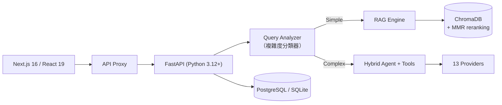

# AI Real Estate Assistant 研究筆記

## 資料來源

| 項目 | 連結 |
|------|------|
| GitHub Repo | <https://github.com/AleksNeStu/ai-real-estate-assistant> |
| 線上 Demo | <https://realestate-web-dz1y.onrender.com/>（免登入，Render 免費層冷啟動需 30–60 秒） |
| 商業託管版 | [PropVector AI](https://propvectorai.com)（尚未上線） |
| 架構文件 | `docs/architecture/large-saas-overview.md` |
| 版本紀錄 | [CHANGELOG.md](https://github.com/AleksNeStu/ai-real-estate-assistant/blob/main/CHANGELOG.md) / [Releases](https://github.com/AleksNeStu/ai-real-estate-assistant/releases) |

**Repo 現況**（2026-07-28）：★ 285 / fork 110 / **MIT** / Python + TypeScript / 建立 2024-07-27 / **最後 push 2026-07-27（昨天）** / 1,360 個檔案 / open issues 10 / 最新版本 v5.1.0（2026-06-28）。

**貢獻者結構**（README 寫「7 contributors」，實際分布）：

| 帳號 | commits |
|------|--------:|
| AleksNeStu（作者） | **1,314** |
| dependabot[bot] | 80 |
| stephenalexbrowne / Jwrede / KrabbiAI / github-actions | 3 / 2 / 1 / 2 |

實質上是**單人專案**，其餘貢獻合計 8 個 commit。

## 專案概述

用自然語言找房子：輸入「Kraków 兩房、500k 以下」，系統做意圖解析 → 抽取篩選條件 → 混合語意 + 關鍵字檢索 → 回傳匹配物件，並附上房貸試算、租買比較、ROI、TCO 等金融工具與地圖群集視覺化。

技術上它是一套完整的 **FastAPI + Next.js 16 全端 SaaS 骨架**，而不只是一個 RAG demo：PostgreSQL/SQLite、ChromaDB 向量庫、13 個 LLM provider 的路由層、JWT + API Key 雙模認證、9 種語言在地化（含 EU AI Act 合規標籤）、Docker / k8s / Render / Railway / Vercel 五套部署設定。

它同時是一個**明碼標價的 open-core 商業專案**。README 裡有一段被 `<!-- HOSTED-FUNNEL-START -->` 註解包起來的表格，直接列出哪些功能留在 OSS、哪些進託管版——這個界線畫得比多數 open-core 專案清楚得多。

## 技術架構



### 三個作者自稱的差異點

| # | 差異點 | 實質內容 |
|---|-------|---------|
| 1 | **多 provider 路由** | 13 個 provider，自動 fallback 鏈，可用 header 或請求參數逐次切換，不需改程式碼 |
| 2 | **Hybrid RAG** | Query complexity classifier 把請求分派到 RAG-only（簡單）/ RAG + 增強（中等）/ agent + tools（複雜）三條路徑；ChromaDB + MMR reranking，宣稱相關性提升 30–40% |
| 3 | **9 語言在地化** | 英、波、俄、德、西、義、葡、土、烏，AI 生成內容附 EU AI Act 合規標籤 |

### 13 個 LLM Provider（來自 `apps/api/models/providers/`）

```
openai · anthropic · google · grok · deepseek · openrouter · groq
mistral · qwen · zai · moonshot · opencode · ollama
```

值得注意的是**預設 provider 是 `zai`（GLM）而非 OpenAI**，而清單裡 groq、moonshot、qwen、openrouter、opencode 多為低價或免費層。這個抽象層的實際用途是**成本路由**，不是模型品質比較。（README 的 Features 段寫「6+ providers」、Differentiators 段寫「13」，以程式碼為準是 13。）

### Render 512MB 逼出的條件式 lazy loading

這是整個 repo 最值得單獨拿出來看的一段工程決策。`apps/api/models/provider_factory.py` 的 docstring 直接寫明問題：

> 在 Render 免費層（512 MB 硬上限）上，因為每個 provider 模組都在啟動時 eager import，baseline 比上限高約 20 MB，第一次記憶體尖峰就會被 OS 殺掉。

解法是**只在 Render 上走 lazy import**：

```python
IS_RENDER = os.environ.get("RENDER") == "true"   # Render 自動設定此變數
```

而 README 用一整張表列出五種部署情境下的實際行為：

| 平台 | `RENDER` | Provider 載入 | 記憶體 baseline |
|------|:--------:|--------------|----------------:|
| Render 免費/入門 | ✅ | Lazy——只載入 `DEFAULT_PROVIDER`（`zai`），其餘 12 個首次使用時才載入 | ~480 MB |
| VPS / 裸機 | ❌ | Eager——13 個全部啟動時載入 | ~530 MB |
| Docker / compose | ❌ | Eager | ~530 MB |
| 其他 PaaS（Fly.io、Railway…） | ❌ | Eager | 視方案 |
| 本機 / CI | ❌ | Eager（測試假設此路徑） | ~530 MB |

然後補上一句：**「lazy path 是 Render 特定的 workaround，一般記憶體受限的生產部署不該把它當最佳實踐。」**

### 測試與安全管線

| 層級 | 數量 | 工具 | 覆蓋率 |
|------|-----:|------|-------:|
| Backend | 6,254+ | pytest、mypy、ruff | 90%+ |
| Frontend | 1,000+ | Jest、ESLint | 80%+ |
| Security | 5 掃描器 | Gitleaks、Semgrep、Bandit、Trivy、CodeQL | — |
| E2E / a11y | — | axe-core、Playwright（WCAG 2.1 AA） | — |

測試用 pytest-xdist 平行執行（本機）與 GitHub Actions matrix（CI）。近期 releases 有一半是安全性修補（`pydantic-settings` CVE、`aiohttp` 9 個 advisory、`fastapi` 4 個 advisory）。

## 快速開始

```bash
git clone https://github.com/AleksNeStu/ai-real-estate-assistant.git
cd ai-real-estate-assistant
cp deploy/compose/.env.example deploy/compose/.env    # demo 模式為預設，不需 API key
docker compose -f deploy/compose/docker-compose.yml up --build
# Frontend: http://localhost:3082 · API docs: http://localhost:8082/docs
```

本機完整 demo（含產生模擬資料）走 PowerShell 腳本：

```powershell
.\scripts\demo\01-launch-docker.ps1     # 5-8 分鐘
.\scripts\demo\02-generate-data.ps1     # 2-3 分鐘
```

產生的模擬資料集：250+ 物件（波蘭 5 城市：Kraków、Warsaw、Gdańsk、Wrocław、Poznań）、50 使用者、100 儲存搜尋、200 收藏、15 仲介檔案、150 leads、300 活動事件、20 份 CMA 報告。

## Open-core 切分

README 裡的功能分界表（作者原話：**「the repo stays open-core: the core engine remains free, anything that gates revenue lives in the hosted product」**）：

| 能力 | OSS（本 repo） | Hosted（PropVector AI） |
|------|:-------------:|:----------------------:|
| 核心 RAG 房產問答、demo 資料集 | 免費 | 包含 |
| 自備 LLM key、本地 Ollama | 免費 | 包含 |
| ChromaDB 向量搜尋（樣本資料） | 免費 | 包含 |
| **即時 / MLS 資料饋送、資料增補管線** | ❌ | Pro |
| **帳號、收藏、儲存搜尋、通知** | ❌ | Pro |
| **AI CRM（lead scoring、drip、pipeline）** | ❌ | Pro / Enterprise |
| 多代理 Agentic OS | 有限 | Pro |
| CRM 連接器（HubSpot/Pipedrive）、SSO、MFA | ❌ | Enterprise |
| White-label / 自架支援合約 | ❌ | Enterprise（客製） |

定價：**Free $0 / Pro $29 月 / Enterprise 客製**（README 註明尚可能調整）。

## 目前限制與注意事項

| 項目 | 說明 |
|------|------|
| **Demo 用的是模擬 AI 回應** | README 明說「The demo uses simulated AI responses for instant exploration」。線上 demo 展示的是 UI 與流程，**不是真實 LLM 行為**。要看真的得自己帶 key 跑 |
| **房價預測沒有任何驗證** | v5.1 的「AI Property Valuation with Multi-Year Price Forecast」給 1/3/5/10 年估值與信心區間，但**完全由 LLM 生成**——沒有模型、沒有回測、沒有誤差統計。房貸試算有標「not a lending offer」，但預測準確度沒有任何聲明。這是這個專案最需要謹慎看待的功能 |
| **沒有真實房源** | 內建資料是波蘭 5 城市的模擬資料。真實 MLS 饋送是 Pro 功能。自架者要自己接資料源 |
| **Bus factor = 1** | 1,314 / 1,400 commits 出自一人。README 的「7 contributors」在技術上成立，但其餘 6 個帳號（含 2 個 bot）合計 88 個 commit |
| **Windows 優先** | Quick Start 把 PowerShell 腳本列為「recommended」，Linux/macOS 的 `.sh` 版本列在後面。多數 demo 與測試腳本都有雙版本，但開發順序看得出來 |
| Render 冷啟動 | 免費層閒置後停機，首次造訪需 30–60 秒 |
| 開發分支是 `dev` | staging 從 `dev` 自動部署，`main` 是穩定版。PR 要開向 `dev` |
| 近期開發重心已轉向成長 | 最近 10 個 commit 幾乎都是 SEO / GSC-Bing 索引 / social preview / star-history 圖表修復 / staging badge，不是功能。功能上一版是 6/28 的 v5.1 |

## 研究價值與啟示

### 關鍵洞察

**1. 把「這是 hack，而且你不需要它」寫進文件，是我看過最負責任的技術債標註方式。**
`provider_factory.py` 的 lazy loading 是為了塞進 Render 512MB 免費層的權宜之計。一般專案的處理方式有兩種：默默寫進去（後人踩雷），或包裝成「效能優化」（更糟）。這個 repo 的做法是第三種——**docstring 說明為什麼要 hack、用環境變數把 hack 的作用範圍鎖死在單一平台、README 用一張五列的表告訴你在別的平台上行為是什麼、最後明說「這不是一般情況下的最佳實踐」**。技術債本身不可怕，可怕的是後人不知道它是債。這段值得任何要在受限環境部署的人抄走。

**2. open-core 的界線寫在 README 裡，而不是等你撞牆才發現。**
「核心引擎免費，任何會影響營收的東西放在託管版」——這句話直接寫在功能對照表上方。對照多數 open-core 專案（先讓你裝、用一個月、才發現 SSO 要企業版），這種前置揭露反而讓自架決策變容易：**你一眼就知道自架版本缺的是「即時資料、帳號系統、CRM」這三塊**，而這三塊恰好是把 demo 變成生意的關鍵。這個切分本身就是一份「這個領域錢在哪裡」的說明書。

**3. 285 star 配 7000 個測試與 5 個安全掃描器，這個比例只有一種合理解釋。**
以社群規模衡量，這種投入是過度的。但如果目標是 PropVector AI 要賣給企業，那 90% 測試覆蓋、CodeQL/Semgrep/Trivy 全綠、WCAG 2.1 AA、EU AI Act 標籤就不是工程潔癖，而是**銷售前置條件**——企業採購問卷上的每一格都要有東西填。**開源倉庫在這個模式裡的角色不是「社群」，是「可公開稽核的品質證明」。** 這也解釋了為什麼近期 commit 全在做 SEO 與可信度訊號：產品要上線了，現在需要的是被找到與被信任。

**4. 13 個 provider 的實際意義是成本，不是能力。**
預設 provider 是 `zai` 而不是 OpenAI，清單裡塞滿 groq、moonshot、qwen、openrouter、opencode。這揭示了一個常被忽略的現實：**對要提供免費層的 AI 產品，provider 抽象層的第一價值是「找到還能跑的最便宜模型」，第二才是模型品質。** 對照 [LiteLLM](litellm.md) 那種以路由與可觀測性為核心的 gateway，這裡的抽象更薄也更務實——13 個檔案、一個 dict、一個 `_class_name_for()` 的命名慣例函式，加上四個 brand-casing 例外（`OpenAI` 不是 `Openai`）。**不需要 gateway 產品也能做多 provider，前提是你只需要「切換」而不需要「治理」。**

**5. LLM 生成的房價預測，是這個專案風險與價值錯位最明顯的地方。**
v5.1 最亮眼的新功能是 1/3/5/10 年的房價預測附信心區間。但它是 LLM 直接生成的數字——沒有時間序列模型、沒有回測、沒有誤差界。**「信心區間」這個詞在統計上有明確意義，由 LLM 憑感覺生成時就沒有了。** 專案在房貸試算旁邊謹慎地標了「not a lending offer」，卻沒有對預測給任何等價的免責。這不是這個專案獨有的問題，而是**「LLM 什麼都能生成」與「有些數字需要模型保證」之間的普遍張力**——房產與金融領域尤其危險，因為輸出看起來就像專業分析。

**6. 這是一份「作品集專案如何長成產品」的完整時間軸樣本。**
2024-07 開專案 → 累積到 v5.x、6 萬行、7000 測試 → 2026-06 開始鋪商業版功能表 → 2026-07 全力做 SEO、索引、social preview、star history。**每個階段的 commit 訊息都誠實反映了當時的目標**（`feat(...)` → `fix(security)` → `docs(growth)`）。想走同一條路的人，把這個 repo 的 commit history 從頭讀一遍，比讀十篇創業文章有用。

### 與其他專案的關聯

| 專案 | 關係 |
|------|------|
| [tw-house-ops](tw-house-ops.md) | 同為房產 × AI，但定位相反。tw-house-ops 針對台灣市場的實務流程；這個是通用的 RAG 搜尋平台 + 商業產品。想做台灣版房產 AI，這個 repo 是可直接參考的技術骨架（MIT 授權），資料層換掉即可 |
| [LiteLLM](litellm.md) | 多 provider 路由的重量級對照。LiteLLM 是獨立 gateway 產品（治理、觀測、預算）；這裡是 13 個檔案的內建抽象（只做切換與 fallback）。**判斷標準：你需要的是切換還是治理？** |
| [BYOA Core](bring-your-own-agent.md) | 同樣用 Protocol/抽象層做 provider 可替換，且同樣是單人專案。差別在完成度光譜的兩端：BYOA 是可讀完的教學級實作（停更 5 個月），這個是還在每天推 commit 的產品 |
| [RAG-Anything](rag-anything.md)、[GraphRAG](graphrag.md) | 那些是 RAG 技術本身；這個是 RAG 落進一個垂直領域的完整產品化樣本——包含 query complexity 分流、MMR reranking、以及最容易被教學文章省略的部分（在地化、合規標籤、部署記憶體限制） |
| [Career-Ops](career-ops.md) | 同屬「個人開發者把工具做成 SaaS」的品類。可以對照兩者在 open-core 界線上的不同選擇 |
| [soplint](soplint.md)、[BYOA Core](bring-your-own-agent.md) | 三者都展示了單人專案靠 CI 撐住品質的模式。這個 repo 的極端版本：5 個安全掃描器 + 7000 測試 + WCAG e2e，全部自動跑，因為沒有第二個人能 review |
