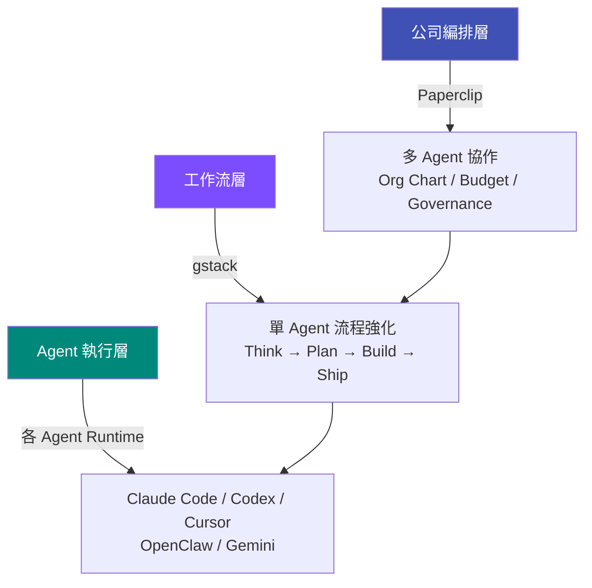

# Headless AI Agent Research

研究與整理 AI Agent 相關的開源專案、架構模式與工具鏈。

---

## 研究主題

-   :material-office-building:{ .lg .middle } **Paperclip**

    ---

    開源的 AI Agent 編排控制平面，把多個 Agent 組織成「零人公司」

    [:octicons-arrow-right-24: 閱讀研究筆記](paperclip.md)

-   :material-hammer-wrench:{ .lg .middle } **gstack**

    ---

    Garry Tan (YC CEO) 的 Claude Code 工作流系統，18 個 slash command 虛擬工程團隊

    [:octicons-arrow-right-24: 閱讀研究筆記](gstack.md)

---

## 研究角度

這些專案從不同層級解決 AI Agent 的問題：

| 層級 | 代表專案 | 解決的問題 |
|------|---------|-----------|
| **公司編排層** | Paperclip | 多個 Agent 如何協作運營、預算控制、治理審批 |
| **工作流層** | gstack | 單個 Agent 如何按流程高效開發 |
| **Agent 執行層** | Claude Code, Codex, OpenClaw | Agent 本身如何理解與執行任務 |
