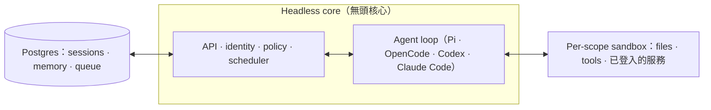

# qm 研究筆記

## 資料來源

| 項目 | 連結 |
|------|------|
| GitHub repo | <https://github.com/yc-software/qm> |
| 官方首頁 | <https://qm.ycombinator.com> |
| npm 套件 | `@yc-software/qm` |
| 關鍵文件 | `docs/getting-started.md`、`cli/README.md`、`deployment.md`、`SECURITY.md`（皆在 repo 內） |

> Metadata（研究當下）：**11,758 stars / 1,306 forks** · TypeScript（9.5 MB，佔壓倒性多數）· MIT · 建立於 2026-07-29（**極新，一週多衝到 1.1 萬星**）· 最新 release `v0.1.4`（2026-07-31，仍 0.x 早期）。由 **Y Combinator**（`yc-software` org）維護。

## 專案概述

**qm 是一個「給公司用的多人（multiplayer）agent harness」**,同時活在 **Slack 與 web**。它的核心命題是對「agent = 個人助理」這個主流設計的反動:

> 大多數 agent 被設計成**個人助理**;你可以硬把一個 agent 塞給整間公司用,但很快就會變得複雜。**qm 專為 startup 設計**——每位員工各有**隔離的 workspace**、彼此獨立工作互不干擾,同時又能在 channel、group message、project 裡跟 agent 協作。

關鍵抽象是 **scope（範圍）**:**每個「人」和每個「房間」都各自擁有** scoped 的 memory、files、keychain view、permissions、crons、web apps、以及一個 durable sandbox。個人把 agent 調成「他自己的」,又能在共享空間協作——這是它跟單租戶個人助理、以及跟純多 agent 框架都不同的定位:**它是多「使用者」× 各自的 agent,不是多「agent 角色」**。

實際能做的事很廣:跨內部筆記/email/文件/資料庫/web 搜尋、從「公司大腦」取資訊、建內部 app 並發布給對的人、學你的寫作語氣後定時 triage 收件匣(含 label 與回覆草稿)、在既有 repo 跑測試/開 PR/盯 CI/查 log、在共享 channel 追專案並發更新。

## 技術架構



- **每一 turn 都走中央 core**,core 可換不同 model 與 harness 生成回應;**Postgres** 存使用者資料、session 歷史與其它 durable 狀態。
- **agent 只有一組小而固定的 tool surface**;其中一個 tool 是 **`execute`**,在該 scope 自己的隔離 sandbox 裡跑指令——那是它的「durable computer」,**裝過的工具會一直留著**。
- **Web UI / admin panel / public portal 都是 core HTTP API 之上的選配 plugin**;Slack 是 core 啟動並監督的 in-process plugin。
- core 用 **TypeScript 直接跑在 Node**、HTTP 用 **Fastify**;Slack plugin 用 **Bolt**;web UI 用 **Vite + Lit**。

### harness 無關(最重要的架構決策之一)

**Pi、OpenCode、Codex、Claude Code 全都驅動同一個 core**——一個部署不綁任何單一 vendor。`package.json` 直接印證:同時依賴 `@anthropic-ai/claude-agent-sdk`、`@earendil-works/pi-*`、`@openai/codex`、`@opencode-ai/*`。**每個 substrate(harness、session store、sandbox、memory)都藏在 interface 後面,production 實作靠「一個 wiring 檔」抽換。**

### deployment directory:通用 core + 公司專屬層

core 本身是**通用的**;所有「某一間公司專屬」的東西(org config、自訂 tools/skills、sandbox image、基礎設施)都住在一個 **deployment directory**,由 `qm` CLI 驗證並部署:

```bash
npm exec --yes --package=@yc-software/qm@latest -- \
  qm init . --org <slug> --target <fly-or-aws>
npm install
```

- 部署跑在**操作者自己的雲帳號**(Fly 或 AWS);init 會生一個 deployment skill 帶 agent 走完基礎設施、web 登入、connector 憑證、選配 Slack、部署與驗證,**無需 checkout 原始碼**。

## 安全模型(比多數 agent 專案認真)

qm 的取徑跟本機 coding agent(OpenCode、Codex、Claude Code)一致:**agent 以「它服務的那個人」的身分行動,用其憑證與權限,一切皆被 audit**。org 選一種 security posture,**較窄的 scope 只能收緊、不能放寬**(policy lattice):

| Posture | 行為 |
|---------|------|
| **Strict** | 每個 harness tool call 都暫停等人核准(只有兩個「無副作用的 turn ender」例外) |
| **Auto**(預設) | 一個 classifier 在**帶 provenance 標籤的外部資料/tool 結果**進到 model 前先篩;可指向自家 screening proxy |
| **Dangerous** | 不篩內容、tool call 間不暫停 |

**關鍵**:predeclared command policy(對 recursive delete、破壞性 SQL 等的核准規則與硬性拒絕)在**每一種 posture 都生效,連 Dangerous 也不例外**。

## 兩個獨特的治理設計

1. **貢獻只收「人寫的文字」,不收 code**——想改什麼,就在 `adrs/` 放一個 `.txt`/`.md` 非正式描述你要的變更;對齊後**由他們來實作**。這是「code 便宜、意圖才是瓶頸」哲學的極端實踐,也反映這專案本身大量由 agent 寫成。
2. **private fork 要用「純 clone」而非 GitHub Fork**——README 花大篇幅解釋:GitHub fork 會**繼承來源 repo 的可見性**(public 的 fork 不能改 private)、且**共用同一個 object network**(推到 fork 的 commit 仍能被 public 端用 SHA 抓到)。純 clone 沒這些問題,代價只是 upstream CI 會在你帳號實跑。兩個 skill 維持雙向邊界:`update-qm` 合上游、`upstream-pr` 送回 org-agnostic 修正並**掃掉 org 識別字**;`deploy/layers/` 下的東西永不上游,core 與 upstream 保持 byte-identical 以讓 merge 最小。

## 目前限制 / 注意事項

- **0.x 早期階段**:`v0.1.x`、建立不到兩週,API/CLI/設定都可能大改,別押 production。
- **自架與營運門檻高**:要有自己的 Fly/AWS 帳號、Postgres、連 Slack、管憑證與 posture——**這是給有工程能力的 startup/團隊,不是個人一鍵起跑的工具**。
- **`execute` sandbox 是強大也是風險面**:durable sandbox 讓 agent 有持久計算能力,但也擴大攻擊面;安全全靠 posture + command policy + provenance 篩選撐住,務必讀 `SECURITY.md` 的 threat model 與已知限制。
- **agent 以人的身分行動**:憑證與權限等同該使用者,誤動作的爆炸半徑 = 那個人能做的事;稽核有、但事前防護取決於 posture 設定。
- **star 數與成熟度不對稱**:1.1 萬星多半來自 YC 光環與話題,實際生產案例仍待觀察。

## 研究價值與啟示

### 關鍵洞察

1. **「multiplayer 而非個人助理」是 agent 產品化的關鍵重構**——把設計單位從「一個 agent」換成「每個人 × 每個房間各一個隔離 scope」,直接解掉「一個 agent 服務全公司會爆炸複雜」的老問題。scoped memory/files/keychain/sandbox 這套隔離模型,是任何想把 agent 推給團隊的產品都該抄的骨架。

2. **harness 無關 = 把「agent 迴圈」當可抽換元件**——Pi/Codex/Claude Code/OpenCode 驅動同一 core,等於承認「harness 是會換的 commodity,價值在 core 的 identity/policy/scheduler/scope 隔離」。這跟 [[headroom]] 把「壓縮」抽成獨立層、[[gs-quant]] 把 substrate 藏在 interface 後是同一種工程直覺:**把易變的供應商層與穩定的核心價值層切開**。

3. **security posture 是一條「只能收緊」的格(lattice),而非開關**——org 設底線、scope 只能更嚴,加上「command policy 連 Dangerous 都生效」的硬底線。這比多數 agent 專案「要嘛全放要嘛全擋」細緻得多,是**把企業權限模型套到 agent 上**的好範本,值得對照本站 [[claude-agent-sdk]]、[[openclaw]] 的權限討論。

4. **provenance 標籤 + 進 model 前篩選,是對 prompt injection 的結構性防禦**——不是靠 model 自律,而是在**外部資料/tool 結果進 model 之前**用 classifier 篩(還能指向自家 proxy)。這是把「不信任外部內容」做成 pipeline 關卡,而非提示詞祈禱。

5. **「貢獻只收人寫的意圖、不收 code」揭示 agent 時代的協作反轉**——當實作由 agent 完成,**稀缺的是清楚表達的意圖(ADR)而非 diff**。這個看似古怪的規則,其實是「code 產能過剩」後的自然結論,值得任何 agent-heavy 團隊思考自己的貢獻流程。

6. **private-fork-via-clone 是一則被低估的營運知識**——「GitHub fork 繼承可見性、共用 object network」這個陷阱會實際害到想私有化上游的公司;qm 用純 clone + `update-qm`/`upstream-pr` 雙 skill 維持邊界的做法,是可直接搬用的 open-core 私有化 SOP。

### 與其他專案的關聯

- **與 [[openclaw]]、[[claude-agent-sdk]]**:同屬 agent harness/SDK 層;qm 特別之處是**把多個 harness(含 Claude Agent SDK)當可抽換 driver**,自己專注在多租戶 scope、身分與 policy。
- **與純多-agent 框架([[crewai]]、[[langgraph-multi-agent]]、[[multi-agent-debate]])的區別**:那些是「多個 agent 角色協作完成一件事」;qm 是「多個**人**各有 agent,並在共享空間協作」——multiplayer ≠ multi-agent,這個對比本身很有教學價值。
- **與 [[mattpocock-skills]]、[[gs-quant]] 的 skill 機制**:qm 的 skills 是 **scope-owned、可 by-grant 分享、admin 核可後晉升全 org、可從 git repo 匯入 skill pack**——是本站看過**治理最完整**的 skill 分享模型,與 mattpocock 的「subscribe vs fork」、gs-quant 的「symlink 綁 SDK 版本」並列為三種 skill 散布法。
- **與 [[headroom]] 的層級對比**:headroom 是 LLM 前的壓縮層,qm 是 agent 之上的**組織與協作層**;兩者都示範「把 agent 系統拆成可抽換的水平層」的架構思路。
